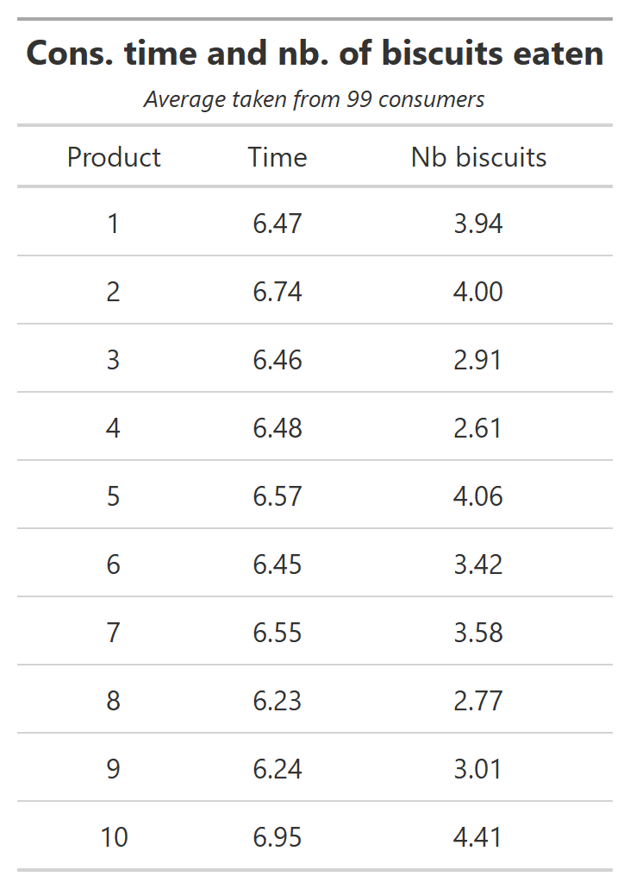
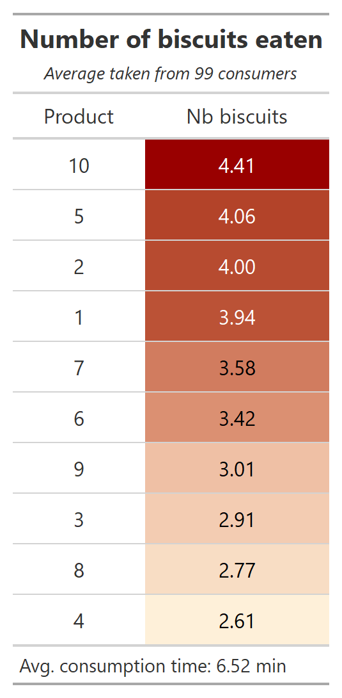
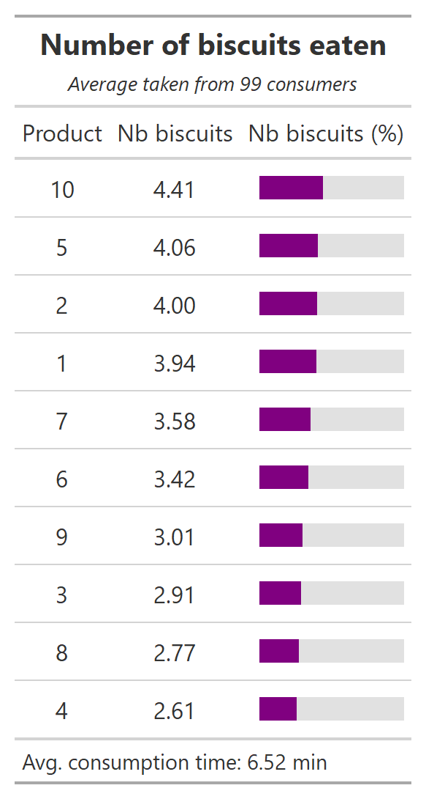
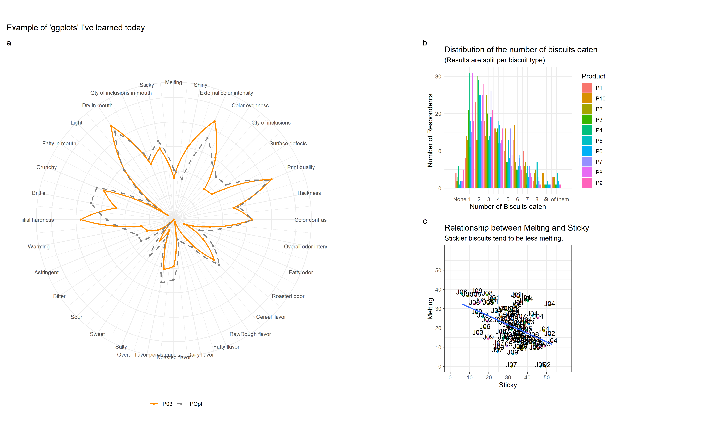

---
output:
  pdf_document: default
  html_document: default
---
# Data Visualization {#data-viz}

> One of the main goal of data analysis is to produce results. Although informative, such results are only impactful if they can be well-communicated. It is hence of utmost importance to present them in a neat way, often through visuals. 
In this chapter, two forms of visuals (namely tables and graphs) are being generated using R. Although some design principles are being tackled, the aim of this chapter is to mainly focus on the *how to?* rather than on the design itself. 
Although R already comes with tools for building and printing tables and graphs, we opt for using additional packages (`{flextable}` and `{gt}` for tables, `{ggplot2}` for graphs) as they provide more flexibility and possibilities.

## Introduction

Tables and graphs are the two fundamental vehicles to communicate information clearly and effectively. They are useful visual elements to summarize and organize information to show patterns and relationships. Tables and graphs allow the audience/reader to easily and quickly get a clear idea of the data findings, make comparisons, get insights from it and ultimately, draft conclusions without much effort.

The best medium of communication, whether a table, a bar chart, a line chart, or a radar plot, will highly depend on the type of data, the amount of data to be displayed (e.g. number of attributes or samples), and the purpose of the analysis. 

Usually, tables are meant to be read, so they are ideal when you have data that cannot easily be presented by other communication elements, or when the data requires more specific attention. However, if you encounter a situation where you have a very long and/or wide table, (which is common in sensory and consumer studies), other vehicle of communication should be considered. The same remark also applies to a graphical visualization, and if you have very little data to display, tables might be best suited. 

Sometimes (if not often) you have to play with your data, and test displaying it as a table or different types of graphs, before deciding which one suit best. As practical advice, do not hesitate to ask colleagues for feedback as having an external point of view often helps. Remember, to select the best way to communicate your data, you must understand the needs of your audience, the purpose for which various forms of display can be effectively used, but also the strengths and weaknesses of each type of data representation considered.

## Design Principles

Regardless of the way you decide to display your data, you must understand visual perception and its application to graphical communication. It is important to spend some time with the design and aesthetic aspects of your visualization. You should be able to recognize smart design by becoming familiar with some aspects and examples of great design. Inattention to the visual design such as tables with improper alignment of numbers, excessive use of lines and fill colors, can greatly diminish their effectiveness. In other words, when used adequately, design should help you communicate your results by *clarifying* it, and not distract your audience from it. 

Some important pre-attentive aspects that you should be aware of will be presented in this section, but to read more about visual perception and graphical communication, as well as some examples of great design, we strongly recommend *Storytelling with Data* by Cole Nussbaumer Knaflic (@Knaflic2015) and *Show me the Number: Designing Table and Graphs to Enlighten* by Stephen Few (@Few2012).

Since a *picture is worth a thousand words*, let's demonstrate the difference between pre-attentive and attentive processing using an example provided by Stephen Few in his book *Show me the Number: Designing Table and Graphs to Enlighten*. First, take a look at the numbers below and determine, as quickly as you can, how many times the number 5 appears:

98734979027513649782316497802316487415113697412369846321
12346879231648791300023665698774646821397486248797964312
12369874474578962341680021364789613469174312679812439612
12332146987412361789461230502135467980213648126498731203

This appears to be a tedious task and it most likely took you a few minutes because it involved **attentive processing**. The list of numbers did not have any hint (also called pre-attentive attributes) that could help you to easily distinguish the number five from the other numbers. Hence, you are forced to perform a sequential search throughout the whole list.

Let's do it again, but now using the list of numbers below:

98734979027\textcolor{red}{\textbf{5}}1364978231649780231648741\textcolor{red}{\textbf{5}}113697412369846321
1234687923164879130002366\textcolor{red}{\textbf{5}}698774646821397486248797964312
12369874474\textcolor{red}{\textbf{5}}78962341680021364789613469174312679812439612
12332146987412361789461230\textcolor{red}{\textbf{5}}0213\textcolor{red}{\textbf{5}}467980213648126498731203

This time the task is much easier and you can count the number of times the number 5 appears much faster. This is because we used the **pre-attentive attribute** of color to distinguish the number five, standing it out in contrast to the rest. This example shows in an easy way the power of pre-attentive attributes for effective visual communication. As stated by Cole Nussbaumer Knaflic in her book *Storytelling with Data*, when we use pre-attentive attributes strategically, we enable our audience to see what we want them to see before they even know they are seeing it!

The various pre-attentive attributes that can be used to draw your audience's attention quickly and create a visual hierarchy of information include **attributes of form** such as line length, line width, orientation, shape, size, added marks, and enclosure, **attributes of color** which would be hue and intensity, also spatial position and motion. Some of the strategies for a smart design for graphical communication described by Cole Nussbaumer include:

* **Highlight the important stuff** - use tools such as bold, italics, underlining, uppercase text, color, and different sizes to draw your audience's attention to what you want them to focus on. 
* **Eliminate Distractions** - while some elements should be highlighted, unnecessary or irrelevant items or information should be identified to be cut or de-emphasized to minimize your audience's distraction. Get rid of noncritical data or components, things that wouldn't change the main message, and summarize when details are not needed. When a piece of information is necessary to come along with your visualization but is not really a message-impacting, you should de-emphasize it - light gray usually works well for that purpose. 

Now the main stage is set, let's focus on how to build nice tables and graphs in R.

## Table Making {#tablemaking}
 
By default, R allows printing matrices or data frames as tables. However, these tables cannot be customized and are only informative. An example of table can be shown here:

```{r, eval=TRUE, echo=FALSE}
matrix(c(1:6), nrow=2, ncol=3, dimnames=list(paste("Name row", 1:2), paste("Name col", 1:3)))
```

To extend table customization, dedicated packages are required. For illustration, the sensory data (stored in *biscuits_sensory_profile.xlsx*) is used. 
Before starting, let's first load the usual libraries.

```{r, message=FALSE, warning=FALSE, echo = TRUE, eval = TRUE}
library(tidyverse)
library(readxl)
library(here)
```

```{r, eval=TRUE, echo=FALSE}
options(tibble.print_min=4, tibble.print_max=4)
```


Let's imagine we want to communicate the sensory profiles of the 11 biscuits on a few attributes including `Shiny`, `Sweet`, `Sour`, `Bitter`, and `Salty`. A first step consists in transforming the data to create such results (see \@ref(means) for more details).

```{r, echo = TRUE, eval = TRUE, message=FALSE, warning=FALSE, results='hide'}
file_path <- here("data","biscuits_sensory_profile.xlsx") 

mean_sensory <- readxl::read_xlsx(file_path, sheet="Data") %>% 
  select(Product, Shiny, Sweet, Sour, Bitter, Salty) %>%
  group_by(Product) %>%
  summarize(across(.cols = where(is.numeric),.fns = mean))
```

### Introduction to `{flextable}` {#flextable}

Now the correct table has been created, let's represent it in a neater way using our first dedicated package called `{flextable}`. Before going too deep in designing the table, let's simply apply the `flextable()` function to `mean_sensory` (after loading `{flextable}` first):
  
```{r flextablebasic, echo = TRUE, eval = TRUE, message=FALSE, warning=FALSE}
library(flextable)  

flex_table <- mean_sensory %>% 
  flextable()
```

```{r, eval=TRUE, echo=FALSE, tab.cap="Basic Flextable"}
flex_table %>% 
  font(fontname = "Calibri", part="all") %>% 
  fontsize(size=8, part="all") %>% 
  autofit()
```

As you can see, the table is being printed in the *Viewer* section of RStudio. This table is already better designed, although it is still quite overcrowded that could benefit from some additional design work to look nicer. 

A first simple improvement consists in reducing the number of decimals (`colformat_double()`), changing the font size (`fontsize()`, not visible in our output) and type (`bold()` or `italic()`), and aligning the text (`align()`) for instance.

```{r flextablebasic2, echo = TRUE, eval = TRUE, message=FALSE, warning=FALSE}
flex_table_design <- flex_table %>%
  colformat_double(digits = 2) %>%
  fontsize(size = 10, part = "all") %>% 
  bold(bold = TRUE, part = "header") %>%
  italic(j = -1, italic = TRUE, part = "body") %>%
  align(align = "center", part = "all")
```

```{r, eval=TRUE, echo=FALSE, tab.cap="Flextable - aesthetics improvements"}
flex_table_design %>% 
  font(fontname = "Calibri", part="all") %>% 
  fontsize(size=8, part="all") %>% 
  autofit()
```

As can be seen, the function names are very intuitive, and so are the options. In particular, it is interesting to see that most functions allows applying changes to the entire table (`part = "all"`), the header only (`part = "header"`) or the body only (`part = "body"`). And even within a part, it is possible to make a sub-selection by selecting the rows (`i`) or columns (`j`) to include or exclude. Here, all the text in the body is set in italic except for the product names, hence the option `j=-1` (read exclude the first column).

After presenting some of the basic aesthetic options, let's go once step further and play around with coloring. For instance, let's imagine we would change the header background and text color, and would want to call the audience's attention by highlighting the optimized formulation. We can also change the colour of the outer lines of the table using `fp_border()` from `{officer}`. The following code could be used to do this (results are not being saved):

```{r, flextabledesigned, echo = TRUE, eval = FALSE, message=FALSE, warning=FALSE}
flex_table_design %>%
  bg(bg = "black", part = "header") %>% 
  color(color = "white", part = "header") %>% 
  fontsize(size = 13, part = "header", i = 1) %>%
  color(i = 11, color = "orange", part = "body") %>%
  color(i = 1:10, color = "grey70", part = "body") %>% 
  add_header_lines(values = "Sensory Profile of 11 biscuits") %>% 
  border_remove() %>% 
  border_outer(border=officer::fp_border(color="darkorange", width=2)) %>%
  fix_border_issues()
```

```{r, eval=TRUE, echo=FALSE, tab.cap="Flextable - coloring function"}
flex_table_design %>%
  bg(bg = "black", part = "header") %>% 
  color(color = "white", part = "header") %>% 
  fontsize(size = 13, part = "header", i = 1) %>%
  color(i = 11, color = "orange", part = "body") %>%
  color(i = 1:10, color = "grey70", part = "body") %>% 
  add_header_lines(values = "Sensory Profile of 11 biscuits") %>% 
  font(fontname = "Calibri", part="all") %>% 
  fontsize(size=8, part="all") %>% 
  autofit() %>% 
  border_remove() %>% 
  border_outer(border=officer::fp_border(color="darkorange", width=2)) %>%
  fix_border_issues()
```

Alternatively, we could decide to be more sober by applying other pre-attentive attributes. For instance, the size of the table can be adjusted, and an horizontal line can be added to delimit the optimal sample from the other. For the latter part, the customization of the line can be made using the function `fp_border()` from the `{officer}` package^[More information regarding the `{officer}` package are provided in Section \@ref(powerpoint)].

```{r, echo=TRUE, eval=FALSE, message=FALSE, warning=FALSE}
library(officer)

flex_table_design %>%
  hline(i=10, border=fp_border(color="grey70", style="dashed")) %>% 
  autofit()
```

```{r, echo=FALSE, eval=TRUE, message=FALSE, warning=FALSE, tab.cap="Flextable - lines customization"}
library(officer)
flex_table_design %>%
  hline(i=10, border=fp_border(color="grey70", style="dashed")) %>%
  font(fontname = "Calibri", part="all") %>% 
  fontsize(size=8, part="all") %>% 
  autofit()
```

In some situations, applying some design options might mess up the appearance of your table, in particular its border lines. If that should happen to you, just apply the function `fix_border_issues()` at the end of your code to solve it.

Lastly, you can use conditional formatting if you want to highlight some specific values (e.g. values for `Sweet` that are below 20 should be colored in blue, and above 30 in red), as in the example below:

```{r, echo=TRUE, eval=FALSE}
color_code <- ifelse(mean_sensory$Sweet <= 20, "blue", 
                     ifelse(mean_sensory$Sweet >= 30, "red", "black"))

flex_table_design %>% 
  color(j=~Sweet, color=color_code)
```

```{r, echo=FALSE, eval=TRUE, tab.cap="Flextable - conditional formatting"}
color_code <- ifelse(mean_sensory$Sweet <= 20, "blue", 
                     ifelse(mean_sensory$Sweet >= 30, "red", "black"))
flex_table_design %>% 
  color(j=~Sweet, color=color_code)%>%
  font(fontname = "Calibri", part="all") %>% 
  fontsize(size=8, part="all") %>% 
  autofit()
```

Other illustrations of the use of `{flextable}` are provided in section \@ref(powerpoint). 

For curious readers who want to get a deeper look into all the possibilities provided by this package, we refer them to the book [*Using the flextable R package*](https://ardata-fr.github.io/flextable-book/index.html) by David Gohel and to [*Flextable gallery*](https://ardata.fr/en/flextable-gallery/) for inspiration.

### Introdution to `{gt}`

As an alternative to `{flextable}`, the `{gt}` package can also be considered as it also produces nice-looking tables for reports or presentations. 
Let's first install (if needed) and load the `{gt}` package.

```{r, echo = TRUE, eval = TRUE, message=FALSE, warning=FALSE}
library(gt)
```

Focusing now on the consumer study (*biscuits_consumer_test.xlsx*), let's display a table with the average number of biscuits (for each variant) consumers ate, and their corresponding eating time. To do so, we first need to transform the time columns (expressed as min and s) to a double format and express them in minutes. Then, we can group them by product to get the average for the time spent and the number of biscuits eaten.

```{r, echo = TRUE, eval = TRUE, message=FALSE, warning=FALSE, results='hide'}
file_path <- here("data","biscuits_consumer_test.xlsx") 

mean_consumer <- readxl::read_xlsx(file_path, 
                                   sheet="Time Consumption") %>%
  dplyr::select(Product, `Time (min)`, `Nb biscuits`) %>%
  separate(`Time (min)`, c("Min", "Sec"), sep="min") %>%
  mutate(across(c("Min","Sec"), as.numeric)) %>% 
  mutate(Time = Min+Sec/60) %>% 
  group_by(Product) %>% 
  summarise(across(c("Time", "Nb biscuits"), mean, na.rm = TRUE)) %>% 
  ungroup()
```

Now that the data is ready, we can display it with some basics adjustments to make it look nicer.

```{r, echo=TRUE, eval=FALSE, message=FALSE, warning=FALSE}
mean_consumer %>%
  gt () %>%
  cols_align(align = "center", columns = everything()) %>%
  fmt_number(columns = c("Time", "Nb biscuits") , decimals = 2) %>%
  tab_header(title = md("**Cons. time and nb. of biscuits eaten**"), 
             subtitle = md ("*Average taken from 99 consumers*"))
```

```{r gttable, fig.cap='gt Table.', fig.align='center', echo=FALSE, out.width="100%", eval=TRUE}

```

Note that we used *Markdown* to style the title and subtitle by wrapping the values passed to the title or subtitle with the `md()` function. In Markdown, `**text**` writes the text in bold, and `*text*` in italic.

The `{gt}` package offers several resources to make beautiful tables. Let's illustrate this by focusing on the average number of biscuits eaten only since the average consumption time is very similar across products. The idea is to use pre-attentive attributes for the audience to clearly see which samples were the most popular (i.e. the most eaten) and which one were not. Let's first prepare the data and calculate the overall time consumption considering all products.

```{r, message=FALSE, warning=FALSE, results='hide', echo = TRUE, eval = TRUE}
mean_consumer_2 <- mean_consumer %>%
  dplyr::select(- "Time") %>%
  arrange(desc (`Nb biscuits`))
```

Now that the data is ready, we can display using a similar style as before in which we add some color-code to accentuate products' consumption. We will also add a `note` to the table that expresses the average time used to consumer the biscuits. So let's start with creating the table:

```{r, message=FALSE, warning=FALSE, results='hide', echo = TRUE, eval = TRUE}
note <- str_c("Avg. consumption time: ", 
              round(mean(mean_consumer$Time),2), " min")

consumption <- mean_consumer_2 %>%
  gt () %>%
  cols_align(align = "center", columns = everything()) %>%
  fmt_number(columns = "Nb biscuits" , decimals = 2) %>%
  tab_header(title = md ("**Number of biscuits eaten**"), 
             subtitle = md ("*Average taken from 99 consumers*")) %>%
  tab_source_note(source_note = note)
```

Now, let's color code the cells based on the average number of biscuits eaten. To color code, the range of average number of biscuits eaten is required. Then, we can use the `col_numeric()` function from the `{scales}` package to generate the colors of interest (in practice, we provide the colour for the minimum, maximum, and the function generates automatically all the colors in between to create the gradient).

```{r, echo=TRUE, eval=FALSE, message=FALSE, warning=FALSE}
library(scales)

nb_range <- range(mean_consumer_2$`Nb biscuits`)

consumption %>% 
    data_color(columns=`Nb biscuits`, 
               colors=col_numeric(c("#FEF0D9","#990000"), 
                                  domain=nb_range, alpha=0.75))
```

```{r gttabledesigned, fig.cap='gt Table - coloring function.', fig.align='center', echo=FALSE, out.width="100%", eval=TRUE}

```

Applying this strategy of coloring the number of biscuits eaten according to their range makes the table nicer and easier to get insights from. In our case, we can quickly see that groups of products based on their average consumption: Product 10 is the most eaten, followed by a group that include products 5, 2, and 1. At last, samples 8 and 4 are the least consumed samples.

Although the package `{gt}` proposed some nice feature, additional options are provided by its extension package called `{gtExtras}` which provides additional themes, formatting capabilities, opinionated diverging color palette, extra tools for highlighting values, possibility of embed bar plots in the table etc. For more information, please check [gtExtras](https://jthomasmock.github.io/gtExtras/).

To illustrate one of the possible use of `{gtExtras}` let's twist the previous table as following: Since each consumer was provided with a maximum of 10 biscuits, let's transform the average consumption into percentages. We can then re-create the previous table in which we also add a bar-chart based on the percentages:

```{r, eval=FALSE, echo=TRUE}
library(gtExtras)

mean_consumer_2 %>%
  mutate(`Nb biscuits (%)` = 100*(`Nb biscuits`/10)) %>% 
  gt () %>%
  cols_align(align = "center", columns = everything()) %>%
  fmt_number(columns = "Nb biscuits" , decimals=2) %>%
  tab_header(title = md ("**Number of biscuits eaten**"), 
             subtitle = md ("*Average taken from 99 consumers*")) %>%
  tab_source_note(source_note = note) %>% 
  gt_plt_bar_pct(`Nb biscuits (%)`, scaled=TRUE)
```

```{r gttextratable, fig.cap='gtExtra Table.', fig.align='center', echo=FALSE, out.width="100%", eval=TRUE}

```

In this section, due to their simplicity and flexibility, we emphasized the use of `{flextable}` and `{gt}` to build beautiful tables for your reports. However, there are other alternatives including `{kable}` and `{kableExtra}`, or `{huxtable}` for readers that are not yet fully satisfied.

## Chart Making

"A picture is worth 1000 words". This saying definitely applies to Statistics as well, since visual representation of data often appears clearer than the values themselves stored in a table. It is hence no surprise that R is also a powerful tool for building graphics. 

In practice, there are various ways to build graphics in R. In fact, R itself comes with an engine for building graphs through the `plot()` function. An extensive description can be found in *R Graphics* by Paul Murrell (@Murrell2011). Due to its philosophy, its simplicity, and the point of view adopted in this book, we will limit ourselves to graphics built using the `{ggplot2}` package. 

### Philosophy of `{ggplot2}`

`{ggplot2}` belongs to the `{tidyverse}`, and was developed by H. Wickham and colleagues at RStudio. It is hence no surprise that a lot of the procedures that we are learning throughout this book also applies to `{ggplot2}`. More generally, building graphics with `{ggplot2}` fits very well within the pipes (`%>%`) system from `{magrittr}`. In fact, `{ggplot2}` works with its own piping system that uses the `+` symbol instead of `%>%`.

In practice, `{ggplot2}` is a multi-layer graphical tools, and graphics are built by adding layers to existing graphs. The advantage of such procedure is that `ggplot` objects are not fixed: They can be printed at any time, and can still be improved by adding other layers if needed. To read more about `{gglot2}` and its philosophy, please refer to
 [*A Layered Grammar of Graphics*](http://vita.had.co.nz/papers/layered-grammar.pdf) by Hadley Wickham.

Note that since building graphics is limited to one's imagination, it is not possible to tackle each and every possibilities offered by `{ggplot2}` (and its extensions). For that reason, we prefer to focus on how `{ggplot2}`works, and by using as illustration throughout the book examples of graphics that are useful in Sensory and Consumer Science. This should be more than sufficient to get you started, and should cover 90% of your daily needs. Still, if that should not be sufficient, we invite you to look into the online documentation or to references such as [*The R Graph Gallery*](https://r-graph-gallery.com/).

### Getting started with `{ggplot2}` {#ggplot2}

To use `{ggplot2}`, it needs to be loaded. This can either be done directly using:

```{r, eval=FALSE, echo=TRUE}
library(ggplot2)
```

However, as said before, this step is not always needed since it is part of `{tidyverse}`: At the start of this chapter, when we loaded the `{tidyverse}` package, we also loaded `{ggplot2}`.

To illustrate the use of `{ggplot2}`, both the sensory data (*biscuits_sensory_profile.xlsx*) and the number of biscuit eaten by each respondents (*biscuits_consumer_test.xlsx*) are used. Although these files have already been loaded in Section \@ref(tablemaking), let's re-load them:

```{r, eval=TRUE, echo=TRUE}
file_path <- here("data","biscuits_sensory_profile.xlsx") 

p_info <- readxl::read_xlsx(file_path, sheet="Product Info") %>% 
  dplyr::select(-Type)

sensory <- readxl::read_xlsx(file_path, sheet="Data") %>% 
  inner_join(p_info, by="Product") %>% 
  relocate(Protein:Fiber, .after=Product)

file_path <- here("Data","biscuits_consumer_test.xlsx")

Nbiscuits <- readxl::read_xlsx(file_path, sheet="Time Consumption") %>% 
  mutate(Product = str_c("P", Product)) %>% 
  rename(N = `Nb biscuits`)
```

To initiate a graph, the function `ggplot()` is called.
Since the data to be used are stored in `sensory`, `ggplot()` is applied on `sensory`:

```{r, eval=TRUE, echo=TRUE}
p <- ggplot(sensory)
```

Running this line of code generates an empty graphic stored in `p`. This is logical since no layers have been added yet.
So let's imagine we want to look at the overall relationship between `Sticky` and `Melting`. To evaluate this relationship, a scatter plot with `Sticky` in the X-axis and `Melting` in the Y-axis is created. To do so, two types of information are required:

* the type of visual (here a scatter point);
* the information regarding the data to plot (what should be represented).

Such information can be provided as such:

```{r, eval=TRUE, echo=TRUE, warning=FALSE, message=FALSE, fig.cap="Scatter plot."}
p + geom_point(aes(x=Sticky, y=Melting))
```

This code adds a layer that consists of points (defined by `geom_point()`) in which the X-axis coordinates are defined by `Sticky` and the Y-axis coordinates by `Melting`, as defined through aesthetics (or `aes()`). This layer is added to the already existing graph `p`.

#### Introduction to Aesthetics {.unnumbered #scatter}

In the previous example, one can notice that many points are being printed. This surprising result is logical since `sensory` contains the raw sensory data, meaning that there are as many points as there are assessors evaluating products.

Let's color the points per products to see if we can see any patterns. Since the color code is specific to the data (more precisely to `Product`), it should be informed within the aesthetics by adding `colour=Product` within `aes()`:

```{r, eval=TRUE, echo=TRUE, warning=FALSE, message=FALSE, fig.cap="Scatter plot with emphasis on the color through `aes()`."}
p + geom_point(aes(x=Sticky, y=Melting, colour=Product))
```

As you can see, any parameters provided within `aes()` may depend on a variable (e.g. `colour` in the previous example). 
If for any reasons, a specific setting should uniformly be applied to all the elements of the graph, then it should be defined outside `aes()`. 

Let's illustrate this by providing a simple example in which we change the type of the dots from circle to square using `pch`, and by increasing their size using `cex`:

```{r, eval=TRUE, echo=TRUE, warning=FALSE, message=FALSE, fig.cap="Scatter plot with emphasis on the type of dots through `pch` and `cex`."}
p + geom_point(aes(x=Sticky, y=Melting, colour=Product), pch=15, cex=5)
```

Regardless of the products, all the points are now shown as large squares.

Depending on the `geom_*()` function considered, different parameters should be informed within `aes()`. Here is a list of the most common `aes()` you would use:

 - `x`, `y`, `z`, provides the coordinates on the X, Y, Z dimensions respectively;
 - `colour`/`color`, `fill` controls for the color code^[You can also use `alpha` to control for the transparency of the elements by defining values between 0 (completely transparent) to 1 (no transparency).] that is being applied to the different elements of a graph;
 - `group` makes the distinction between points that belong to different groups^[Note that `colour` and `fill` are specific cases of groups as they additionally provide a visual cue on the groups through the color code];
 - `text`, `label` prints text/labels on the graph;
 - `size` controls the size of the element (this should preferably be used with numerical variables).
 
It may not be clear yet on how those aesthetics work, but don't worry, many examples illustrating the use of these various types of aesthetics are provided throughout the book.

#### Introduction to `geom_*()` functions {.unnumbered #linechart}

Since `{ggplot2}` is a multi-layer graph, let's add another layer. For example, the name/code of the panelists associated to each point can be printed. 

Such procedure is done through the use of another `geom_*()` function in `geom_text()`^[Try using `geom_label()` instead of `geom_text()` to see the difference between these two.] which requires in `aes()` the position of the labels (`x` and `y`) as well as the `label` itself.

To avoid having the label overlapping with the point, the text is slightly shifted vertically using `nudge_y`. For simplicity, let's rebuild the graph from the start:

```{r, eval=TRUE, echo=TRUE, warning=FALSE, message=FALSE, fig.cap="Scatter plot with emphasis on the information displayed through `geom_point()` and `geom_text()`."}
ggplot(sensory)+
  geom_point(aes(x=Sticky, y=Melting, colour=Product))+
  geom_text(aes(x=Sticky, y=Melting, label=Judge), nudge_y=1)
```

One interesting remark is that some information required in `aes()` is being repeated across the different `geom_*()` used. Such writing can be simplified by providing the `aes()` information that applies to all `geom_*()` to the original `ggplot()` call^[Intrinsically, this is what is done with `sensory` which is only mentioned within `ggplot()` and is not repeated across the different `geom_*()` functions.]. The previous code hence can be simplified to:

```{r, eval=TRUE, echo=TRUE,  warning=FALSE, message=FALSE}
p <- ggplot(sensory, aes(x=Sticky, y=Melting, label=Judge))+
  geom_point(aes(colour=Product))+
  geom_text(nudge_y=1)
```

With this new code, you'll notice that:

* `x` and `y` are automatically applied to both `geom_point()` and `geom_text()`;
* although `label` is only relevant for `geom_text()`, it can still be provided at the beginning as it will be ignored by `geom_point()`;
* `colour` should only be provided within `geom_point()` else the text would also be colored according to `Product` (which we do not want here);
* `nudge_y` is defined outside `aes()` as it applies to all the text.

Since the graphics look at the relationship between two quantitative variables, let's add another layer to the previous graph that shows the regression line:

```{r, eval=TRUE, echo=TRUE}
line_p <- p +
  geom_smooth(method=lm, formula="y~x", se=FALSE)
```

```{r, eval=TRUE, echo=FALSE, warning=FALSE, message=FALSE, fig.cap="Scatter plot with regressionh line through `geom_smooth()`."}
line_p
```

This code adds a regression line to the graphic. It is built using the `lm()` engine in which the simple linear regression model `y~x` is fitted. This result is somewhat surprising since we have not run any regression yet, meaning that `geom_smooth()` is performing this analysis in the background by itself. 

In practice, most `geom_*()` function comes with a statistical procedure attached to it. This means that on the raw data, the `geom_*()` function calls its `stat_*()` function that runs the corresponding analysis. In the previous example, `geom_smooth()` calls `stat_smooth()`.

Let's illustrate this concept again using another example: bar-charts that is applied on the data stored in `Nbiscuits`. 
Here, we want to see the distribution (through bar-charts) of the number of biscuits eaten per consumer. A quick look at the data shows that some respondents ate portions of the cookies. To simplify the analysis, let's consider the total number of entire cookies eaten: if a respondent has eaten say 3.5 biscuits, it will be rounded down to 3 full cookies. 

```{r, eval=TRUE, echo=TRUE}
Nbiscuits <- Nbiscuits %>% 
  mutate(N = floor(N))
```

To create such distribution, a first solution consists in counting for each product how many respondents ate 0 biscuit, 1 biscuit, 2 biscuits, etc. This is automatically done using `geom_bar` and `stat="count"`. The parameter `position="dodge"` is used to get the results per biscuit side by side rather than stacked up vertically (value by default):

```{r, eval=TRUE, echo=TRUE}
bar_p <- ggplot(Nbiscuits, aes(x=N, fill=Product)) +
  geom_bar(stat="count", position="dodge")
```

```{r, eval=TRUE, echo=FALSE, warning=FALSE, message=FALSE, fig.cap="Bar Chart displaying the distribution using `geom_bar()`."}
bar_p
```

In the background, this corresponds to grouping the data by `Product`, summarizing the results by counting `N`, and then performing `geom_bar()` in which no transformation is required (we set `stat="identity"`)^[This code could even be simplified by using `geom_col()` which corresponds to `geom_bar()` with `stat="identity"` as default.]:

```{r, eval=FALSE, echo=TRUE}
Nbiscuits %>% 
  count(Product, N) %>% 
  ggplot(aes(x=N, y=n, fill=Product))+
  geom_bar(stat="identity", position="dodge")
```

As can be seen, these two graphics are identical. 

#### Making graphs pretty {.unnumbered #prettygrphs}

In the two previous graphs generated (stored in `line_p` and `bar_p`), some features can be changed to produce clearer visualizations. Currently, the background is grey with vertical and horizontal white lines, the legend is positioned on the right side, the axis is defined based on the data itself (and so are the axis titles), there is no title, etc. All these points (and many more) can be modified, as it will be shown in this section.

Let's start with a quick win by completely changing the overall appearance of the graphic. To do so, predefined *themes* with pre-set background (with or without lines, axis lines, etc.) can be applied. The two themes we use the most are `theme_minimal()` and `theme_bw()` (see [*Complete themes*](hhttps://ggplot2.tidyverse.org/reference/ggtheme.html) for a complete list of pre-defined themes.)

Let's start with improving `bar_p` using `theme_minimal()`:

```{r, eval=TRUE, echo=TRUE}
bar_p <- bar_p+
  theme_minimal()
```

```{r, eval=TRUE, echo=FALSE, warning=FALSE, message=FALSE, fig.cap="Bar Chart with emphasis on the display through `theme()`."}
bar_p
```

Rather than using pre-defined themes (or to complement pre-defined themes), the different parameters of the graph can be controlled through `theme()`.

Let's modify the axes by changing their names and by applying more logical breaks. For instance, the limits of the x-axis can be extended to -1 and 11 to ensure that all the histograms are visible, else R removes some and returns a warning: *Removed 10 rows containing missing values*.

```{r, eval=TRUE, echo=TRUE}
bar_p <- bar_p +
  scale_x_continuous(name="Number of Biscuits eaten", 
                     breaks=seq(0,10,1), 
                     labels=c("None", 1:9, "All of them"), 
                     limits=c(-1,11))+
  ylab("Number of Respondents")
```

```{r, eval=TRUE, echo=FALSE, warning=FALSE, message=FALSE, fig.cap="Bar Chart with emphasis on the display through `scale_x_continuous()` and `ylab()`."}
bar_p
```

Last but not least, a title is being added to the graph using `ggtitle()`:

```{r, eval=TRUE, echo=TRUE}
bar_p <- bar_p +
  ggtitle("Distribution of the number of biscuits eaten",
          "(Results are split per biscuit type)")
```

```{r, eval=TRUE, echo=FALSE, warning=FALSE, message=FALSE, fig.cap="Bar Chart with emphasis on the display through `ggtitle()`."}
bar_p
```

Let's apply a similar transformation to `line_p`. Here, we are aiming in having a more *realistic* plot using Cartesian coordinates, a nice theme, no legend, and a title to the graph.

```{r, eval=TRUE, echo=TRUE}
line_p <- line_p +
  theme_bw()+
  scale_x_continuous(breaks=seq(0,50,10), limits=c(0,60))+
  scale_y_continuous(breaks=seq(0,50,10), limits=c(0,60))+
  coord_fixed()+
  ggtitle("Relationship between Melting and Sticky",
          "Stickier biscuits tend to be less melting.")+
  guides(colour="none")
```

```{r, eval=TRUE, echo=FALSE, warning=FALSE, message=FALSE, fig.cap="Scatter plot with emphasis on the display through `theme()`, `scale_*_continuous()`, `coord_fixed()`, `ggtitle()` and `guides()`."}
line_p
```

### Common Charts

You have now an overview of the basics of `{ggplot2}` and its philosophy. You'll find plenty of other examples throughout this book to help you develop your skills in building graphics in R.

Since making an exhaustive list of plots that are relevant in sensory and consumer science is out of the scope of this book, it is not going to be further developed here. Yet, here is a summary of the `geom_*()` that are commonly used:

* Scatter points: 
  * `geom_point()`: create a scatter point (see example Section \@ref(ggplot2))
* Line charts:
  * `geom_line()`: create a line that connects points;
  * `geom_smooth()`: add a regression line (see example Section \@ref(ggplot2));
  * `geom_hline()` (resp. `geom_vline()`): add a horizontal (resp. vertical) line using `yintercept` (resp. `xintercept`);
  * `geom_segment()`: draw a segment going from (`x`;`y`) to (`xend`;`yend`)^[This function can also be used to draw arrows through the parameter `arrow` and the function of that same name `arrow()`.].
* Bar charts: 
  * `geom_col()` and `geom_bar()`: produce bar-charts by either using the raw values, or by computing the frequencies first (see example Section \@ref(ggplot2));
  * `geom_histogram()` and `geom_freqpoly()`: work in a similar way as `geom_bar()` except that it divides the x axis into bins before counting the number of observation in each bin and either represent it as bars (`geom_histogram`) or lines (`geom_freqpoly()`).
* Distribution:
  * `geom_density()`: build the density plot;
  * `geom_boxplot()`: build the well-known boxplot;
  * `geom_violin()`: application of `geom_density()` displayed in `geom_boxplot()` fashion. 
* Text and Labels:
  * `geom_text` and `geom_label`: add text to the graph (see example Section \@ref(ggplot2));
  * the package `{ggrepel}` provides alternative functions (`geom_text_repel()` and `geom_label_repel()`) that re-position labels to avoid overlapping (*repel* stands for *repulsive*).
* Rectangles^[In Sensory and Consumer science, this will often be used for building surface plot responses (e.g. external preference map), and hence is associated to `geom_contour()` to show the different lines.]:
  * `geom_tile()`, `geom_rect`: create area either using its center point (`geom_tile()`) or its four corner (`geom_rect()`) defined by `xmin`, `xmax`, `ymin`, and `ymax`; 
  * `geom_raster()`: high performance alternative to `geom_tile()`/`geom_rect` where all the tiles have the same size. 

Besides `geom_*()`, a lot of graphical parameters can further be controlled. This includes of course the `theme()` and the `aes()`:

* For pre-defined themes, see example;
* `axis` parameters including its title (`axis.title`), text (`axis.text`), ticks (`axis.ticks`), line (`axis.line`), and all their sub-levels.
* `legend` parameters including its position (`legend.position`), direction (`legend.direction`), its text (`legend.text`, `legend.title`), the design of the box (`legend.box`, `legend.background`), etc. 
* `panel` parameters including its background (`panel.background`), the grid lines (`panel.grid`), the border (`panel.border`), etc.
* `plot` parameters including the different titles (`plot.title`, `plot.subtitle`, `plot.caption`), the background (`plot.backgorund`), etc.
  
Most of these parameters can be controlled at different levels of granularity:

* overall, e.g. `panel.grid`;
* more detailed, e.g. `panel.grid.major` and `panel.grid.minor`;
* most detailed, e.g. `panel.grid.major.x`, `panel.grid.major.y`, etc.

Depending whether the option to modify is some text, a line, or a rectangle, `element_text()`, `element_line()`, or `element_rect()` would be respectively used to control them. These functions provide general (e.g. `color`) as well as specific options (e.g. `family` and `face` for text, `linetype` for lines etc.) to each type. 

Note that if some elements should be left blank, `element_blank()` can be used regardless of the nature of the element.

Let's illustrate these concepts using our previous graph stored in `line_p`. Here, the goal is to remove the grid line, to replace the x and y axis lines by arrows, and to re-position the axis titles to the far end of the axis so that it is next to the arrow head. 

```{r, eval=TRUE, echo=TRUE, warning=FALSE, message=FALSE, fig.cap="Scatter plot with emphasis on the display through `theme()`."}
line_p +
  theme(panel.grid=element_blank(), 
        panel.border=element_blank(),
        axis.line=element_line(arrow = arrow(ends = "last", 
                                             type = "closed")),
        axis.title=element_text(hjust=1))
```

Similarly to the theme, aesthetics can also be adjusted. In previous examples, the x-axis in `bar_p` was adjusted by setting limits, providing breaks and replacing the values by certain labels using `scale_x_continuous()`. 
Most aesthetics parameters can be controlled by equivalent functions for which the name is using the following structure  `scale_*nameaes*_*typescale*`, where: 

* *nameaes* corresponds to any aesthetics including `x`, `y`, `colour` or `fill`, `alpha`, etc.
* *typescale* corresponds to the type of scale, where it is `continuous`, `discrete`, or `manual` (amongst others).

Such functions fully control how the corresponding aesthetic should behave, by providing the correspondence between a variable level and (say) its color. 
In the graph saved in `bar_p`, remember that we filled in the bar chart using the product information. Let's imagine that we are particularly interested in biscuit `P3`, and want to compare it to the rest of the biscuits. We propose to make `P3` stand out by filling it in orange, and by setting all the other biscuits in the same gray tone.

Such procedure can be done using `scale_fill_manual()`.

```{r, eval=TRUE, echo=TRUE, warning=FALSE, message=FALSE, fig.cap="Bar Chart with emphasis on the display through `scale_fill_manual()`."}
bar_p + 
  scale_fill_manual(values=c("P1"="gray50", "P2"="gray50", 
                             "P3"="darkorange", "P4"="gray50", 
                             "P5"="gray50", "P6"="gray50",
                             "P7"="gray50", "P8"="gray50",
                             "P9"="gray50", "P10"="gray50"))
```

When multiple aesthetics are being used, the legend might become overwhelming or redundant. It is possible to turn off some of these visuals within the `scale_*()` functions, or by using `guides()` and by setting `nameaes='none'` as shown in the `line_p` example.

### Miscealleneous

#### Structuring the axis {.unnumbered #structureaxis}

By default, `ggplot()` generates plot that fits the data and that fits within the output screen. This means that some graphics might not be perfectly representing the data due to some distortion. In a previous example (`line_p`), the dimensions were made comparable through `coord_fixed()`. 

Other transformation can be performed. For instance, the graphic can be transposed using `coord_flip()` as in the following example:

```{r, eval=TRUE, echo=TRUE, warning=FALSE, message=FALSE, fig.cap="Bar Chart with emphasis on the display through `coord_flip()`."}
bar_p + coord_flip()
```

#### Summary through an example: Spider Plots {.unnumbered #spider}

To conclude this section, and summarize most concepts presented in this chapter, let's introduce the well-known spider plots. The use of such plots are quite polarizing among analysts and the reason of this choice here is purely educational, as **1.** there are no pre-defined options in `{ggplot2}` that provides such charts, and **2.** they present some interesting challenges.

Let's start with deconstructing a spider-plot: a spider plot is a line chart presented in a circular way. So let's start with building a line chart of our sensory profiles (the means are considered here). For more clarity, only two of the samples (`P03` and `POpt`) are represented.

```{r, eval=TRUE, echo=TRUE, warning=FALSE, message=FALSE}
sensory_mean <- sensory %>% 
  pivot_longer(Shiny:Melting, 
               names_to="Variables", values_to="Scores") %>% 
  mutate(Variables = fct_inorder(Variables)) %>% 
  group_by(Product, Variables) %>% 
  summarize(Mean = mean(Scores)) %>% 
  ungroup() %>% 
  filter(Product %in% c("P03", "POpt"))

spider_line <- sensory_mean %>% 
  ggplot(aes(x=Variables, y=Mean, colour=Product, linetype=Product))+
  geom_point(pch=20, cex=3)+
  geom_line(aes(group=Product), lwd=1)+
  theme_minimal()+
  xlab("")+
  scale_y_continuous(name="", labels=NULL, limits=c(0,50))+
  scale_colour_manual(values=c("P03"="darkorange", "POpt"="grey50"))+
  scale_linetype_manual(values=c("P03"="solid", "POpt"="dashed"))
```

Next step is to represent this line chart in a circular way. This can be done using `coord_polar()`:

```{r, eval=TRUE, echo=TRUE, warning=FALSE, message=FALSE, fig.cap="Line charts using `coord_polar()`."}
spider_line + coord_polar()
```

This already looks like a spider plot! However, a closer look at it highlights a point that needs improvement: There is no connection between the last attribute (`Melting`) and the first one (`Shiny`). 

To counter this, the following two-fold solution is proposed:

  1. Associate each attribute to its position (e.g. `Shiny` is 1, `External color intensity` is 2, until `Melting` which would be 32);
  2. Duplicate the last attribute (`Melting`) and associate it to position 0.

```{r, eval=TRUE, echo=TRUE, warning=FALSE, message=FALSE}
var <- levels(sensory_mean$Variables)

sensory_mean_pos <- tibble(Variables = c(var[length(var)], var),
                  Position = 0:length(var)) %>%
  full_join(sensory_mean, var_pos, by="Variables")
```

The previous graph is then rebuilt by forcing the position of the attributes on the x-axis using `Position` (`Variables` is used for the labels). Here position 0 is voluntarily omitted (`breaks = 1:length(var)` and `labels = var`), meaning that only the labels going from 1 to the last variable are being showed. However, the x-axis is forced to go from 0 to the number of attributes (`limits = c(0, length(var))`).

```{r, eval=TRUE, echo=TRUE, warning=FALSE, message=FALSE}
spider_plot <- sensory_mean_pos %>% 
  ggplot(aes(x=Position, y=Mean, colour=Product, linetype=Product))+
  geom_point(pch=20, cex=2)+
  geom_line(aes(group=Product), lwd=1)+
  theme_minimal()+
  scale_x_continuous(name="", breaks=1:length(var), 
                     labels=var, limits=c(0,length(var)))+
  scale_y_continuous(name="", labels=NULL, limits=c(0,50))+
  scale_colour_manual(values=c("P03"="darkorange", "POpt"="grey50"))+
  scale_linetype_manual(values=c("P03"="solid", "POpt"="dashed"))+
  coord_polar()+
  theme(legend.position = "bottom", legend.title = element_blank())
```

```{r, eval=TRUE, echo=FALSE, fig.cap="Spider Plot."}
spider_plot
```

By using this trick, the connection between the first and last attributes is established.

#### Combining plots {.unnumbered #combiningplots}

When multiple plots should be generated using the same pattern on subset of data, it is possible to generate them automatically using `facet_wrap()` or `facet_grid()`. The difference between these two functions rely on the number of variables to use for the split: In `facet_wrap()`, the graphics are *vectorized*, meaning that each element of the split is represented independently. For `facet_grid()` however, the graphics is represented in a matrix, meaning that two blocks of split variables are required, one for the columns and one for the rows.

An example of `facet_wrap()` is provided in Section \@ref(regex)). 

For these two functions, the parameter `scales` is particularly interesting as it allows each separate graph to use its own axis scales (`free` or individually using `free_x`/`free_y`) or not (`fixed`).

To go further, consider also the function `facet_trelliscope()` from the `{trelliscopejs}` package. This function generates the same type of graphs as `facet_wrap()` or `facet_grid()` with some powerful twists. After generating the plots, they are still editable thanks to an interactive menu that controls for the *Grid*, *Labels*, *Filter*, and *Sort*. For example, the number of plots to show per row/column can be adjusted, tables with descriptive statistics (e.g. mean, minimum, maximum) can be added under each graph, etc. Moreover, readers that are familiar with the interactivity of `{plotly}` can make great use of it through the `as_plotly = TRUE` parameter, which is then applied to each individual graph!

Such procedure is very handy to produce multiple graphs all at once... when the data allow it. 
When multiple plots are being generated separately (using different data set, or producing different types of plots), it can still be relevant to combine them all in one. To perform such collage, the package `{patchwork}` becomes handy.

`{patchwork}` is a package that allows combining `ggplot()` graphs using *mathematical* operations. To add two elements next to each others, the `+` sign is used. To add two elements on top of each others, they should be separated using `/`. This operation can be combined with `()` to generate fancier collage.

Let's illustrate this by creating a plot with on the left side `spider_plot`, and on the right side `bar_p` on top of `line_p`.

```{r, eval=TRUE, echo=TRUE, warning=FALSE, message=FALSE}
library(patchwork)

p <- spider_plot + (bar_p / line_p)
```

A general title can be added, as well as tag levels (handy for publications!) using `plot_annotation()`.

```{r, eval=FALSE, echo=TRUE, warning=FALSE, message=FALSE}
p + plot_annotation(title = "Example of 'ggplots' I've learned today", 
                    tag_levels='a')
```

```{r, fig.cap='Multiple plots Example', fig.align='center', echo=FALSE, out.width="90%", eval=TRUE}

```

### Few Additional Tips and Tricks {#tipsntricks}

#### Combining data transformation and `{ggplot2}` grammar {.unnumbered #combining}

Both the `{tidyverse}` and `{ggplot2}` are using pipes to combine lines of code or layers. 
However, the pipes themselves are defined differently since `{maggritr}` uses `%>%` whereas `{ggplot2}` uses `+`.
It is however possible to combine both systems one after each other, just remember to switch from `%>%` to `+` as you transition from data transformation/tidying to building your graph (see Chapter \@ref(data-manip)).

#### Ordering elements in a plot {.unnumbered #ordering}

When building a graph using a categorical variables, `{ggplot2}` tends to represent the different levels in alphabetical order, especially if the variable is defined as character. Such situation can make the graph more difficult to read, as the categories may not be presented in a logical order (e.g. fall, spring, summer, winter instead of spring, summer, fall, winter).  To ensure that the elements are in the right order, either consider transforming the variables into factor (using `factor()` by indicating the levels order of your choice, or through `fct_inorder()` to keep the order from the file, Chapter \@ref(data-manip)) or by using a position variable as in the `spider_plot` example. The former option also works for ordering elements in the legend.

If the order of the elements should be changed *within the charts* (simple changes such as reverting the order), it can be done directly within the `geom_*()` function. This is for instance the case with stacked bar chart, in which the order may be reverted using the parameter `position = position_fill(reverse = TRUE)` for instance (suggesting here that the split was defined through `fill` in `aes()`).

#### Fixing overlapping axis text {.unnumbered #overlap}

When `ggplot()` are being built using categorical variables, the labels used on the x-axis are often overlapping (some of the labels being then unreadable). A first good/easy solution consists in reducing the size of the label, and/or to shortening them as long as it does not affect its readability. However, this might not always be possible or sufficient, and other adjustments are required. Let's use `spider_line` as illustration to show three possible solutions.

The first option consists in using `theme()` and rotating the labels (here at 45 degrees, but use 90 degrees to get the names vertically). Note that by default, `ggplot()` center the labels: to avoid having them crossing the x-axis line, they are being left-centered using `hjust=1`:

```{r, eval=TRUE, echo=TRUE, warning=FALSE, message=FALSE, fig.cap = "Spider Plot fixing overlapping through `theme ()`."}
spider_line + 
  theme(axis.text.x = element_text(angle=45, hjust=1))
```

A second option consists in dodging one every two labels along the X-axis. This option works fine, especially when the labels are not too long. In our example unfortunately, some overlap can still be seen. Note that this option is accessible within `scale_x_discrete()`, not within `theme()` as we would expect:

```{r, eval=TRUE, echo=TRUE, warning=FALSE, message=FALSE, fig.cap = "Spider Plot fixing overlapping through `scale_x_discrete()`."}
spider_line + 
  scale_x_discrete(guide = guide_axis(n.dodge = 2))
```

Last option consists in transposing the graph using `coord_flip()`. This solution works well since labels on the y-axis are written horizontally. However, this option is not always suitable due to conventions: if it is recommended for bar charts, it may not be for line charts for instance. 

#### Exporting graphs {.unnumbered #export}

There are various ways to save or export `ggplot()` charts. To save these plots to your computer in various formats (e.g. png, pdf, etc.), `ggsave()` is used. By default, `ggsave()` exports the last plot built and saves it in the location defined by `filename`, in the format defined by `device` (additional information regarding the width, height, dpi etc. can also be configured).

For instance, the `spiderplot` generated earlier^[Since `spiderplot` is not the last plot generated, it needs to be defined in `plot`.] can be saved as following:

```{r, eval=FALSE, echo=TRUE}
ggsave(filename="spiderplot.png", plot=spiderplot, device="png")
```

As an alternative, `ggplot()` graphs can also be exported in PowerPoint or Word through the `{rvg}` package (see Section \@ref(exportplots)).

#### Additional libraries {.unnumbered #additional}

`{ggplot2}` is a very powerful tool for data visualization. By default, it offers a very large variety of possibilities, which should cover most situations that you would encounter. If not, a quick internet search will most likely find extensions in alternative packages that will provide you with solutions. 

To help you further, here is a non-exhaustive list of relevant packages: 

 - `{ggcharts}`: This package provides nice and clear alternatives to some `{ggplot2}` options through simple functions in one line of code, including `bar_chart()`, `line_chart()`, `lollipop_chart()` and `dumbbell_chart()` just to name a few.
 - `{graffify}`: This package extends `{ggplot2}` by providing nice and easy functions to help data visualization and linear models for ANOVA. For example, it generates through one function bar chart with error bars through `plot_scatterbar_sd()`, or simultaneous box-plot and scatter plot through `plot_scatterbox()`.
 - `{factoextra}`: Although `{FactoMineR}` generates its graphs in `{ggplot2}` and in base R, `{factoextra}` is a great extension as it is easy to use and provides a wide variety of options to customize your plots.
 - `{ggcorrplot}`: There are many packages that propose to visualize graphically tables of correlations, however we particularly like this one for its simplicity.
 - `{ggwordcloud}`: It is a great package for building word-clouds as it provides a large degree of control. With this package, the words can either be positioned randomly, by matching a pre-defined shape, etc. But more interestingly, words can also be positioned semi-randomly, hence giving more interpretation power to the final results (for more information, please visit (see [*ggwordcloud*](https://lepennec.github.io/ggwordcloud/).
 - `{ggraph}`: This package provides neat solutions to build network visualization in `{ggplot2}`.
 - `{performance}`: This package provides pre-defined graphs that allow you evaluating the quality of your models through the single `check_model()` function. See also `{ggside}` if you want to print on the margin of your regression plot the marginal distributions (or density plot) of your different categories. 

To learn more about `{ggplot2}` basics, we recommend two additional source of information:

 - `{esquisse}`: After loading the package, run the function `esquisser()`. This command opens a window in which you can select your data set (the data set should be available within you R environment), the type of plot to build, and all the relevant information to build your plot (which variable to be used as X-axis, Y-axis, etc.) through an user-friendly interface. Ultimately, the graph is being generated, but more importantly, the code used to generate the plot is provided. This is hence an educational tool to learn build graphs with `{ggplot2}`.
 - [*from Data to Viz*](https://www.data-to-viz.com/) provides a wide gallery of graphics sorted by the type of data that you have. Each graphic proposed is illustrated with an example provided in R (often in `{ggplot2}`) and in Python. This website is hence inspirational and educational both at the same time!