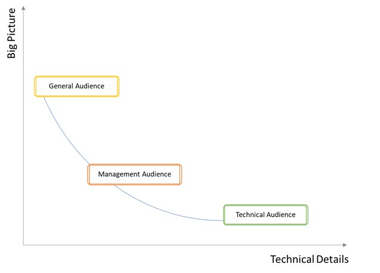
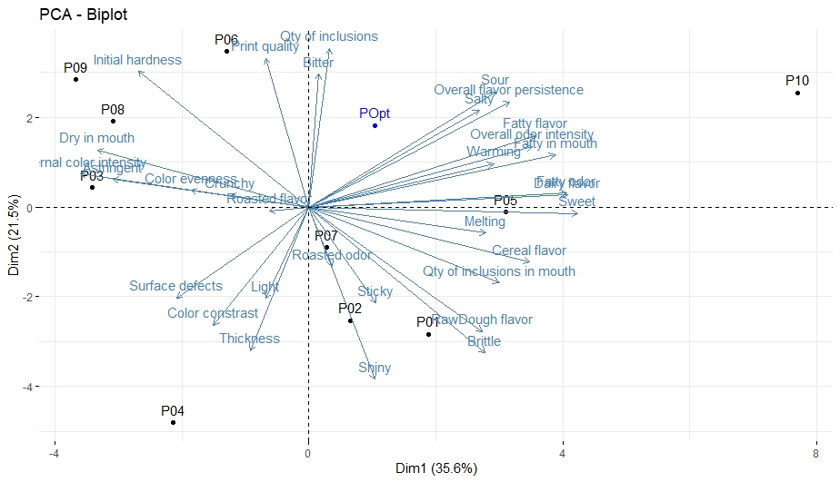
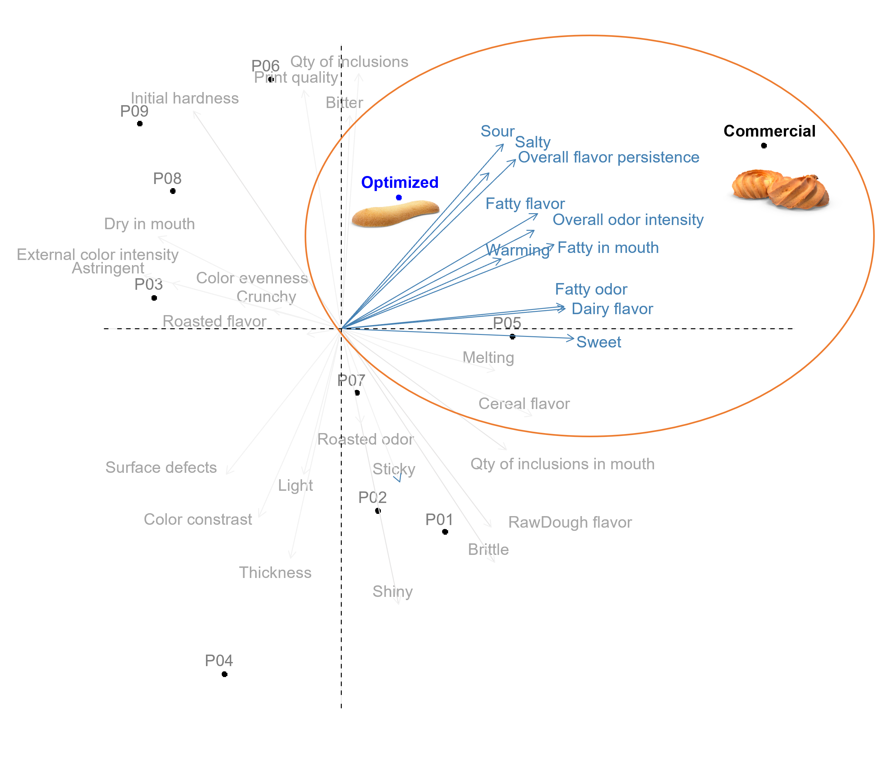

# Value Delivery {#value-delivery}

> Most of this book focus on handling data through the procedure of data cleaning, transformation, analyses, or representation. This makes sense since the aim is to present data science in the context of sensory and consumer research. But these steps may be irrelevant if analysts or reseachers are not able to communicate their findings efficiently. Effective communication is as much important as any other step and so, we will guide you through that, providing some valuable tips and practical examples. This chapter approaches important topics to help you reach the goal of successful communication, from understanding the distinction between different analysis and audience awareness to methods to communicate, the art of storytelling, and ultimately reformulate.

## How to Communicate?

Sensory and consumer scientists often act as consultant whether it be for their own company or for customers. Being able to communicate effectively is perhaps one of the most important skills they should master. Communication is a simple act of transferring information and although undervalued by many, plays a key role in any business’s success. Let’s start this chapter reminding that there are different ways to communicate, and this process usually includes a combination of two or more types of languages, which are:

* **Vocal** – the language produced by articulate sounds. It is the language used in client’s meetings and presentations for instance.
* **Non-verbally** – is related to the body language, gestures, and the tone and pitch of the voice. 
* **Written** – is the representation of a spoken language in a writing system, like proposals, technical documents, or final reports.
* **Visual** – is the communication using visual elements, such as the visual quality of presentations or other written documents, including formatting, logo, colors, figures, plots, etc. 

It is through effective communication that you will bring potential clients’ attention and interest in your company and the services you provide, that will make you truly understand your client’s needs, gain their trust and provide the right solutions that will ultimately bring to a long-term partnership. Efficacious communication will be responsible for keeping a friendly relationship and your clients' commitment throughout the project development and will also help you to properly convey the outcomes of a project in a way that will at least meet (or better surpass) your clients' expectations, and opens possibilities for follow-up engagements and/or recommendations.

The ability to communicate accurately, clearly and as intended, is definitely something that consultants should not overlook because although it seems straightforward, it involves a number of skills that may take several years of practice to master.  You will find plenty of materials on the Internet and books to help you to understand better and develop your very basic skills for effective communication. We will not focus on that in this chapter, but it is worth highlighting some important aptitudes for vocal communication, which may configure one of the most powerful types of communication with your client:

* **Confidence**: Being confident makes you be to be seen as an expert on the topic and as having the situation under control. The audience will be more likely to trust, believe, be connected, and give credit to a confident person.
* **Passion and Enthusiasm**: Be passionate about what you do, and convinced/enthusiastic about the solution you provide. The audience can easily capture that on your vocally and non-verbally language and will be much more interested if they can see and feel your passion. 
* **Ability to be succinct**. No matter how interesting you feel about a topic, you must know that the audience will lose interest after some time, especially if there is a lot of technical and detailed information. Be aware that the attention span of your audience isn’t long, so use your time wisely during the presentation, keeping it short and at the point. 
* **Feeling**. This is a skill that definitely one needs time to master, but it is crucial that you pick what is going on with your client, if they seem to be understanding and following you, or if they seem to be confused or not sure about what you are talking about.

In this chapter, we focus on four topics that we believe any successful consultant should have in mind which are: Exploratory, Explanatory and Predictive Analysis; Audience Awareness; Method to Communicate; and Storytelling.
 
## Exploratory, Explanatory and Predictive Analysis

As a consultant in the field, you likely are in a position where you get data from your client and review it, do the analysis, and ultimately, convey the results. And here is where it is important to make a clear distinction between exploratory and explanatory analysis. **Exploratory analysis** is the stage where you dig into the data, get to understand them, figure out patterns and things that may be interesting or important to highlight. The **explanatory analysis** is the ability, from the learning from the previous step, to select and/or reorganize your data (by remaking your tables, plots, or charts) in a way you can easily convey the message to your audience, and ultimately make them understand and focus on the things that are worthy. Let’s discuss that a little bit more.

The hard work starts once you get the data. This is the time you will likely analyze it in multiple ways, make several plots, and look at the data from multiple angles. This is what we call, exploratory analysis! After understanding all the analysis, it may be tempting to show the audience everything, all the steps, decisions, different plots, and approaches you have taken, but **do not do that**. You don’t want to overload your audience making them go through the same tough path you went. Instead of showing your handwork, the robustness of your analysis, and building up your credibility, you will make your audience confused, bored, and lacking interest. 

Once you have done all the hard work on data analysis, it is the moment to take some time to stand back and look at the key findings and the message(s) you want to convey. It is important to keep in mind that there is always a balance to find between presenting quantified, accurate, and credible information (i.e. with sufficient details) and presenting information that makes sense, is relevant and that is easily readable and understandable. This challenging phase is what we call explanatory analysis! This is the moment you need to use your ability to translate an extensive, detailed, and complex version of your data analysis to a more concise/holistic version, to a version that will easily and clearly convey the message and highlight the main points. Keep in mind that the explanatory analysis has to be tailored according to your audience (as discussed in the next topic), which means that the way you present the data analysis and the level of details provided vary if you are presenting it to a group of experts in the field, including statisticians and mathematicians or in a lecture for a very diverse audience, as in a conference for instance. You need to find the right balance!

Some examples in the field to exemplify the two extremes (too complicated or too simple):

* *Factorial maps* – The overuse of factorial maps is a common practice in the sensory and consumer science field. It's a great tool to explore data, to make or confirm hypotheses, but maybe not the best to communicate since not so many people can correctly read and interpret them. Therefore, a good approach would be to initially work with the factorial map to interpret and draw conclusions, but then, find another way through tables or alternative charts (that may be simpler to understand) to communicate the findings to your audience.
* *Spider Plots* – This is the other extreme when consultants can fail but not because they present a very complex and extensive analysis, but because they decide to show the data in such an easy way that puts at risk important information that should be captured. The use of spider plots is still a common practice that many people can easily understand, but the problem is that this analysis is so simple that it can mask sensory complexity. 

It is worth noticing that there is a third type of analysis in the data science field, **predictive analysis**. This is a hot topic in the area that involves techniques such as data modeling, machine learning, AI, and deep learning. Instead of being focused on exploring or explaining the data, predictive analysis is concerned with making successful predictions, in ensuring that the predictions are accurate. Examples of this approach include face recognition and text-speech transcription. Eventually, some models can be studied to provide insights, but this is not always the case.

## Audience Awareness

One of the most important things about being a successful consultant is Audience Awareness! No matter how good you, your team, and the service or product your company offers, if you fail to communicate with your target audience, the message will not get through. Knowing the audience, who the target people are is the cornerstone of any successful business. Knowing your audience makes you be better able to connect to them. 

In order to know your audience, you must gather some information about them beforehand, such as:

* **Background**: Do they have a sensory science background? Statistical background? Do they have experience in data science, including R language? Do they have experience in automated reporting dashboards, machine learning, etc? If so, are they juniors, specialists, seniors? 
* **Role**: What is the role your audience plays in the project? Are they the decisions makers? Are they the final users of a dashboard, for instance? 
* **Vocabulary**: Will your audience understand very technical terms, or do you need to use simplified terms to convey the same message? This topic is closely related to the audience’s background.
* **Expectations**: What is your audience expecting in a presentation or final report? A short summary of the project’s outcomes? A detailed explanation of the statistical analysis including appendixes with further details? Recommendations for follow-up projects? Interpretation and conclusion of the analysis?

In general, according to the profile, the audience will likely fall into one of the three categories: **Technical Audience**, **Management (Decisions Makers)**, and **General Interest**. There is no magical formula on how to deal exactly with each of these types of audience, but in general, based on our experience, we must highlight that the key differences are in the focus, language, level of technical and detailed information you need to provide for each of those target public. In general, it tends to be necessary a higher level of details and technical information and a lower level of the big picture once you move from your general interest audience to the management, and further down to the technical audience (Figure \@ref(fig:trade-off)). We will further discuss the main differences between each audience above.

```{r trade-off, fig.cap='Trade-off curve based on the level of technical details and the big picture for each type of audience.', out.width='90%', echo=FALSE, eval=TRUE}

```

### Technical Audience

The technical audience refers to the ones who will likely have a significant background and experience in or related to the field you are providing consulting service (e.g. Sensory Scientists, Statisticians, Data Analysts, Data Architecture, or your client’s IT group). They are the team that will likely be working closely with you throughout the project development, at different stages. This type of audience is usually more exigent and/or engaged and because of its expertise in the field, will likely be expecting a presentation, report, or any other technical document in a higher level of details and with a more technical vocabulary, otherwise, you will sound that you are not an expert in the topic. This audience usually needs a lower sense of the big picture of the project, which means, that they are less interested in the details like the timelines, main outcomes, etc. But be aware, it is very important to still be able to distinguish between different technical audience (e.g. don't use sensory technical language to talk to the IT team). 

### Management

Although a person in a management position (e.g. Sensory Manager or Director and Principal/Senior Scientist) likely has a broad experience and background in the field, they tend to be more interested in the whole picture, which means timelines, progress of the project, potential issues, outcomes, applicability, next steps, etc. A person in a management position has many other projects and roles in a company and will not have time to be involved in the details. Instead, they likely designate a team (your technical audience) to be closely involved. In this case, you should be more concise in a meeting, presentation, or report, for instance. It is advised to keep a certain level of technical language, but it is better to present things in a simpler way and in a lower level of details than you would do for the technical audience. Additionally, the focus should be different, since as we mentioned, this audience is likely to be more interested in the whole picture instead of the specifics of the project.

Another distinct type of audience that falls into the management audience would be the executives, as a VP of Research & Regulatory for instance. This public is not necessarily from the field and has even less time and/or background to absorb the specifics. The focus should be the same (whole picture) but with even fewer technical details. The approach and language of this audience tend to be closer to the general interest.

### General Interest

The general audience usually refers to the ones that are likely the final users or are somehow related, contributed, or are interested in the project. In this way, this public is usually the least interested in the details and the most interested in the whole picture. The general audience usually refers to a larger group of people with different backgrounds and distinct levels of expertise, for instance, an R&D internship, a Chemistry Researcher, and a Senior Sensory Specialist can be all final users of a dashboard you developed. In this case, to make sure everyone follows you in a training (say), you must use less technical language and a lower level of details, otherwise you will lose part of your audience’s attention. But at the same time, you may need to consider covering things that sound obvious to you, you ought to be careful about not skipping topics assuming that everyone knows about that or using certain terms and expressions considering that is evident for all. This can be the most challenging audience to deal with due to its diversity, but in a meeting, training session, or presentation, you should be very attentive and use your feeling to capture what's going on and maybe change your position to better connect with the audience

A valuable tip shared by Cole Nussbaumer, in her book Storytelling with data, is to avoid general audiences, such as the technical and management team at the same time, or general audience such as “anyone related to the field that might be interested in the project”. Having a broad audience will put you in a position where you can’t communicate effectively to any of them as you would be if the audience was narrowed down.

* **Example**

We will use the PCA biplot from the biscuits sensory study shown in the previous chapter and point out the main differences in the approach according to the audience. As a quick reminder, 11 breakfast biscuits with varying contents of proteins and fibers were evaluated in this study. Products `P01` to `P09` are prototypes, product `P10` is a standard commercial biscuit without enrichment and the eleventh product (`Popt`) is an additionally optimized biscuit. 

Let’s picture a situation where the R&D team has been developing multiple trials for the biscuit formulation, changing the concentration/ratio of protein and fiber, with the objective to have a product with a sensory profile as close as possible to the commercial biscuit. For this exercise, your role as a consultant was to support the R&D team designing the study and conducting the analysis and ultimately analyzing ad interpreting the results to make the final conclusion (Figure \@ref(fig:pca)). 

```{r pca, fig.cap='PCA Biplot Biscuit Study.', fig.align='center', echo=FALSE, out.width="90%", eval=TRUE}

```

We won’t go deep into the interpretation since it’s not the focus of this example, but rather point out the approach we would recommend for each type of audience as shown in the Figure \@ref(fig:summarytable1)).

```{r summarytable1, fig.cap='Exemplification of the approach for each type of audience', fig.align='center', echo=FALSE, out.width="100%", eval=TRUE}
knitr::include_graphics("images/table_value_delivery_2.png")
```


<!-- ```{r summarytable1, echo=FALSE, eval=TRUE, message=FALSE, warning=FALSE, tab.cap="Exemplification of the approach for each type of audience."} -->
<!-- library(readxl) -->
<!-- library(tidyverse) -->
<!-- library(flextable) -->

<!-- file_path <- file.path("data/table value delivery.xlsx") -->

<!-- table <- read_xlsx(file_path) %>% -->
<!--   flextable() %>% -->
<!--   bold(bold = TRUE, part = "header") %>% -->
<!--   bold(i = NULL, j = 1, bold = TRUE, part = "body") %>% -->
<!--   autofit() %>% -->
<!--   align(align = "center", part = "all") %>% -->
<!--   hline(i = 5) %>% -->
<!--   hline(i = 8) %>% -->
<!--   hline(i = 16) %>%  -->
<!--   font(fontname = "Calibri", part="all") %>%  -->
<!--   fontsize(size=9, part="all") %>%  -->
<!--   autofit() -->
<!-- ``` -->

Following those recommendations, your PCA for the management or general audience may look like Figure \@ref(fig:pcamanagement). 

Note that the PCA was simplified for a more straightforward understanding: 
- the PCA variance explanation and grid lines were removed, 
- attributes were slightly moved to avoid overlap, 
- the samples and attributes with lower interest were given a lighter color 
- the attributes and samples we want our audience to focus their attention were given a different, stronger color, 
- pictures and a more appealing description were used instead of the samples codes 
- some strategies as to circle the important area/group of samples and attributes helps the audience to focus on what we deem most important to extract from this analysis were adopted. 

In this example, the idea may be to highlight to the audience that the optimized formulation is in fact closer to the commercial one, and to increase even more this similarity, some attributes, like sour, salty, overall flavor persistence, fatty flavor, and fatty in mouth, has to be increased.

```{r pcamanagement, fig.cap='PCA Biplot Biscuit Study Modified.', fig.align='center', echo=FALSE, out.width="90%", eval=TRUE}

```

## Methods to Communicate

How will you communicate to your audience? Are you going to deliver a live presentation? Are you going to present a proposal in a live meeting? Or will the communication be a written document you will send through email?

What is the format you will be using to communicate? Word, Excel, or PowerPoint? Are you going to send the document in PDF format? Are you going to present a dashboard? Are you going to share R Scripts?

As we will discuss in more detail later, the way and the format you use to communicate to your clients or audience have a huge impact on successful communication, and you should be well aware of that!

### Consider the Mechanism 

You should be aware that the primary method or mechanism you use to communicate strongly affect the way your audience effectively gets the information and so you should tailor it accordingly. One of the most important aspects is related to the amount of control you have over the audience, how they get the information, and hence the level of details needed (@Knaflic2015). 

In a live presentation, for instance, you are in full control. You can answer questions your audience may have, you can slow down and go into a particular detail you deem important, or you can speed up over repetitive, obvious, or not-so-important topics. In short words, you are the expert there and so, you can easily provide effective communication, and because of that, you don’t need to overcrowd your slides or any other document and divert or lose your audience’s attention with unnecessary information. You can for instance just show a plot or graph and a very simple interpretation or bullet points because you are covering vocally the nuances and details about that.

In the case the communication si done through a written document in a non-live situation, you have much less control over your audience, on how they will take the information, on whether they will get the main point. In this situation, you need to be more careful and likely provide a higher level of details to answer or clarify potential questions or doubts your audience may have. In this situation, showing a plot or graph and just a very simple interpretation or bullet points is likely not enough.

It can be a great idea to merge those two formats, when possible, where you can give time to the audience to consume the information on their own for a while and give the topic thought and a moment where you can discuss it in a live situation, not in this order necessarily. So, for example, let’s pretend you have to present a proposal for a client. Instead of sending a dense document to explain all the details and just wait for the client’s response, you can make a more concise document, easier to go through if you have a live moment with the client. You can for instance present the proposal initially in a live meeting, where you cover in general all the important topics and details, and then send the written document to the client. 

### Pick the Correct Format

The second point of this topic on the method of communication is related to the correct format to pick. There are certainly many ways for you to communicate with your client - word, excel, or PowerPoint whether in pdf format or not, dashboard, or even scripts – but surely one is the most suitable. Again, there is no universal answer for the best format to pick since it may vary according to clients’ requests and the type of project you are dealing with. But there is one thing you should always follow, unless strictly necessary, do not share documents in an editable format. You may use Word to write proposals or final reports, Excel for plots or tables, and PowerPoint for live presentations, and that’s totally fine, but never share that in the editable format. We always recommend saving in pdf format to share with your client or audience and this is because of two simple reasons. First, the pdf format cannot be modified! You definitely don’t want to take the risks of others changing your document which can lead to misunderstanding, putting you in a delicate situation. Second, the pdf format preserves document formatting which means that it retains the intended format if the file is viewed online or printed. In short words, it is very unprofessional to share documents in editable format.

You may be wondering, so in what type of situation would you share an editable format? When would you share a document in Word, PowerPoint, or Excel? In the situation where you are working with a partner for instance. So, for example, a project that you are working on involves multiple partners and one unique report or presentation. In this case, it may be convenient to share the Word or PowerPoint document for each of the partners to include their inputs. After the document is ready, make sure you carefully review the formatting and save it in pdf before sending it out to the client. 

There are two other formats that may be common in the sensory data science field, which are dashboards and scripts. If you are developing a graphical user interface for your client, you need to deploy the dashboard at some point to a server for your client to be able to access it. The deployment can be done in two ways: web-based, as a simple client web page, or locally, as a locally installed desktop application. The choice should be based on the client’s preference.

The last method of communication that is fairly common in the field is R or any other programming language script. It is very common that the client requests the scripts used for a specific project, the text file containing the set of commands and comments you used for instance to develop an automated analysis reporting dashboard. You can share the repository where the scripts are hosted, or you can zip the scripts and share them with your clients. The details should be discussed with the client’s IT team since each company has a particular preference. As the scripts should always be available under the client’s requests, you should be careful to not display sensitive or confidential information by reusing codes or throughout the comments.

## Storytelling

There are basically two ways to communicate with our audience, the first is called conventional rhetoric. A PowerPoint full of facts, filled with bullet points and statistics with a presenter with a formal and memorized speech and using the same voice tone, would be the best way to illustrate the conventional rhetoric style. This way to communicate, which drove the businesses of the past, has a more analytical approach, where statistics, charts, metrics would be dumped on the audience and left to them to digest. There is no need to say that this approach is completely outdated, it clearly fails to stimulate the audience’s attention or evoke their energy or emotions. 
The second way to communicate, which is the last topic we want to cover in this chapter and also happens to be a critical skill for any successful consultant, is through storytelling! Storytelling is something that we all know, from an early age we were introduced to the notion of narrative structure, which means a clear beginning, middle, and end. The ability of one going throughout this structure to tell us a story is what makes a book, play, or movie grab our attention and evoke our emotional responses, is what makes it interesting! In short words, storytelling is one of the most powerful and effective ways to attract people’s attention because we were taught to communicate with stories throughout history. This universal language that everyone can understand has the power to truly engage your audience because it translates abstract facts, numbers, and plots into compelling pictures; it inspires, motivates, and drive actions because it taps into people’s emotions.

As described in the book *Once Upon an Innovation*, by Jean Storlie and Mimi Sherlock (@Sherlock2020), the left side of our brain is linked to more logical and analytical thinking, including data processing, number handling, and statistical interpretations. The right side is linked to expression, emotional intelligence, and imagination, and in our context, will be the part of our brain that will capture the big picture, that will turn data and facts into possibilities and innovative ideas. If you as a consultant overwhelms your audience with analytics you will reduce their capacity for big picture thinking, you will shut down their capability to generate novel ideas and solutions. We are not saying that numbers, plots, and facts are not important, but that they should be presented in a story narrative format, in a way that will be able to light up the right side of the brain, and this stimulation of both paths is what trigger unexpected and novel solutions, inspire support and drive changes.

In a real situation, you as a consultant have many pieces of information that you have collected throughout the journey with a client, from the very first communication until the end of a project. You have valuable information about your client company’s situation, challenges and issues, needs, expectations, potential solutions and/or failed attempts, and final outcomes. Storytelling is the master of tying all together and articulating it into the context of a story in a creative way to engage and persuade your audience. A good story allows you to successfully connect with your audience, it makes your audience understand, reflect, and act in a way that plots, numbers, and facts altogether simply can’t. 

You may be wondering. How exactly should I construct a story? What should be covered in each piece of the narrative? We will provide here a summary of the pieces of a good story and the specifics based on our experience and also on the books Storytelling with Data by Cole Nussbaumer (@Knaflic2015) and Beyond Bullet Points by Cliff Atkinson (@Cliff2018). Both books dedicate a good part to Storytelling making them a great resource on this topic.

**The beginning (Context)**

The key piece of any story is the context, the description of the situation, and surrounding details. This first step is the moment to set up the essential information or background on the topic you will be covering to get everyone on common ground. You should initially spend time to make sure your audience clearly understands the context, why this is important or necessary, and why they are there before diving into actions or results. Subsequently, you will raise the challenges or problems and propose some recommended solutions. It is at this very first step that you will first grab your audience’s attention. If you fail at this moment, it is very unlikely that you will recover their interest in the subsequent steps.

For live presentations, it is strongly recommended to use the first few minutes to be an icebreaker to make everyone feel more comfortable and create a more friendly environment. In order to do so, you can start introducing yourself in case you haven’t met everyone yet, you can have a conversation and talk about the latest news, ask about how they and their families are doing, etc.  The second piece of advice is to start the presentation by stating bullets of the main points that will be covered, so your audience will have awareness of what you will be talking about.

**The middle (Action and Impact)**

Now is when you get to the crux of your story, it is at this moment that you will explain your solutions or actions and highlight the impacts. You will continue it in a way you will convince your audience of the solution you are proposing or make them clearly understand, agree, and be excited about the outcomes and possibilities of a solution you worked on. You should be careful to retain your audience’s attention addressing how they can be part and/or benefit from the solution you are referring to. In the case of a live presentation, pose always confidently, show enthusiasm about what you are talking about, and watch out for hidden clues, try to constantly catch your audience’s response/feedback through their expressions and body language. 

The content to build out your story at this moment is very dependent on the context of the situation, but from a consultant perspective, it will be likely the moment you will further develop the situation or problem covering relevant information, show some data to illustrate the situation, discuss potential solutions to address a particular topic or present the outcomes of your project. 

**The end (Conclusion)**

This is the moment you close your story; it is when you should tie it back to the beginning to somehow recap the problem, highlight the basic idea and conclude the story. You should finish your presentation in an impactful way, re-emphasizing and repeating your main point, what you want to stick deeply in your audience’s mind. Once more, the content at the end of the story can be somehow dependent on the context of the situation, but in a consulting world, it would likely include a conclusion of the topic and also next steps and further recommendations.

## Reformulate {#reformulate2}

Something important to keep in mind is the follow-up process after a report is sent or a presentation is delivered. The ability to receive feedback and reformulate is undoubtedly a very important and sometimes challenging skill that consultants seeking success should be aware of. It may be challenging since some consultants can be reluctant to feedback because of a misconception that they are the expert in the field and hence, their approach is the best. So, one of the most important rules, regardless of the expertise and knowledge you have in the field, is to be humble! Consultants must understand the idea that: 1) you need to make your client pleased unless you have a strong reason not to do so like ethical reasons or statistical rules and 2) your point of view can be biased over time and your client’s request may indeed improve the clarity of an outcome for instance. Or, you can simply be wrong, miss something and have not taken the best approach. It happens! So, be open to feedback and be prepared to reformulate! 

Sometimes the client feedback is something very minor, to adjust the scale of a plot, match the color with the company’s palette or change the type of plot. In other cases, the feedback will demand a bit more time. It is common that the way you deemed best to present the outcomes is not that clear from your client’s view or the set of data or plots you selected did not convey the message you were expecting or in an extreme situation, your client does not agree or ask you to redo an experiment or procedure. In this case, you will need to dedicate more time to address your client’s request.

Regardless of the situation, you should be motivated and be open mind to your client’s feedback and afterward carefully work on that to tackle it all at once. You definitely want to avoid a situation where your report or presentation be back and forth with your client. It is recommended that you make all possible changes and prepare a convincing explanation for the things that you strongly do not agree with or have a solid reason not to do so. Ideally, you should get back to your client as soon as possible highlighting the changes that were made and explaining the ones not addressed. 
