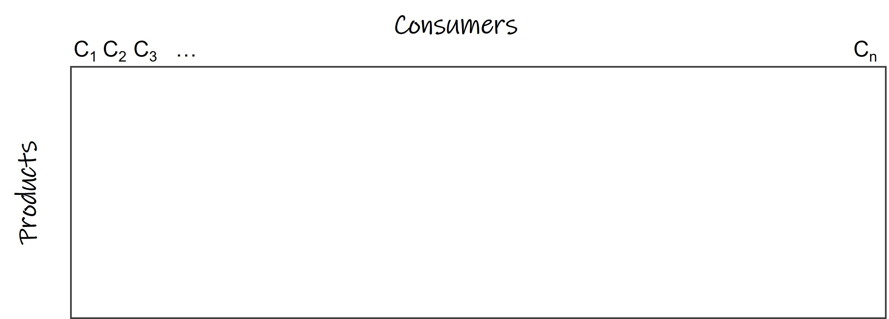

---
output:
  pdf_document: default
  html_document: default
---
```{r include=FALSE}
knitr::opts_chunk$set(echo = TRUE, eval = FALSE)
```
# Bienvenue! {#bienvenue}

## Why Data Science for Sensory and Consumer Science? {-}

Located at the crossroads of biology, social science, and design, sensory and consumer science (SCS) is definitely the tastiest of all sciences. On the menu is a wide diversity of products and experiences that sensory and consumer scientists approach through the lens of human senses. Thanks to a wide set of refined methods, they have access to rich, complex and mouthwatering data. Delightedly, data science empowers them and leads them to explore new flavorful territories.

### Core principles in Sensory and Consumer Science {-}

Sensory and consumer science is considered as a pillar of food science and technology and is essential to product development, quality control and market research. Most scientific and methodological advances in the field are applied to food. This book makes no exception as we chose a cookie formulation dataset as a main thread. However, SCS widely applies to many other consumer goods; so are the content of this book and the principles set out below.

#### Measuring and analyzing human responses {-}
Sensory and consumer science aims at measuring and understanding consumers’ sensory perceptions as well as the judgement, emotions and behaviors that may arise from these perceptions. SCS is thus primarily a science of measurement, although a very particular one that uses human beings and their senses as measuring instruments. In other words, sensory and consumer researchers measure and analyze human responses.

To this end, SCS relies essentially on sensory evaluation which comprises a set of techniques that mostly derive from psychophysics and behavioral research. It uses psychological models to help separate signal from noise in collected data [@lee2004; @Ennis2016Thurstonian]. Besides, sensory evaluation has developed its own methodological framework that includes most refined techniques for the accurate measurement of product sensory properties while minimizing the potentially biasing effects of brand identity and the influence of other external information on consumer perception [@LawlessHeym2010].

A detailed description of sensory methods is beyond the scope of this book and many textbooks on sensory evaluation methods are available to readers seeking more information. However, just to give a brief overview, it is worth remembering that sensory methods can be roughly divided into three categories, each of them bearing many variants:

*	Discrimination tests that aim at detecting subtle differences between products. 
*	Descriptive analysis (DA), also referred to as ‘sensory profiling’, aims at providing both qualitative and quantitative information about products' sensory properties.
*	Affective tests. This category includes hedonic tests that aim at measuring consumers’ liking for the tested products or their preferences among a product set.

Each test category generates its own type of data and related statistical questions in relation to the objectives of the study. Typically, data from difference tests with forced-choice procedures (e.g. triangle test, duo-trio, 2-AFC, etc.) consist in series of binary answers (correct/failed) depending on whether judges successfully picked the odd sample(s) among a set of three or more samples ^[Other procedures like the *different from control* test or the *degree of difference* test generate rating data]. These data are used to determine whether the number of correct choices is above the level expected by chance [see @OMahonyRousseau2003 for an overview of these methods, the related theories and experimental factors].

Conventional descriptive analysis data consist in intensity scores given by each panelist to evaluated samples on a series of sensory attributes, hence resulting in a product x attribute x panelist dataset (Figure \@ref(fig:DAdata)). Note that depending on the DA method, quantifying means other than intensity ratings can be used (ranks, frequency, counts, etc.). Most frequently, each panelist evaluates all the samples in the product set. However, the use of a balanced incomplete design can also be found when the experimenters aim to limit the number of samples evaluated by each subject.

```{r DAdata, fig.cap='Typical structure of a Descriptive Analysis dataset', fig.align='center', echo=FALSE, eval=TRUE}
knitr::include_graphics("images/DA_data.jpg")
```

Eventually, datasets from hedonic tests consist of hedonic scores (i.e. degrees of liking, or preference ranks) given by each interviewed consumer to a series of products (Figure \@ref(fig:hedodata)). As in the case of DA, each consumer usually evaluates all the samples in the product set, but balanced incomplete designs are sometimes used too. In addition, some companies favor pure monadic evaluation of products (i.e. between-subject design or independent groups design) which obviously result in unrelated sample datasets.

```{r hedodata, fig.cap='Two-way hedonic data from a consumer test where *n* consumers have evaluated a series of products', fig.align='center', echo=FALSE, eval=TRUE}

```

Sensory and consumer researchers also borrow methods from other fields, in particular from sociology and experimental psychology. As a result, it is now frequent to collect textual sensory data from open comments and qualitative interviews, or sensory distances or co-occurrences from projective and sorting tasks. Definitely a multidisciplinary area, SCS develops in many directions and reaches disciplines that range from genetics and physiology to social marketing, behavioral economics and computational neuroscience. So have diversified the types of data sensory and consumer scientists must deal with. As in many scientific fields, the development of sophisticated statistical techniques and access to powerful data analysis tools have played an important role in the evolution of sensory & consumer science. Statisticians and data analysts in SCS have developed their own field of research, coined Sensometrics [@Schlich1993; @Brockhoff2011; @Qannari2017]. Now then, what makes sensory & consumer science special? And how does it influence the way sensory and consumer data are handled?

#### Dealing with human diversity {-}
Sensory evaluation attempts to isolate the sensory properties of foods and provides important and useful information about these properties to product developers, food scientists, and managers [@LawlessHeym2010]. However, one should bear in mind that these 'sensory properties' actually result from the interaction between the object (the food) and the perceiver of that object (the consumer). In fact, we may very well consider the true object of evaluation in SCS to be mental representations. They are nonetheless very concrete and directly impact behaviors, health and economic decisions [@Kahneman2000].
A direct consequence of this is that sensory data depend both on the product to be evaluated and on the subjects who evaluate the product. Because people are different, individual sensory data are expected to differ accordingly. In its core principle, SCS recognizes the diversity of human beings, biologically, socially and culturally speaking, not to mention the fact that each individual has their own personal history and experience with products. In short, people perceive things differently and like different things. For this reason, SCS only relies on groups of people (i.e. a panel of judges, a sample of consumers) and never on a single individual's response. Yet, sensory and consumer scientists usually collect individual data and analyze them at a refined level of granularity (individual, subgroups) before considering larger groups (specific populations or marketing targets).

This said, sensory and consumer studies must lead to operational recommendations. They are used to make informed decisions on product development, to launch new product, and sometimes to help define food and health policies. Data science can precisely help sensory and consumer scientists to reach those objectives while taking diversity into account.

For measures of sensory description, sensory and consumer scientists can manage the diversity of human responses to a certain extent by training panels to use a consensual vocabulary, by aligning evaluated concepts and calibrating the quantification of evaluations on scales [@Bleibaum2020]. However, this won't eliminate interindividual differences in sensitivity, simply because we are genetically different, on top of differences due to age, physiological state, illness, etc. Nowadays, as the field becomes more and more consumer-oriented, it becomes clear that the use of several subjects in a panel cannot be assimilated to a mere repetition of individual measurements. Accordingly, sensory methods have been developed to allow panelists to better express their own perceptions and to get a more accurate picture of how people perceive products [@Varela2012]. These methods yield richer and more complex data that require more advanced analysis techniques to extract relevant and actionable information. Historically, one the first methodological innovations in this direction has been the use of free choice profiling combined to Generalized Procrustes Analysis [@Williams1984]. Since then, sensory and data analysis methods have multiplied greatly [@Delarue2022]. Naturally, data science has become even more crucial to accompany this evolution.

As regards hedonic tests (liking, acceptance, preference...), the measurements are in essence subjective and participants to such tests are by definition 'untrained' consumers. A constant outcome of these tests is to find important interindividual differences and it is very common to find consumers who have opposite sensory preference patterns. Clustering and segmentation techniques are thus routinely applied to consumer data. One difficulty though, is to link these differences in preferences to other consumer variables, should they be sociodemographic, psychographic, or related to usage and attitudes. Most often, one set of variables (e.g. demographics) is not enough to fully explain preference patterns. In saturated and ever changing markets however, being able to understand individual needs and preferences is critical should one intend to develop customized products. This makes the understanding of consumer segments even more important. Nowadays, these segments go far beyond sensory preferences and must take into account variables that touch environmental awareness and sustainability dimensions.

#### Specificities of data handled in sensory and consumer science {-}

Sensory and consumer data are usually of relatively small size. Indeed, we often deal with a number of subjects ranging between a dozen (for trained panels) and few hundreds (for consumer hedonic tests). Of course, when multiplied by the number of samples being evaluated by each subject, we would get a much larger numbers of observations, but this will still be relatively modest compared with so-called big data generated everywhere online. The same goes with the number of variables in sensory data sets. Sensory descriptive analysis, for example, typically relies on 10 to 50 attributes, which could be seen as a lot but is in fact much less than in other fields producing experimental data with thousands of variables like chemometrics, genomics, etc.

This being said, it must be stressed that sensory and consumer data are very diverse. Indeed, the need to understand perceptions and preferences often leads sensory and consumer scientists to deal with multiple datasets, each possibly comprising various data types. Most sensory techniques yield quantitative (e.g. intensity, similarity, hedonic) data collected from rating scales or ranking tasks, but other methods would provide inter-product distances (e.g. napping), co-occurrences (e.g. free sorting), citation frequencies (e.g. CATA), or texts (e.g. open-ended comments, natural speech). Besides, agreement scores from Likert scales would often be used when sensory studies are combined with usage and attitude surveys or psychometrics questionnaires. To add richer information, but more complexity to this picture, experimenters are sometimes interested the temporal dimension of sensory measurements (by the means of methods like TI, TDS, TCATA) or may simply aim to measure reaction times (e.g. Implicit Association Test).  
Eventually, different type of data can result from the same task. For example, this would typically be the case for *free JAR* that yields both categorization data with hedonic valence and textual data [@Luc2022]. With the development of all sorts of media and data collection means, such patterns will surely become even more frequent.  

```{r multipledata, fig.cap='Sensory and consumer science studies often yield multiple dataset that may all relate to each other', fig.align='center', echo=FALSE, eval=TRUE}
knitr::include_graphics("images/multiple_data.jpg")
```

As could be expected, sensory and consumer studies are often multifaceted and collected data may all relate to each other when they apply to the same product set and/or to the same consumers (Figure \@ref(fig:multipledata)). Such links between datasets are usually sought because they allow uncovering consumers' motivations and their drivers of preferences, thanks to modeling techniques (e.g. preference mapping, PLS regression), segmentation analyses (e.g. latent variables clustering), and machine learning. As a prerequisite to the application of any of these techniques though, it is critical to understand how these data are structured, and to properly handle them in a reliable and efficient manner. Many examples of such data manipulation are given throughout this book and specific guidance is given in Chapter \@ref(data-manip).  

Last, it is worth mentioning that sensory and consumer data are intrinsically subjective. This is of course a good thing because the goal of any sensory study is to capture subjects' point of view. However, it could make some of the usual data quality criteria useless. This is specially true for hedonic data, for which repeatability and reference values could be questionable notions [@Koster2003; @Kosteretal2003]. Sensory and consumer scientists may nonetheless rely on techniques allowing them to evaluate the degree of consensus of their panel, or tools like jackknife and bootstrap to evaluate the robustness of their data.


### Computational Sensory Science {-}

We can make an analogy of the future (or maybe the present already) of the sensory and consumer  science field with other areas that advanced into the computational field, such as computational neuroscience and computational biology. A quick search in Wikipedia on the definition of those fields and a little about on how those areas evolved or how the term 'computational' was introduced will make you realize that is the same path as the consumer and sensory field is moving along.

- **Computational neuroscience**: "is a branch of neuroscience which employs mathematical models, computer simulations, theoretical analysis and abstractions of the brain to understand the principles that govern the development, structure, physiology and cognitive abilities of the nervous system. The term 'computational neuroscience' was introduced to provide a summary of the current status of a field which was referred to by a variety of names, such as neural modeling, brain theory and neural networks." (https://en.wikipedia.org/wiki/Computational_neuroscience)

- **Computational biology**: is a branch of biology that "involves the development and application of data-analytical and theoretical methods, mathematical modelling and computational simulation techniques to the study of biological, ecological, behavioral, and social systems. Computational biology, which includes many aspects of bioinformatics and much more, is the science of using biological data to develop algorithms or models in order to understand biological systems and relationships." (https://en.wikipedia.org/wiki/Statistical_model)

The sensory and consumer science field although not officially named with the term 'computational', is already expanded in this field. The way consumer and sensory data is explored today is extremely advanced and went way beyond the simple statistical analysis performed a few years ago using the data collected from standard consumer or trained panel studies. Nowadays, sensory is getting into the big data field by organizing and putting together years of historical data into a database to answer future business questions and extract meaningful information.

Advances in digital technologies such as the integration of biometrics to assess consumers' physiological and emotional responses, incorporation of virtual, augmented, and mixed reality, and even the use of sensor technologies (*'electronic noses and tongues'*) for sensory analysis are already widely used in the field. Additionally, data is being collected from different sources, such as social media. Those advanced technologies and complex data being extracted require much more advanced tools and computer capabilities to analyze and get meaningful information. 

Rapid data acquisition, allied with the need for flexible, customized, and fast results interpretation, is opening a huge way for automation. The urge to deep explore, segment products/consumer, and discover new or hidden patterns and relationships to get the most valuable insights from the data sets is also nurturing the implementation of Artificial Intelligence, particularly Machine Learning.

At this point, we hope to have motivated you even more about the importance of data science for practitioners or students of sensory and consumer science who want to participate in the emerging field of computational sensory science. 

Let's get started?