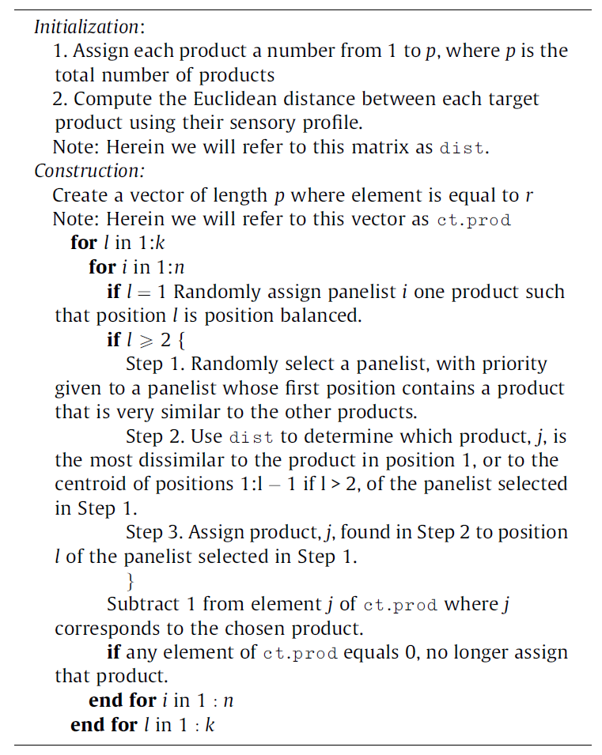

---
output:
  pdf_document: default
  html_document: default
---
```{r include=FALSE}
knitr::opts_chunk$set(echo = TRUE, eval = TRUE)
```

# Data Collection {#data-collection}

> Before any statistical analysis and vizualizations, robust data need to be collected. This important step often requires a *proper* experimental design, i.e. an experimental design that would assure relevant and meaningful data are obtained with maximum efficiency to answer our research questions. This chapter approaches all the required steps to reach such goal, from setting up the test (e.g. estimation of the number of panelists, design of sensory evaluation sessions and design of experiments), to the collection of data (through valuable execution tips) and its importation in a statistical software (R, here).

Like with any other chapter, let's start by loading the `{tidyverse}`.

```{r, eval=TRUE, echo=TRUE, message=FALSE, warning=FALSE}
library(tidyverse)
```


## Designs of sensory (DoE) experiments

### General approach

Sensory and consumer science relies on experiments during which subjects usually evaluate several samples one after the other. This type of procedure is called 'monadic sequential' and is common practice for all three main categories of tests (difference testing, descriptive analysis, hedonic testing). The main advantage of proceeding this way is that responses are within-subjects (data can be analyzed at the individual level) so that analysis and interpretation can account for inter-individual differences, which is a constant feature of sensory data.

However, this type of approach also comes with drawbacks^[Market researchers would argue that evaluating several products in a row doesn't usually happen in real life and that proceeding this way may induce response biases. They thus advocate the use of pure monadic designs in which participants are only given one sample to evaluate. This corresponds to a between-group design that is also frequently used in fields where only one treatment per subject is possible (drug testing, nutrition studies, etc.).] as it may imply order effects and carry-over effects [@Macfie1989]. Fortunately, most of these effects can be controlled with a proper design of experiment (DoE). A good design ensures that order and carry-over effects are not confounded with what you are actually interested to measure (most frequently, the differences between products) by balancing these effects across the panel. However, it is important to note that the design does not eliminate these effects and that each subject in your panel may still experience an order and a carry-over effect, as well as boredom, sensory fatigue, etc.

Before going any further into the design of sensory evaluation sessions, it is important to first estimate the number of panelists needed for your study. For that, you may rely on common practices. For instance, most descriptive analysis studies with trained panelists are typically conducted with 10-20 judges, whereas 100 participants is usually considered as a minimum for hedonic tests. Of course, these are only ballpark numbers and they must be adjusted to the characteristics of the population you are interested in and to the specifics of your study objectives. In all cases, a power analysis would be wise to make sure that you have a good rationale for your proposed sample size, especially for studies involving consumers. The `{pwr}` package provides a very easy way to do that, as shown in the example code below for a comparison between two products on a paired basis (such as in monadic sequential design). Note that you need to provide an effect size (expressed here by Cohen’s *d*, which is the difference you aim to detect divided by the estimated standard deviation of your population).

```{r, eval=TRUE, echo=TRUE}
library(pwr)
pwr.t.test(n=NULL, sig.level=0.05, type="paired", alternative="two.sided", power=0.8, d=0.3)
```

For discrimination tests (e.g. tetrad, 2-AFC, etc.), the reader may also refer to the `{sensR}` package and its `discrimSS()` function for the sample size calculation in both difference or similarity testing context.

### Crossover designs {#Crossover}

For any sensory experiment that implies the evaluation of more than one sample, first-order and/or carry-over effects should be expected. That is to say, the evaluation of a sample may affect the evaluation of the next sample even though sensory scientists try to lower such effects by asking panelists to pause between samples and use of appropriate mouth-cleansing techniques (drinking water, eating unsalted crackers, or a piece of apple, etc.). The use of crossover designs is thus highly recommended [@Macfie1989]. 

Williams's Latin-Square designs offer a perfect solution to balance carry-over effects. They are very simple to create using the `williams()` function from the `{crossdes}` package. For instance, if you have five samples to test, `williams(5)` would create a 10x5 matrix containing the position at which each of three samples should be evaluated by 10 judges (the required number of judges per design block).

Alternately, the `WilliamsDesign()` function in `{SensoMineR}` allows you to create a matrix of samples (as numbers) with numbered `Judges` as row names and numbered `Ranks` as column names. You only have to specify the number of samples to be evaluated, as in the example below for 5 samples. 

```{r, eval=TRUE, echo=TRUE, warning=FALSE, message=FALSE}
library(SensoMineR)
wdes_5P10J <- WilliamsDesign(5)
```

```{r, eval=TRUE, echo=FALSE}
wdes_5P10J
```

Suppose you want to include 20 judges in the experiment, you would then need to duplicate the initial design.

```{r, echo=TRUE, eval=TRUE}
wdes_5P20J <- do.call(rbind, replicate(2, wdes_5P10J, simplify=FALSE))
rownames(wdes_5P20J) <- paste("judge", 1:20, sep="")
```

```{r, eval=TRUE, echo=FALSE}
wdes_5P20J
```

The downside of Williams's Latin square designs is that the number of samples (*k*) to be evaluated dictates the number of judges. For an even number of samples you must have a multiple of *k* judges, and a multiple of *2k* judges for an odd number of samples.

As the total number of judges in your study may not always be exactly known in advance (e.g. participants not showing up to your test, extra participants recruited at the last minute), it can be useful to add some flexibility to the design. Of course, additional rows would depart from the perfectly balanced design, but it is possible to optimize them using Federov's algorithm thanks to the `optFederov()` function of the `{AlgDesign}` package, by specifying `augment = TRUE`. For example we can add three more judges to the Williams Latin square design that we just built for *nbP=*5 products and 10 judges, hence leading to a total number of *nbP=*13 judges. Note that this experiment is designed so that each judge will evaluate all the products, therefore the number of samples per judge (*nbR*) equals the number of products (*nbP*).

```{r, eval=TRUE, echo=TRUE, message=FALSE, warning=FALSE}
library(AlgDesign)
nbJ=13
nbP=5
nbR=nbP

wdes_5P10J <- WilliamsDesign(nbP)
tab <- cbind(prod=as.vector(t(wdes_5P10J)), judge=rep(1:nbJ,each=nbR), rank=rep(1:nbR,nbJ))
optdes_5P13J <- optFederov(~prod+judge+rank, data=tab, augment=TRUE, nTrials=nbJ*nbP, rows=1:(nbJ*nbP), nRepeats = 100)
xtabs(optdes_5P13J$design)
```

In the code above, `xtabs()` is used to arrange the design in a table format that is convenient for the experimenter.

Note that it would also be possible to start from an optimal design and expand it to add one judge at a time. The code below first builds a design for 5 products and 13 judges and then adds one judge to make the design optimal for 5 products and 14 judges.

```{r, echo=TRUE, eval=TRUE}
nbJ=13
nbP=5
nbR=nbP

optdes_5P13J <- optimaldesign(nbP, nbP, nbR)$design
tab <- cbind(prod=as.vector(t(optdes_5P13J)),judge=rep(1:nbJ,each=nbR),rank=rep(1:nbR,nbJ))
add <- cbind(prod=rep(1:nbP,nbR),judge=rep(nbJ+1,nbP*nbR),rank=rep(1:nbR,each=nbP))

optdes_5P14J <- optFederov(~prod+judge+rank,data=rbind(tab,add), augment=TRUE, nTrials=(nbJ+1)*nbP,
                          rows=1:(nbJ*nbP), nRepeats = 100)
```

<!-- Can we make it so that this table is visually appealing and more readable? -->

### Balanced incomplete block designs (BIBD) {#BIBD}

Sensory and consumer scientists may sometimes consider using incomplete designs, i.e. experiments in which each judge evaluates only a subset of the complete product set [@Wakeling1995]. In this case, the number of samples evaluated by each judge remains constant but is lower than the total number of products included in the study. 

You might want to choose this approach for example if you want to reduce the workload for each panelist and limit sensory fatigue, boredom and inattention. It might also be useful when you cannot "afford" a complete design because of sample-related constraints (limited production capacity, very expensive samples, etc.). The challenge then, is to balance sample evaluation across the panel as well as the context (i.e. other samples) in which each sample is being evaluated. For such a design you thus want each pair of products to be evaluated together the same number of times.

The `optimaldesign()` function of `{SensoMineR}` can be used to search for a Balanced Incomplete Block Design (BIBD). For instance, let's imagine that 10 panelists are evalauting 3 out of 5 possible samples. The design can be defined as following:

```{r, eval=TRUE, echo=TRUE}
incompDesign1 <- optimaldesign(nbPanelist=10, nbProd=5, nbProdByPanelist=3)
incompDesign1$design
```

BIBD are only possible for certain combinations of numbers of treatment (products), numbers of blocks (judges), and block size (number of samples per judge). Note that `optimaldesign()` will yield a design even if it is not balanced but it will also generate contingency tables allowing you to evaluate the design's orthogonality, and how well balanced are order and carry-over effects.

You can also use the `{crossdes}` package to generate a BIBD with this simple syntax: `find.BIB(trt, b, k, iter)`, with `trt` the number of products (here 5), `b` the number of judges (here 10), `k` the number of samples per judge (here 3), and `iter` the number of iteration (30 by default). Furthermore, the `isGYD()` functions evaluates whether the incomplete design generated is balanced or not. If the design is a BIBD, you may then use `williams.BIB()` to combine it with a Williams design to balance carry-over effects.

```{r, eval=FALSE, echo=TRUE}
library(crossdes)
incompDesign2 <- find.BIB(trt=5, b=10, k=3)
isGYD(incompDesign2)
williams.BIB(incompDesign2)
```

Incomplete balanced designs also have drawbacks. First, from a purely statistical perspective, they are conducive to fewer observations and thus to a lower statistical power. Product and Judge effects are also partially confounded even though the confusion is usually considered as acceptable.

### Incomplete designs for hedonic tests: Sensory informed designs

One may also be tempted to use incomplete balanced block designs for hedonic tests. However, proceeding this way is likely to induce framing bias. Indeed, each participant will only see part of the product set which would affect their frame of reference if the subset of product they evaluate only covers a limited area of the sensory space. 

Suppose you are designing a consumer test of chocolate chip cookies in which a majority of cookies are made with milk chocolate while a few cookies are made with dark chocolate chips. If a participant only evaluates samples that have milk chocolate chips, this participant will not know about the existence of dark chocolate and will potentially give very different scores compared to what they would have if they had a full view of the product category.

To reduce the risks incurred by the use of BIBD, an alternative strategy is to use a sensory informed design. Its principle is to allocate each panelist a subset of products that best cover the sensory diversity of the initial product set. Pragmatically, this amounts to maximizing the sensory distance between drawn products [@Franczak2015]. Of course, this supposes that one has sensory data to rely on in the first place. 

```{r fig.align='center', echo=FALSE, eval=TRUE}
# pseudo-code for sensory informed design (Franczak et al., 2015)

```

## Product-related designs

Because of their contribution to product development, sensory and consumer scientists often deal with DoE other than sensory designs strictly speaking [see for instance @gacula2008design]. Sensory-driven product development is indeed very frequent and implies strong interconnection between the measure of sensory responses and the manipulation of product variables (e.g. ingredients) or process variables (e.g. cooking parameters) [for a review, see @Yu2018]. 

In order to get the most of sensory experiments, it is thus essential to ensure that the products or prototypes to be tested will be conducive to sound and conclusive data. First and foremost, as in any experimental science, one wants to avoid confounding effects. In addition to this and to put it more generally, the goal of DoE is to define which trials to run in order to be able to draw reliable conclusions without spending time and resources on unnecessary trials. In other words, one seeks maximum efficiency. This is especially critical in sensory science to limit the number of products to be evaluated and to keep panelists' workload under control.

### Factorial designs

Full factorial designs are of course commonly used and their application is usually straightforward. They won't be detailed here. However, it is worth noting that when the number of factors increases, the corresponding number of trials can quickly become daunting (e.g., *2^k^* trials for a two-level design with *k* factors). Thus, always in the view of sparing experimental resources, incomplete and fractional designs are frequently used. 

Several strategies can be used to define which experiments to conduct [@Dean2017, @Lawson2014, @Rasch2011]. One option would be to build an optimal design thanks to the `{AlgDesign}` or the `{OptimalDesign}` packages that calculate experimental designs for D, A and I criteria. An example is given below in the case of a mixture design but would apply to regular factorial designs as well.

<!-- Vanessa: Maybe it's good to clarify what D, A and I criteria are / Ref have to be fixed in this part 
Thierry: should it be: "calculate experimental by maximizing/minimizing D, A, or I criteria"?--> 

### Mixture designs

In many projects  (e.g. in the food industry, in the personal care industry), optimizing a product's formula implies adjusting the proportions of its ingredients. In such cases, the proportions are interdependent (the total sum of all components of a mixture must be 100%). Therefore, these factors (the proportions) must be treated as mixture components. Mixture designs are usually represented using ternary diagrams.

The `{mixexp}` package offers a very convenient way to do this. In addition to creating the design, `DesignPoints()` allows to display the corresponding ternary diagram. Below is the example of a simplex-lattice design for 3 components and 3 levels obtained thanks to function `SLD`:

```{r echo=TRUE, eval=TRUE, message=FALSE, warning=FALSE}
library(mixexp)
mdes <- SLD(fac=3, lev=3)
DesignPoints(mdes)
```

Suppose that we want to adjust a biscuit recipe to optimize its sensory properties, we can design an experiment in which the proportion of ingredients vary. Let's play with butter, sugar, and flour. All three combined would account for 75% of the dough recipe and the remaining 25% would consist of other ingredients that we won't modify here (eggs, milk, chocolate, etc.). Besides, not any amount of these three ingredients would make sense (a biscuit with 75% of butter is not a biscuit, even in Brittany). We thus need to add constraints (ex: butter varies between 15 and 30% of this blend, sugar varies between 25 and 40%, and flour varies between 30 and 50%). Given this set of constraints (defined by `uc` for the upper contraints, and `lc` for the lower constraints), we can use `mixexp::Xvert` to find the extreme vertices of our design (by also including a edge centroid using `ndm=1`):

```{r, eval=TRUE, echo=TRUE}
mdes2 <- Xvert(nfac=3, uc=c(.30, .40, .50), lc=c(.15, .25, .30), ndm = 1, plot = FALSE) %>% 
      mutate(across(where(is.numeric), round, digits = 3))
```

However, this design implies creating 11 mixtures, which is more than needed to apply a Scheffé quadratic model [@Lawson2016]. To reduce the number of mixtures and still allow fitting a quadratic model, we can use the `optFederov()` function from `{AlgDesign}` to select a D-optimal subset. Here, let's limit to 9 products (`nTrials=9`).

```{r echo=TRUE, eval=TRUE, message=FALSE, warning=FALSE}
MixBiscuits <- optFederov(~ -1+x1+x2+x3+x1:x2+x1:x3+x2:x3+x1:x2:x3, mdes2, nTrials=9)
DesignPoints(MixBiscuits$design, axislabs = c("Butter","Sugar","Flour"), pseudo = TRUE)
```

Once the design is built, it could be desirable to randomize the order in which each sample is being made, to avoid further biases. Suppose that we obtain average liking scores for our 9 biscuits as given in Table \@ref(tab:biscuit-mixt) and stored in `Bmixt`:

```{r, eval=TRUE, echo=TRUE}
Bmixt <- MixBiscuits$design %>%
  as_tibble() %>%
  dplyr::select(-4) %>%
  mutate(Product = c("A", "B", "C", "D", "E", "F", "G", "H", "I"), .before=x1) %>%
  mutate(scores = c(7.5, 5.4, 5.5, 7.0, 6.0, 8.0, 5.8, 6.8, 7.9)) %>%
  rename("Butter"=x1, "Sugar"=x2, "Flour"=x3, "Liking"=scores)
```

```{r eval=TRUE, echo=FALSE, message=FALSE, warning=FALSE, label="biscuit-mixt", tab.cap="Average liking scores obtained for the biscuits from the mixture design"}
MixBiscuits$design %>%
  as_tibble() %>%
  dplyr::select(-4) %>%
  mutate(Product = c("A", "B", "C", "D", "E", "F", "G", "H", "I"), .before=x1) %>%
  mutate(scores = c(7.5, 5.4, 5.5, 7.0, 6.0, 8.0, 5.8, 6.8, 7.9)) %>%
  rename("Butter"=x1, "Sugar"=x2, "Flour"=x3, "Liking"=scores) %>% 
  flextable::qflextable(.)
```

Once the data are collected we can use the `mixexp::MixModel()` function to fit a linear model and `mixexp::ModelPlot()` to draw a contour plot. This simple code would allow to get a contour plot that shows where would be the optimal area for the biscuit formulation.

> Regardless of the construction of the mixture design, ternary diagrams are easy to plot with packages such as `{ggtern}` or `{Ternary}`. `{ggtern}` is particularly interesting since it builds on `{ggplot2}` and uses the same syntax.

```{r, echo=TRUE, eval=TRUE}
invisible(
  capture.output(
    res <- MixModel(Bmixt, response="Liking", mixcomps=c("Butter","Sugar","Flour"), model=4)
  )
)

ModelPlot(model = res,
          dimensions = list(x1="Butter", x2="Sugar", x3="Flour"),
          lims = c(0.15, 0.30, 0.25, 0.40, 0.30, 0.50), constraints = TRUE,
          contour = TRUE, cuts = 12, fill = TRUE, pseudo = TRUE,
          axislabs = c("Butter", "Sugar", "Flour"))
```

From these data. the optimal biscuit would have 31% of sugar, 27% of butter, and 42% of flour, and would reach a predicted liking score larger than 8. 

### Screening designs

Product development is not a monolithic process and in the early stages of a project it could be extremely useful to use a design of experiment in combination with sensory evaluation to identify most influential factors of interest [@Mao2007; @Pineau2019]. Factorial and mixture designs belong to the product developers' essential toolkit and could serve this purpose. In practice however, they can only include a relatively limited number of factors. By contrast, fractional factorial designs (aka screening designs) are extremely efficient at dealing with many factors, pending some sacrifices on the estimation of interactions and quadratic effects. If, for example, we want to estimate the effect of 5 factors and assume that three and four-factor interactions are negligible, we can then build a *2^5-1^* design (of, thus, 16 trials instead of 32) in which main effects are confounded with four-way interactions, and two-factor interactions are confounded with three-factor interactions. This design can be easily obtained with the `{FrF2}` package, with this simple command: 

```{r, eval=TRUE, echo=TRUE, warning=FALSE, message=FALSE, results='hide'}
library(FrF2)
FrF2(nruns=16, nfactors=5, randomize=FALSE)
```

To reduce the number of trials even further, we can go as in the example below with a quarter fraction *2^k-2^* design, in which each effect that can be estimated is confounded with three other interactions.

```{r echo=TRUE, eval=TRUE, message=FALSE, warning=FALSE, results='hide'}
FrF2(nruns=8, nfactors=5, randomize=FALSE)
```

Although fractional designs are only scarcely used, studies have shown that they could greatly contribute to sensory-led development of food [@Baardseth2005; @Modi2008; @Rytz2017; @Pineau2019] as well as non-food product [@Dairou2003].

For higher number of factors, Plackett-Burman designs are the most commonly used fractional factorial designs. They can be easily obtained with the `pb()` function of the `{FrF2}` package. For example, `FrF2::pb(12)` yields a 12 trials design that allows to test the effects of 11 factors.

### Sensory informed designs

Eventually, it is worth mentioning that, in some cases, sensory properties themselves can be used as factors and thus be implemented in a DoE. In this line of thinking, Naes and Nyvold have suggested that working this way would leave more scope for creativity [@Naes2004]. Naturally, this implies that product developers have (1) access to the measure of these properties and (2) can control the level of these properties and their interactions. These requirements are rarely met in food development but can be more easily implemented in some non-food applications [see for example @Petiot2022].

A specific applications consists in using the sensory information available to make a selection of a subset of products, as described above.

## Execute

Sir Ronald Fisher famously said in his presidential address to the first Indian statistical congress (1938): *"To consult the statistician after an experiment is finished is often merely to ask him to conduct a post-mortem examination. He can perhaps say what the experiment died of."*

Hopefully, the sections above would have helped the sensory and consumer scientist designing their experiment in a way that would warrant them relevant and meaningful data that are obtained with maximum efficiency.

Fisher continues: *"To utilise this kind of experience the statistician must be induced to use his imagination, and to foresee in advance the difficulties and uncertainties with which, if they are not foreseen, his investigations will be beset."*
Fortunately, we can spare the reader some of these imagination efforts and reiterate the fundamental principles of sensory evaluation that should help avoiding major pitfalls^[For a more detailed description of these principles, we refer the reader to comprehensive sensory evaluation textbooks. See for instance [@LawlessHeym2010, (Civille and Carr, 2016) or (Stone, Bleibaum and Thomas, 2022)].

* **Individual evaluation**  
Probably the most important requirement for the validity of sensory measurements is to perform individual evaluation. Sensory responses are very easily biased when judges can communicate. When this happens, observations cannot be considered independent which would rule out most statistical tests. Although this principle is generally accepted and correctly applied, some situations may be more challenging in this regard (such as project team meetings, b2b sample demonstration, tasting events, etc.). Individual evaluation is usually ensured by the use of partitioned sensory booths, but it can also be achieved by other means (table-top partitions, curtains, separate tables, separate rooms). There are some cases, in consumer research, where interactions between subjects are allowed or even encouraged because they correspond to real-life situations. But these are exceptions to the rule, and in such cases, observations are to be considered at the group level.

* **Balanced order effects and treatments**  
We already discussed the importance of balancing the evaluation order for first-order and carry-over effects (section \@ref(Crossover)). We cannot overstate how necessary this precaution is to get valid data. On top of having to deal with such effects, sensory scientists sometimes want to test how products are perceived (or liked) under different conditions (e.g. blind vs. branded, with/without nutritional information, in the lab vs. at home, etc.). Choice must then be made between a within-group design (in which participants evaluate the products under the different conditions) and a between-group design (in which participants evaluate the product under one condition only). As often in consumer science, there is no perfect experiment and these two options have pros and cons. For instance, the within-group design would be more powerful and would allow data analysis at the individual level, but it would be more likely to induce response biases. Note that in both cases, participants must be randomly assigned to one group (corresponding either to a given condition, or to the order in which each condition is being experienced if the study follows a within-group design).

* **Blind evaluation and controlled evaluation conditions**  
The primary goal of most sensory tests is to measure panelists' responses based on sensory properties only, without the interference of other variables that are seen as sources of potential biases.
For this reason, tests are most frequently conducted on a blind-labeled basis without any information regarding the samples being tested (product identity, brand, price, nutritional facts, claims, etc.). Samples are thus usually blind labeled with random three-digit codes. This way, focus is placed on sensory perception and not on memory or expectations. Even information about the presence of duplicates or about the total number of products included in the design could induce biases. However it is not always possible to hide all information (for example when the brand is printed directly on the product). It should also be noted that information is sometimes included as part of the study design to precisely evaluate the effect of that information. Besides, when sensory evaluation is used for market research goals, evaluation of the full mix can be preferred.  
Along the same lines and always in the view of collecting accurate and repeatable data, sensory scientists strive to control evaluation conditions. Sensory booths serve this purpose as they allow individual evaluation under controlled and standardized conditions. Nevertheless, for consumer tests (especially for hedonic tests), researchers may value the role of context in judgement construction and decision making, and thus seek to contextualize their experimental setup for gains in ecological validity (REF REF REF Galinanes Plaza).^[Sensory and consumer research facilities such as living labs or immersive spaces are used in efforts to better account for the role of context without compromising on control. For more information on this topic, see REF REF REF Meiselman's book on context]

* **Separate affective from analytical tasks**  
For sensory evaluation, a clear distinction is usually made between analytical measurements (whereby emphasis is placed on description of sample characteristics or on differences and similarities between samples) and affective measurements (whereby focus is placed on liking, preferences, and emotions that may derive from the consumption of a product). Because the tasks involved in these two types of measurements are very different, the general recommendation is to conduct them separately (and most often, with different people). Proceeding otherwise would risk inducing cognitive biases and collecting skewed - or even meaningless - data.
For example, if the goal of a study is to measure how much consumers like a given set of food products, it wouldn't make sense to ask trained panelists to rate their liking for the products they have been trained to describe. They can certainly do it, but their judgement of the products is likely to be changed by that training and by their extensive exposure to the product. Therefore, they can no longer be considered *normal* consumers. This is relatively commonsense. However, the risk of biases can sometimes be more subtle. Indeed, it might be tempting to ask consumers to give their liking for samples and, within the same session, to describe the same samples for a number of attributes. By doing so, you risk changing participants' mindset (e.g. by over-focusing on specific attributes) and thus altering liking scores (REF REF). There is much debate though about which type of descriptive tasks would actually lead to biased responses (REF REF).
With this in mind, experimenters might still consider conducting combined measurements for product optimization, especially to get rough estimates of product specifications to target in the first stage of product development. In this objective, Just-about-right (JAR) scales or the Ideal Profile Method (IPM) are very popular tasks. They provide a very direct way to optimize products' sensory characteristics (REF REF).
Alternately, one might expect that 'untrained' consumers cannot be used for descriptive analysis. However in the past few decades, the development of descriptive methods that do not require training and that can be achieved in a single session has made consumer-based descriptive analysis possible, reliable, and accepted (REF REF). 

* **Sample availability**  
An obvious, but essential, condition for conducting sensory evaluation, is to have samples available for testing. It is surprising to see how many sensory studies fail simply because the experimenters have not anticipated the production of experimental samples in sufficient quantities or procurement of commercial products. Especially, remember that for many sensory tests, samples are needed for training in addition to the evaluation itself. No data analysis can make up for a lack of samples, no matter how sophisticated it may be. We therefore strongly advise experimenters to review their need for samples when they design a study and, if they do not make the samples themselves, to discuss with their clients or project teams (R&D, pilot plant, suppliers, etc.) to ensure that samples will be available over the course of the study.

<!-- Should we add a section on respondents? By this I mean discussing about the Central Limit Theorem and the fact that conclusions should be drawn based on the respondents used: if a consumer test is done based on users of the products, conclusions should apply for the corresponding population of users, not generalized to the entire population. (in other words, adapt your recruitment of panelists to your objectives...) -->

* **Regulations for studies with human subjects**
Running a sensory or a consumer study implies working with human subjects at some point (online surveys and simple passive observation count!). Therefore, experimenters must ensure that their protocol complies with local and international rules. Most often, research projects should be approved by an Institutional Review Board (IRB) or an appropriate ethical committee. As far as data are concerned, it is also important to ensure that data collection, use, and storage comply with applicable regulations such as EU's General Data Protection Regulation (GDPR), or the California Consumer Privacy Act (CCPA)).

* **Quantification**  
Finally, it is critical that sensory and consumer scientists anticipate what type of analysis they will conduct in accordance with the exact information they are looking for and thus define what data type and scaling method they will adopt[SEE BOOK O'MAHONY //  BOOK LAWLESS HEYMANN]. The means of quantification (counts, sorting, ranking, scaling, mapping, reaction time, etc.) has usually been set long before execution, when the study was designed. When time comes to run the tests, the experimenter will have to rely on a proper and reliable way to collect data. Nowadays, commercial sensory software solutions allow to collect any type of data, including temporal information. However, in some cases, the experimenter may choose to ask panelists to use paper and pencil, or just to give a verbal answer, or to arrange the samples physically on a bench. Care must then be taken to ensure proper coding scheme and data entry. At this stage, it is important to keep as much information as possible on the experimental details, such as who evaluated which sample, in which order, at what time, etc. It is usually advised to try to enter data in a single spreadsheet with one column per variable and one line per observation, but in some rare cases, it might be more convenient to enter each panelist's data in separate tabs. This could be the case, for example for methods like free sorting or napping. Note that entering data is prone to mistakes and typos, especially when entered manually into a spreadsheet. In the next sections we will see how to import data from that spreadsheet into R (Section \@ref(data-import)) and how to check for outliers and missing values (Section \@ref(data-cleaning)).

## Import {#data-import}

It is a truism, but to analyze data we first need *data*. If this data is already available in R, then the analysis can be performed directly. However, in most cases, the data is stored outside the R environment, and needs to be imported.

In practice, the data might be stored in as many format as one can imagine, whether it ends up being a fairly common solution (*.txt* file, *.csv* file, or *.xls(x)* file), or software specific (e.g. Stata, SPSS, etc.).

Since it is very common to store the data in Excel spreadsheets (*.xls(x)*) due to its simplicity, the emphasis is on this solution. Fortunately, most generalities presented for Excel files also apply to other formats through `base::read.table()` for *.txt* files,  `base::read.csv()` and `base::read.csv2()` for *.csv* files, or through the `{read}` package (which is part of the `{tidyverse}`).

For other (less common) formats, you may find alternative packages that would allow importing your files in R. Particular interest can be given to the package `{rio}` (*rio* stands for *R* *I*nput and *O*utput) which provides an easy solution that:

1. Handles a large variety of files, 
2. Guess the type of file it is, 
3. Provides tools to import, export, and convert almost any type of data format, including *.csv*, *.xls(x)*, or data from other statistical software such as SAS (*.sas7bdat* and *.xpt*), SPSS (*.sav* and *.por*), or Stata (*.dta*).

Similarly, the package `{foreign}` provides functions that allow importing data stored from other statistical software (incl. Minitab, S, SAS, Stata, SPSS, etc.).

Although Excel is most likely one of the most popular way of storing data, there are no `{base}` functions that allow importing such files directly. Fortunately, many packages have been developed for that purpose, including `{XLConnect}`, `{xlsx}`, `{gdata}`, and `{readxl}`. Due to its convenience and speed of execution, we will focus on `{readxl}`.

### Importing Structured Excel File

First, let's import the *biscuits_sensory_profile.xlsx* workbook using `readxl::read_xlsx()` by informing as parameter the `location` of the file and the `sheet` where it is stored. For convenience, we are using the `{here}`^[The package `{here}` is very handy as it provides an easy way to retrieve your file's path (within your working directory) by simply giving the name of the file and folder in which they are stored in.] package to retrieve the path of the file (stored in `file_path`).

This file is called _structured_ as all the relevant information is already stored in the same sheet in a structured way. In other words, no decoding is required here, and there are no 'unexpected' rows or columns (e.g. empty lines, or lines with additional information regarding the data that is not data):

* The first row within the *Data* sheet of *biscuits_sensory_profile.xlsx* contains the headers;
* From the second row onward, only data is being stored.
 
Since this data will be used for some analyses, it is assigned data to an R object called `sensory`.

```{r import_sensory, echo=TRUE, eval=TRUE, message=FALSE, warning=FALSE}
library(here)
file_path <- here("data","biscuits_sensory_profile.xlsx") 

library(readxl)
sensory <- read_xlsx(file_path, sheet="Data")
```

To ensure that the importation went well, it is advised to print `sensory` after importation. Since `{readxl}` has been developed by Hadley Wickham and colleagues, its functions follow the `{tidyverse}` principles and the data thus imported is stored in a `tibble`. Let's take advantage of the printing properties of a `tibble` to evaluate `sensory`:

```{r, echo=TRUE, eval=TRUE}
sensory
```

`sensory` is a tibble with 99 rows and 35 columns that includes the `Judge` information (first column, defined as character), the `Product` information (second column, defined as character), and the sensory attributes (third column onward, defined as numerical or `dbl`).

### Importing Unstructured Excel File

In some cases, the data are not so well organized/structured, and may need to be *decoded*. This is the case for the workbook entitled *biscuits_traits.xlsx*. 

In this file:

* The variables' name have been coded and their corresponding names (together with some other valuable information we will be using in Section \@ref(data-analysis)) are stored in a different sheet entitled _Variables_;
* The different levels of each variable (including their code and corresponding names) are stored in another sheet entitled _Levels_.

To import and decode this data set, multiple steps are required:

1. Import the variables' name only;
2. Import the information regarding the levels;
3. Import the data without the first line of header, but by providing the correct names (obtained in the step 1.);
4. Decode each question (when needed) by replacing the numerical code by their corresponding labels.

Let's start with importing the variables' names from *biscuits_traits.xlsx* (sheet *Variables*)

```{r import_TFEQ_labels1, echo=TRUE, eval=TRUE, message=FALSE}
file_path <- here("data","biscuits_traits.xlsx") 
var_names <- read_xlsx(file_path, sheet="Variables")
```

```{r, eval=TRUE, echo=FALSE}
var_names
```

In a similar way, let's import the information related to the levels of each variable, stored in the *Levels* sheet. 
A deeper look at the *Levels* sheet shows that only the coded names of the variables are available. In order to include the final names, `var_names` is joined (using `inner_join`).

```{r import_TFEQ_labels2, echo=TRUE, eval=TRUE, message=FALSE}
var_labels <- read_xlsx(file_path, sheet="Levels") %>% 
  inner_join(dplyr::select(var_names, Code, Name), by=c(Question="Code"))
```

```{r, eval=TRUE, echo=FALSE}
var_labels
```

Ultimately, the data (*Data*) is imported by substituting the coded names with their corresponding names. This process can be done by skipping reading the first row of the data that contains the coded header (`skip=1`), and by passing `Var_names` as header or column names (after ensuring that the names' sequence perfectly match across the two tables!).

Alternatively, you can import the data by specifying the range in which the data is being stored (here `range="A2:BJ108"``).

```{r, import_TFEQ_data3, echo=FALSE, eval=TRUE}
biscuits_traits_data <- read_xlsx(file_path, sheet="Data", col_names=var_names$Name, skip=1)
```

The data has now the right headers, however each variable is still coded numerically. This step to convert the numerical values with their corresponding labels is described in Section \@ref(data-prep).

> It can happen that the data include extra information regarding the levels of a factor as sub-header. In such case, a similar approach should be used: 
1. Start with importing the first *n* rows of the data that contain this information using the parameter `n_max` from `readxl::read_xlsx``. 
2. From this subset, extract the column names.
3. For each variable (when information is available), store the additional information as a list of tables that contains the code and their corresponding label.
4. Re-import the data by skipping these *n* rows, and by manually informing the headers.

### Importing Data Stored in Multiple Sheets {#import-mult-sheet}

It can happen that the data that need to be analyzed is stored in different files, or in different sheets within the same file. Such situation could happen if the same test involving the same samples is repeated over time, or has been run simultaneously in different locations, or simply for convenience for the person who manually collected the data. 

Since the goal here is to highlight the possibilities in R to handle such situations, we propose to use a small fake example where 12 panelists evaluated 2 samples on 3 attributes in 3 sessions, each session being stored in a different sheet in *excel_scrap.xlsx*.

A first approach to tackle this problem could be to import each file separately, and to combine them together using the `bind_rows()` function from the `{dplyr}` package. However, this solution is not optimal since it is very tedious when a larger number of sheets is involved, and it is not automated since the code will no longer run (or be incomplete) when the number of session changes.

Instead, we prefer to fully automate the importation. To do so, let's first introduce `excel_sheets()` from `{readxl}`: this function provides the name of all the sheets that are available in the file of interest in a list. Then, through `map()` from the `{purrr}` package, we apply `read_xlsx()` to all the elements one by one of obtained with `excel_sheets()`. 

```{r, eval=TRUE, echo=TRUE}
path <- file.path("data", "excel_scrap.xlsx")
files <- path %>% 
  excel_sheets() %>% 
  set_names(.) %>% 
  map(~read_xlsx(path, sheet = .))
```

As can be seen, this procedure creates a list of tables, with as many elements are there are sheets in the excel file. 

> As an alternative, consider using `import_list()` from `{rio}` as it imports automatically all the sheets from a spreadsheet with one single command.

To convert this list of data tables into one unique data frame, we first extend the previous code and `enframe()` it by informing that the separation was based on `Session`. Once done, the data (stored in `data`) is still nested in a list, and should be *unfolded*. Such operation is done with the `unnest()` function from `{tidyr}`:

```{r, eval=TRUE, echo=TRUE}
files %>% 
  enframe(name = "Session", value = "data") %>% 
  unnest(cols = c(data))
```

This procedure finally returns a tibble with 72 rows and 6 columns, ready to be analyzed!

>Few additional remarks regarding the last set of code: 
1. Instead of `enframe()`, we could have used `reduce()` from `{purrr}`, or `map()` combined with `bind_rows()`. However, both these solutions have the drawbacks that the information regarding the `Session` would be lost since it is not part of the data set itself. 
2. The functions `enframe()` and `unnest()` have their alter-ego in `deframe()` and `nest()` which aim in transforming a data frame into a list of tables, and in nesting data by creating a list-column of data frames.
3. In case the different sets of data are stored in different excel files (rather than different sheets within a file), we could apply a similar procedure by using `list.files()` (instead of `excel_sheets()`) from the `{base}` package, together with `pattern = "xlsx"` to limit the search to Excel files present in a pre-defined folder. Such solution becomes handy when many similarly structured files are stored in the same folder and need to be combined. 