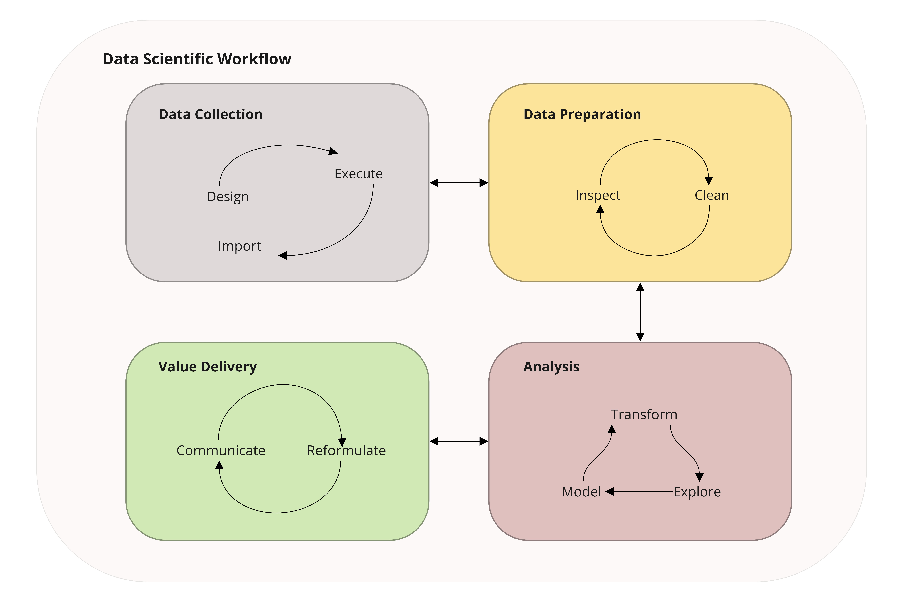

```{r include=FALSE}
knitr::opts_chunk$set(echo = TRUE, eval = FALSE)
```
# Why Data Science? {#data_science}

In this chapter we explain what is data science and discuss why data science is valuable to sensory and consumer scientists. While this book focuses on the aspects of data science that are most important to sensory and consumer scientists, we recommend the excellent book from @Wickham2016 for a more general introduction to data science.

## History and Definition

You may have heard that data science was called the "sexiest job of the 21st century" by Harvard Business Review (@Davenport2012).  But what is data science?  Before we give our definition, we provide some brief history for context.  For a comprehensive survey of this topic, we recommend @Cao2017. 

To begin, there was a movement in early computer science to call their field "data science."  Chief among the advocates for this viewpoint was Peter Naur, winner of the 2005 Turing award ^[A prize roughly equivalent in prestige to a Nobel prize, but for computer science.].  This viewpoint is detailed in the preface to his 1974 book, "Concise Survey of Computer Methods," where he states that data science is "the science of dealing with data, once they have been established" (@Naur1974).  According to Naur, this is the purpose of computer science.  This viewpoint is echoed in the statement, often attributed to Edsger Dijkstr, that "Computer science is no more about computers than astronomy is about telescopes."

Interestingly, a similar viewpoint arose in statistics, as reflected in John Tukey's statements that "Data analysis, and the parts of statistics which adhere to it, must ... take on the characteristics of science rather than those of mathematics" and that "data analysis is intrinsically an empirical science" (@Tukey1962). This movement culminated in 1997 when Jeff Wu proposed during his inaugural lecture upon becoming the chair of the University of Michigan's statistics department, entitled "Statistics = Data Science?," that statistics should be called data science (@Wu1997).

These two movements^[It is worth noting that these two movements were connected by substantial work in the areas of statistical computing, knowledge discovery, and data mining, with important work contributed by Gregory Piatetsky-Shapiro, Usama Fayyad, and Padhraic Smyth among many others.  See @Fayyad1996, for example.] came together in 2001 in William S. Cleveland's paper "Data Science: An Action Plan for Expanding the Technical Areas in the Field of Statistics" (@Cleveland2001).  In this highly influential monograph, Cleveland makes the key assertion that "The value of technical work is judged by the extent to which it benefits the data analyst, either directly or indirectly."  

A more recent development in the history of data science has been the realization that the standard outputs of data science - such as tables, charts, reports, dashboards, and even statistical models - can be viewed as tools that must be used in the real world in order to be valuable.  This realization stems from the influence of the technology sector, where the field of design has focused on improving the ease of use of websites, apps, and devices.  To quote Steve Jobs, perhaps the most influential champion of design within the technology space:

> "Design is not just what it looks and feels like.  Design is how it works."

Based on this history, we provide our definition of **data science**: 

> Data science is the intersection of statistics, computer science, and industrial design.  

Accordingly, we use the following three definitions of these fields:

- **Statistics**: The branch of mathematics dealing with the collection, analysis, interpretation, and presentation of masses of numerical data.
- **Computer Science**: Computer science is the study of processes that interact with data and that can be represented as data in the form of programs.
- **Industrial Design**: The professional service of creating and developing concepts and specifications that optimize the function, value, and appearance of products and systems for the mutual benefit of both user and manufacturer.

Hence data science is the delivery of value through the collection, processing, analysis, and interpretation of data.

## Benefits of Data Science

Now that we have a working definition of data science, we consider some reasons for sensory and consumer scientists to embrace it.  Many of these reasons apply to any modern scientific discipline, yet the fact that sensory and consumer scientists often occupy a central location in their organizations (such as sitting between product development and marketing, for example) means that sensory and consumer scientists must routinely create useful  outputs for consumption by a wide variety of stakeholders.  Moreover, sensory and consumer data are often diverse, so facility in data manipulation and flexibility in data analysis are especially important skills for sensory scientists.

### Reproducible Research

One of the most important ideas in data science is that of reproducible research (cf. @Peng2011).  Importantly, reproducibility in the context of data science does not refer to the repeatability of the experimental results themselves if the experiment were to be conducted again.  What is instead meant by reproducible research is the ability to proceed from the input data to the final results in reproducible steps.  Ideally, these steps should be well-documented so that any future researcher, including the researcher who originally conducted the work, should be able to determine all choices made in data cleaning, manipulation, and analysis that led to the final results.  Since sensory and consumer scientists often work in teams, this clarity ensures that anyone on the team can understand the steps that led to prior results, and can apply those steps to their own research going forward.

### Standardized Reporting

Related to the idea of reproducible research is that of standardized reporting.  By following a data-scientific workflow, including automated reporting (see Chapter \@ref(auto-report)), we can standardize our reporting across multiple projects.  This standardization has many benefits:

- **Consistent Formatting** When standardized reporting is used, outputs created by a team are formatted consistently regardless of who creates them.  This consistency helps consumers of the reports - whether those consumers are executives, clients, or other team members - quickly interpret results.
- **Upstream Data Consistency** Once a standardized workflow is put in place, consistency of data formatting gains a new importance as producers of the report can save significant time by not having to reformat new data.  This fact puts pressure on the data collection procedure to become more consistent, which ultimately supports knowledge management (ADD DATABASE REFERENCES).
- **Shared Learning** Once a team combines standardized reporting with tools for online collaboration such as GitHub (see Appendix \@ref(git-and-github)), any improvement to reporting (for example, to a table, chart, text output, or even to the reporting format itself) can be leveraged by all members of the team.  Thus improvements compound over time, to the benefit of all team members.

## Data Scientific Workflow

A schematic of a data scientific workflow is shown in Figure \@ref(fig:ds-workflow).  Each section is described in greater detail below.

```{r ds-workflow, fig.cap='Data scientific workflow.', fig.align='center', echo=FALSE, eval=TRUE}



```

### Data Collection {#data-collection2}

#### Design

From the standpoint of classical statistics, experiments are conducted to test specific hypotheses and proper experimental design ensures that the data collected will allow hypotheses of interest to be tested (c.f. @Fisher1935).  Sir Ronald Fisher, the father of modern statistics, felt so strongly on this topic that he said:

> “To call in the statistician after the experiment is done may be no more than asking him to perform a postmortem examination: he may be able to say what the experiment died of.” 

This topic of designed experiments, which are necessary to fully explore causal or mechanistic explanations, is covered extensively in @Lawson2014.  

Since Fisher's time, ideas around experimental design have relaxed somewhat, with @Tukey1977 arguing that exploratory and confirmatory data analysis can and should proceed in tandem.  

> "Unless exploratory data analysis uncovers indications, usually quantitative ones, there is likely to be nothing for confirmatory data analysis to consider.
> 
> Experiments and certain planned inquires provide some exceptions and partial exceptions to this rule.  They do this because one line of data analysis was planned as a part of the experiment or inquiry. *Even here, however, restricting one's self to the planned analysis -- failing to accompany it with exploration -- loses sight of the most interesting results too frequently to be comfortable.* (Emphasis original)"

In this book, we take no strong opinions on this topic, as they belong more properly to the study of statistics than to data science.  However, we agree that results from an experiment explicitly designed to test a specific hypothesis should be viewed as more trustworthy than results incidentally obtained.  Moreover, as we describe in Chapter \@ref(machine-learning), well-selected sample sets support more generalizable predictions from machine learning models.

#### Execute

Execution of the actual experiment is a crucial step in the data science workflow, although not one in which  data scientists themselves are necessarily involved.  Even so, it is imperative that data scientists communicate directly and frequently with the experimenters so that nuances of the data are properly understood for modeling and interpretation.  

#### Import

Once the data are collected, they need to find their way into a computer's working memory to be analyzed.  This importation process should be fully scripted in code, as we detail in Chapter \@ref(data-collection), and raw data files should never be directly edited.  This discipline ensures that all steps taken to import the data will be understood later and that the reasoning behind all choices will be documented.  Moreover, writing code to import raw data allows for new data to be analyzed quickly in the future as long as the data formatting is consistent.  For sensory scientists, who regularly run similar tests, a streamlined workflow for data import and analysis both saves much time and protects against errors.

### Data Preparation

Preparing data for analysis typically involves two steps: data inspection and data cleaning.

#### Inspect {#inspect_2}

In this step, the main goal is to gain familiarity with the data. Under ideal circumstances, this step includes reviewing the study documentation, including the study background, sampling, design, analysis plan, screener (if any), and questionnaire.  As part of this step, the data should be inspected to ensure they have been imported properly and relevant data quality checks, such as checks for consistency and validity, should be performed.  Preliminary summary tables and charts should also be preformed at this step to help the data scientist gain familiarity with the data.  These steps are discussed in further detail in Section \@ref(inspect) of Chapter \@ref(data-prep).

#### Clean {#clean_2}

Data cleaning is the process of preparing data for analysis.  In this step we must identify and correct any errors, and ensure the data are formatted consistently and appropriately for analysis.  As part of this step, we will typically tidy our data, a concept that we cover in more detail in Section \@ref(tidy-data).  It is extremely important than any changes to the data are made in code with the reasons for the changes clearly documented.  This way of working ensures that, a year from now, we don't revisit our analysis to find multiple versions of the input data and not know which version was the one used for the final analysis^[Anyone working in the field for more than five years has almost certainly experienced this problem, perhaps even with their own data and reports].  We discuss data cleaning in further detail in Section \@ref(clean).  
 
### Data Analysis {#data-analysis2}

Data analysis is one of the areas of data science that most clearly overlaps with traditional statistics.  In fact, any traditional or computational statistical technique can be applied within the context of data science.  

In practice, the dominant cultural difference between the two fields can be summarized as:

* Statistics often focuses on advancing explicit theoretical understanding of an area through parameter estimation within first-principle models.
* Data science often focuses on predictive ability using computational models that are validated empirically using held-out subsets of the data.

Another cultural difference between the two fields is that data science, evolving more directly out of computer science, has been more historically interested in documenting the code used for analysis with the ultimate goal of reproducible research.  See @Peng2011 for more information on this topic, for example.  This difference is gradually disappearing, however, as statistics more fully embraces a data scientific way of scripting analyses.  

Data analysis is covered in greater detail in Chapter \@ref(data-analysis).  The typical steps of data analysis are data transformation, exploration, and modeling, which we review below.

#### Transform

Data transformation is slightly different from data preparation.  In data preparation, we prepare the raw data for processing in a non-creative way, such as reshaping existing data or storing character strings representing dates as date formatted variables.  With data transformation, we create new data for analysis by applying functions to the raw data.  These functions can be simple transformations such as inversions or logarithms, or can be summary operations such as computing means and variances, or could be complex operations such as principle components analysis or missing value imputation.  In a machine learning context (see Chapter \@ref(machine-learning)), this step is often referred to as "feature engineering."  In any case, these functions provide the analyst an opportunity to improve the value of the analysis through skillful choices.  Data transformation is covered in more detail in Chapter \@ref(data-analysis).

#### Explore

Just as data transformation differs slightly from data preparation, data exploration differs slightly from data inspection.  When we inspect the data, our goal is to familiarize ourselves with the data and potentially spot errors as we do so.  With data exploration, our goal is to begin to understand the results of the experiment and to allow the data to suggest hypotheses for follow-up analyses or future research.  The key steps of data exploration are graphical visualizations (covered in Chapter \@ref(data-viz)) and exploratory analyses (covered in Chapter \@ref(data-analysis)).  As we will discuss later in this book, employing automated tools for analysis requires caution; the ease with which we can conduct a wide range of analyses increases the risk that chance results will be regarded as meaningful.  In Chapter \@ref(machine-learning) we will discuss techniques, such as cross-validation, that can help mitigate this risk.

#### Model

At last we reach the modeling step of our workflow, which is the step in which we conduct formal statistical modeling.  This step may also include predicitve modeling, which we cover in Chapter \@ref(machine-learning), as mentioned above.  One difference between data science and classical statistics is that this step may feed back into the transform and explore steps, as data scientists are typically more willing to allow the data to suggest new hypotheses for testing (recall Tukey's quotation above).  This step is described in further detail in Chapter \@ref(data-analysis).

### Value Delivery {#value-delivery2}

We now arrive at the final stage of the data science workflow, value delivery, which is the stage most influenced by industrial design.  Recall the definition we provided above:

- **Industrial Design**: The professional service of creating and developing concepts and specifications that optimize the function, value, and appearance of products and systems for the mutual benefit of both user and manufacturer.

From this perspective, our product consists of the final results as provided to the intended audience.  Consequently, we may need to adjust both the results themselves and the way they are presented according to whether the audience consists of product developers, marketing partners, upper management, or even the general public.  Hence, in this stage, we communicate our results and potentially reformulate our outputs so that they will provide maximum value to the intended audience.  Although we describe value delivery in more detail in Chapter \@ref(value-delivery), we briefly review the two steps of value delivery, communicate and reformulate, below.

#### Communicate

The goal of the communication step is to exchange information stemming from our data scientific work.  Importantly, communication is a two-way street, so it is just as important to listen in this step as it is to share results.  Without feedback from our audience, we won't be able to maximize the impact of our work.  We discuss this topic in more detail in Section \@ref(communicate2), and note that automated reporting, which we cover in Chapter \@ref(auto-report) also plays a large role in this step by saving time in building slides that can later be spent in thinking about the storytelling aspects of our communications.

#### Reformulate

In the final step of our data scientific workflow, we incorporate feedback received during the communication step back into the workflow.  This step may involve investigating new questions and revising the way we present results.  Since we seek to work in a reproducible manner, the improvements we make to our communication can be committed to code and the lessons these improvements reflect can be leveraged again in the future.  It is also important to note that, as we reformulate, we may need to return all the way to the data cleaning step, if we learn during the communication step that some aspect of the data import or initial interpretation needs to be revised.  Reformulation is discussed in greater detail in Section \@ref(reformulate2).

## How to Learn Data Science

Learning data science is much like learning a language or learning to play an instrument - you have to practice.  Our advice based on mentoring many students and clients is to get started sooner rather than later, and to accept that the code you'll write in the future will always be better than the code you'll write today.  Also, many of the small details that separate an proficient data scientist from a novice can only be learned through practice as there are too many small details to learn them all in advance.  So, starting today, do your best to write at least some code for all your projects.  If a time deadline prevents you from completing the analysis in R, that's fine, but at least gain the experience of making an RStudio project and loading the data in R^[We recommend following the instructions in Appendix \@ref(start-R) to get started.].  Then, as time allows, try to duplicate your analyses in R, being quick to search for solutions when you run into errors.  Often simply copying and pasting your error into a search engine will be enough to find the solution to your problem.  Moreover, searching for solutions is its own skill that also requires practice.  Finally, if you are really stuck, reach out to a colleague (or even the authors of this book) for help.

## Cautions: Don’t that Everybody Does

We have all been in situations in which, for a given study, we edited the raw data files (e.g. removed respondents who were not present for the full study) and saved them using a different name. Some time later, as we need to get back to this study, or share some data with colleagues, finding the *correct* file quickly becomes a challenge that may end up being time consuming. 

It seems clear that such way of working is not viable, and as mentioned earlier, raw data should never be edited. Instead, we prefer to run every data manipulation steps (e.g. removing respondents) in R by also commenting why certain decisions are being made. This simplifies deeply the workflow, and the future you will be grateful when you will re-open this file later on and know exactly what was done and why.

The same also applies for the analysis part. Documenting which analyses were performed using which parameters ensures reproducible research. If at first, documenting you code may seem *a loss of time*, it will pay back later when you will access your code again in some future. Indeed, if decisions are clear in your mind while you are writing your code, it is not necessarily the case later.

Another important aspect is time: do not always go for the fastest or (what seems to be) easiest solution when coding. Instead, try to get the smartest and most efficient code. If you hard-code the names of the variables as they are in your data set, your code is restricted to that particular study, or to any study that exactly fits that format. But as soon as there is a small change (e.g. a small difference in the naming of one of the variables), it will quickly cost you a lot of time to adapt the code to your new study. To be more efficient, we prefer to define as parameters certain elements and/or read the names directly from the file for instance as this saves a lot time and effort. 

Talking about efficiency, never use (through copy/paste for instance) the same lines of code more than twice. If you apply the same code more than 2 to 3 times in your analysis, then you should consider better alternatives such as loops and/or functions. This point is of utmost importance as any small change in that piece of code (e.g. changing a parameter, fixing a bug, etc.) only needs to be done once to be applied everywhere. On the other hand, if you reproduce the same code multiple times, you need to ensure that you correctly modified each and every parts that contain that code (and it is easy to skip some!) 


With these preliminaries completed, and with you (hopefully) sufficiently motivated, let's begin learning data science!
