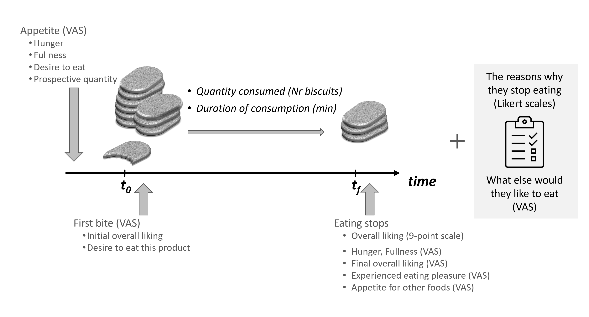

--- 
title: "Data Science for Sensory and Consumer Scientists"
author: "John Ennis, Julien Delarue, and Thierry Worch"
date: "`r Sys.Date()`"
site: bookdown::bookdown_site
documentclass: book
bibliography: [references.bib]
biblio-style: apalike
link-citations: yes
description: "Open development of data science book for sensory and consumer scientists."

---

# Preface {-}

Welcome to the website for *Data Science for Sensory and Consumer Scientists*, a book in development and under contract for [CRC Press](https://www.routledge.com/).

```{r fig.align='center', echo=FALSE, eval=TRUE}
knitr::include_graphics("images/cover_art.png")
```

## Who Should Read This Book? {-}

This book is for practitioners or students of sensory and consumer science who want to participate in the emerging field of computational sensory science.  This book assumes little to no coding experience.  Some statistical experience will be helpful to understand the examples discussed.

## How to Use This Book {-}

This book is meant to be interactive, with the reader ideally typing and running all of the code presented in the parts labeled "Hors d'Oeurves" and "Bon Appétit."  Computer languages are like human languages in that they need to be practiced to be learned, so we highly recommend the reader actually typing all of the code from these parts, running it, and verifying they receive the results shown in the book.  To help with this practice, we have created a [special GitHub repository](https://github.com/aigorahub/data_science_for_sensory_sample_code) that contains folders called `work_along` and `sample_code`.  Please see Appendix \@ref(start-R) for guidance on how to get started with R and GitHub.  In the the `sample_code` folder, we have included the code as presented in the book, while in the `work_along` folder we have provided blank files for each chapter that load the libraries^[You may need to load these libraries before the code will run, please see Appendix \@ref(start-R) for more information on this topic as well.]. 

## Acknowledgements {-}

First and foremost we all thank our wives for their continual support.  Professionally, Vanessa Rios de Souza helped us get us across the finish line through her excellent management and reviewing.  Arkadi Avanesyan, Jakub Kwiecien, and Veerle van Leemput all contributed to the content in various important ways.


<!--chapter:end:index.Rmd-->

```{r include=FALSE}
knitr::opts_chunk$set(echo = TRUE, eval = FALSE)
```
# Bienvenue! {#bienvenue}

## Why Data Science for Sensory and Consumer Science? {-}

Located at the crossroads of biology, social science, and design, sensory and consumer science (SCS) is definitely the tastiest of all sciences. On the menu is a wide diversity of products and experiences that sensory and consumer scientists approach through the lens of human senses. Thanks to a wide set of refined methods, they have access to rich, complex and mouthwatering data. Delightedly, data science empowers them and leads them to explore new flavorful territories.

### Core principles in Sensory and Consumer Science {-}

Sensory and consumer science is considered as a pillar of food science and technology and is useful to product development, quality control and market research. Most scientific and methodological advances in the field are applied to food. This book makes no exception as we chose a cookie formulation dataset as a main thread. However, SCS widely applies to many other consumer goods so are the content of this book and the principles set out below.

#### Measuring and analyzing human responses {-}
Sensory and consumer science aims at measuring and understanding consumers’ sensory perceptions as well as the judgements, emotions and behaviors that may arise from these perceptions. SCS is thus primarily a science of measurement, although a very particular one that uses human beings and their senses as measuring instruments. In other words, sensory and consumer researchers measure and analyze human responses.

To this end, SCS relies essentially on sensory evaluation which comprises a set of techniques that mostly derive from psychophysics and behavioral research. It uses psychological models to help separate signal from noise in collected data [ref O’Mahony, D.Ennis, others?].  Besides, sensory evaluation has developed its own methodological framework that includes most refined techniques for the accurate measurement of product sensory properties while minimizing the potentially biasing effects of brand identity and the influence of other external information on consumer perception [Lawless & Heymann, 2010].

A detailed description of sensory methods is beyond the scope of this book and many textbooks on sensory evaluation methods are available to readers seeking more information. However, just to give a brief overview, it is worth remembering that sensory methods can be roughly divided into three categories, each of them bearing many variants:

*	Discrimination tests that aim at detecting subtle differences between products. 
*	Descriptive analysis (DA), also referred to as ‘sensory profiling’, aims at providing both qualitative and quantitative information about product sensory properties.
*	Affective tests. This category includes hedonic tests that aim at measuring consumers’ liking for the tested products or their preferences among a product set.

Each test category generates its own type of data and related statistical questions in relation to the objectives of the study. Typically, data from difference tests with forced-choice procedures (e.g. triangle test, duo-trio, 2-AFC, etc.) consist in series of binary answers (correct/failed) depending on whether judges successfully picked the odd sample(s) among a set of three or more samples ^[Other procedures like the *different from control* test or the *degree of difference* test generate rating data]. These data are used to determine whether the number of correct choices is above the level expected by chance.

Conventional descriptive analysis data consist in intensity scores given by each panelist to evaluated samples on a series of sensory attributes, hence resulting in a product x attribute x panelist dataset (Figure 1). Note that depending on the DA method, quantifying means other than intensity ratings can be used (ranks, frequency, etc.). Most frequently, each panelist evaluates all the samples in the product set. However, the use of balanced incomplete design can also be found when the experimenters aim to limit the number of samples evaluated by each subject.

Eventually, hedonic test datasets consist in hedonic scores (ratings for consumers’ degree of liking or preference ranks) given by each interviewed consumer to a series of products. As for DA, each consumer usually evaluates all the samples in the product set, but balanced incomplete designs are sometimes used too. In addition, some companies favor pure monadic evaluation of product (i.e. between-subject design or independent groups design) which obviously result in unrelated sample datasets.

Sensory and consumer researchers also borrow methods from other fields, in particular from sociology and experimental psychology. Definitely a multidisciplinary area, SCS develops in many directions and reaches disciplines that range from genetics and physiology to social marketing, behavioral economics and computational neuroscience. So have diversified the types of data sensory and consumer scientists must deal with.

#### Measuring human*product interactions {-}
As in many scientific fields, the development of sophisticated statistical techniques and access to powerful data analysis tools have played an important role in the evolution of sensory & consumer science. Statisticians and data analysts in SCS have developed their own field of research, coined Sensometrics [REF to (Schlich, 1995)]. So, what makes sensory & consumer science special? And how does it influence the way sensory and consumer data are handled?

According to Lawless and Heymann (2010), sensory evaluation attempts to isolate the sensory properties of foods themselves and provides important and useful information to product developers, food scientists, and managers. However, one should bear in mind that ...

### Computational Sensory Science {-}

<!--chapter:end:bienvenue.Rmd-->

# (PART\*) Hors d’Oeuvres {-}

<!--chapter:end:skills-header.Rmd-->

```{r include=FALSE}
knitr::opts_chunk$set(echo = TRUE, eval = FALSE)
```
# Why Data Science? {#data_science}

In this chapter we explain what is data science and discuss why data science is valuable to sensory and consumer scientists. While this book focuses on the aspects of data science that are most important to sensory and consumer scientists, we recommend the excellent text @Wickham2016 for a more general introduction to data science.

## History and Definition

You may have heard that data science was called the "sexiest job of the 21st century" by Harvard Business Review (@Davenport2012).  But what is data science?  Before we give our definition, we provide some brief history for context.  For a comprehensive survey of this topic, we recommend @Cao2017. 

To begin, there was a movement in early computer science to call their field "data science."  Chief among the advocates for this viewpoint was Peter Naur, winner of the 2005 Turing award ^[A prize roughly equivalent in prestige to a Nobel prize, but for computer science.].  This viewpoint is detailed in the preface to his 1974 book, "Concise Survey of Computer Methods," where he states that data science is "the science of dealing with data, once they have been established" (@Naur1974).  According to Naur, this is the purpose of computer science.  This viewpoint is echoed in the statement, often attributed to Edsger Dijkstr, that "Computer science is no more about computers than astronomy is about telescopes."

Interestingly, a similar viewpoint arose in statistics, as reflected in John Tukey's statements that "Data analysis, and the parts of statistics which adhere to it, must ... take on the characteristics of science rather than those of mathematics" and that "data analysis is intrinsically an empirical science" (@Tukey1962). This movement culminated in 1997 when Jeff Wu proposed during his inaugural lecture upon becoming the chair of the University of Michigan's statistics department, entitled "Statistics = Data Science?," that statistics should be called data science (@Wu1997).

These two movements^[It is worth noting that these two movements were connected by substantial work in the areas of statistical computing, knowledge discovery, and data mining, with important work contributed by Gregory Piatetsky-Shapiro, Usama Fayyad, and Padhraic Smyth among many others.  See @Fayyad1996, for example.] came together in 2001 in William S. Cleveland's paper "Data Science: An Action Plan for Expanding the Technical Areas in the Field of Statistics" (@Cleveland2001).  In this highly influential monograph, Cleveland makes the key assertion that "The value of technical work is judged by the extent ot which it benefits the data analyst, either directly or indirectly."  

A more recent development in the history of data science has been the realization that the standard outputs of data science - such as tables, charts, reports, dashboards, and even statistical models - can be viewed as tools that must be used in the real world in order to be valuable.  This realization stems from the influence of the technology sector, where the field of design has focused on improving the ease of use of websites, apps, and devices.  To quote Steve Jobs, perhaps the most influential champion of design within the technology space:

> "Design is not just what it looks and feels like.  Design is how it works."

Based on this history, we provide our definition of **data science**: 

> Data science is the intersection of statistics, computer science, and industrial design.  

Accordingly, we use the following three definitions of these fields:

- **Statistics**: The branch of mathematics dealing with the collection, analysis, interpretation, and presentation of masses of numerical data.
- **Computer Science**: Computer science is the study of processes that interact with data and that can be represented as data in the form of programs.
- **Industrial Design**: The professional service of creating and developing concepts and specifications that optimize the function, value, and appearance of products and systems for the mutual benefit of both user and manufacturer.

Hence data science is the delivery of value through the collection, processing, analysis, and interpretation of data.

## Benefits of Data Science

Now that we have a working definition of data science, we consider some reasons for sensory and consumer scientists to embrace it.  Many of these reasons apply to any modern scientific discipline, yet the fact that sensory and consumer scientists often occupy a central location in their organizations (such as sitting between product development and marketing, for example) means that sensory and consumer scientists must routinely create useful  outputs for consumption by a wide variety of stakeholders.  Moreover, sensory and consumer data are often diverse, so facility in data manipulation and flexibility in data analysis are especially important skills for sensory scientists.

### Reproducible Research

One of the most important ideas in data science is that of reproducible research (cf. @Peng2011).  Importantly, reproducibility in the context of data science does not refer to the repeatability of the experimental results themselves if the experiment were to be conducted again.  What is instead meant by reproducible research is the ability to proceed from the input data to the final results in reproducible steps.  Ideally, these steps should be well-documented so that any future researcher, including the researcher who originally conducted the work, should be able to determine all choices made in data cleaning, manipulation, and analysis that led to the final results.  Since sensory and consumer scientists often work in teams, this clarity ensures that anyone on the team can understand the steps that led to prior results were obtained, and can apply those steps to their own research going forward.

### Standardized Reporting

Related to the idea of reproducible research is that of standardized reporting.  By following a data-scientific workflow, including automated reporting (see Chapter \@ref(auto-report)), we can standardize our reporting across multiple projecsts.  This standardization has many benefits:

- **Consistent Formatting** When standardized reporting is used, outputs created by a team are formatted consistently regardless of who creates them.  This consistency helps consumers of the reports - whether those consumers are executives, clients, or other team members - quickly interpret results.
- **Upstream Data Consistency** Once a standardized workflow is put in place, consistency of data formatting gains a new importance as producers of the report can save significant time by not having to reformat new data.  This fact puts pressure on the data collection produce to become more consistent, which ultimately supports knowledge management (see Chapter \@ref(graph-db)).
- **Shared Learning** Once a team combines standardized reporting with tools for online collaboration such as GitHub (see Appendix \@ref(git-and-github)), any improvement to reporting (for example, to a table, chart, text output, or even to the reporting format itself) can be leveraged by all members of the team.  Thus improvements compound over time, to the benefit of all team members.

## Data Scientific Workflow

A schematic of a data scientific workflow is shown in Figure \@ref(fig:ds-workflow).  Each section is described in greater detail below.

```{r ds-workflow, fig.cap='Data scientific workflow.', fig.align='center', echo=FALSE, eval=TRUE}

knitr::include_graphics("images/data_science_workflow.jpg")

```

### Data Collection {#data-collection2}

#### Design

From the standpoint of classical statistics, experiments are conducted to test specific hypotheses and proper experimental design ensures that the data collected will allow hypotheses of interest to be tested (c.f. @Fisher1935).  Sir Ronald Fisher, the father of modern statistics, felt so strongly on this topic that he said:

> “To call in the statistician after the experiment is done may be no more than asking him to perform a postmortem examination: he may be able to say what the experiment died of.” 

This topic of designed experiments, which are necessary to fully explore causal or mechanistic explanations, is covered extensively in @Lawson2014.  

Since Fisher's time, ideas around experimental design have relaxed somewhat, with Tukey arguing in @Tukey1977 that exploratory and confirmatory data analysis can and should proceed in tandem.  

> "Unless exploratory data analysis uncovers indications, usually quantitative ones, there is likely to be nothing for confirmatory data analysis to consider.
> 
> Experiments and certain planned inquires provide some exceptions and partial exceptions to this rule.  They do this because one line of data analysis was planned as a part of the experiment or inquiry. *Even here, however, restricting one's self to the planned analysis -- failing to accompany it with exploration -- loses sight of the most interesting results too frequently to be comfortable.* (Emphasis original)"

In this book, we take no strong opinions on this topic, as they belong more properly to the study of statistics than to data science.  However, we agree that results from an experiment explicitly designed to test a specific hypothesis should be viewed as more trustworthy than results incidentally obtained.  Moreover, as we will describe in Chapters \@ref(machine-learning) and \@ref(linear-programming), well-selected sample sets support more generalizable predictions from machine learning models.

#### Execute

Execution of the actual experiment is a crucial step in the data science workflow, although not one in which  data scientists themselves are necessarily involved.  Even so, it is imperative that data scientists communicate directly and frequently with the experimenters so that nuances of the data are properly understood for modeling and interpretation.  

#### Import

Once the data are collected, they need to find their way into a computer's working memory to be analyzed.  This importation process should be fully scripted in code, as we detail in Chapter \@ref(data-collection), and raw data files should never be directly edited.  This discipline ensures that all steps taken to import the data will be understood later and that the reasoning behind all choices will be documented.  Moreover, writing code to import raw data allows for new data to be analyzed quickly in the future as long as the data formatting is consistent.  For sensory scientists, who regularly run similar tests, a streamlined workflow for data import and analysis both saves much time and protects against errors.

### Data Preparation

Preparing data for analysis typically involves two steps: data inspection and data cleaning.

#### Inspect {#inspect_2}

In this step, the main goal is to gain familiarity with the data. Under ideal circumstances, this step includes reviewing the study documentation, including the study background, sampling, design, analysis plan, screener (if any), and questionnaire.  As part of this step, the data should be inspected to ensure they have been imported properly and relevant data quality checks, such as checks for consistency and validity, should be performed.  Preliminary summary tables and charts should also be preformed at this step to help the data scientist gain familiarity with the data.  These steps are discussed in further detail in Section \@ref(inspect) of Chapter \@ref(data-prep).

#### Clean {#clean_2}

Data cleaning is the process of preparing data for analysis.  In this step we must identify and correct any errors, and ensure the data are formatted consistently and appropriately for analysis.  As part of this step, we will typically tidy our data, a concept that we cover in more detail in Section \@ref(tidy-data).  It is extremely important than any changes to the data are made in code with the reasons for the changes clearly documented.  This way of working ensures that, a year from now, we don't revisit our analysis to find multiple versions of the input data and not know which version was the one used for the final analysis^[Anyone working in the field for more than five years has almost certainly experienced this problem, perhaps even with their own data and reports].  We discuss data cleaning in further detail in Section \@ref(clean).  
 
### Data Analysis {#data-analysis2}

Data analysis is one of the areas of data science that most clearly overlaps with traditional statistics.  In fact, any traditional or computational statistical technique can be applied within the context of data science.  

In practice, the dominant cultural difference between the two fields can be summarized as:

* Statistics often focuses on advancing explicit theoretical understanding of an area through parameter estimation within first-principle models.
* Data science often focuses on predictive ability using computational models that are validated empirically using held-out subsets of the data.

Another cultural difference between the two fields is that data science, evolving more directly out of computer science, has been more historically interested in documenting the code used for analysis with the ultimate goal of reproducible research.  See @Peng2011 for more information on this topic, for example.  This difference is gradually disappearing, however, as statistics more fully embraces a data scientific way of scripting analyses.  

Data analysis is covered in greater detail in Chapter \@ref(data-analysis).  The typical steps of data analysis are data transformation, exploration, and modeling, which we review below.

#### Transform

Data transformation is slightly different from data preparation.  In data preparation, we prepare the raw data for processing in a non-creative way, such as reshaping existing data or storing character strings representing dates as date formatted variables.  With data transformation, we create new data for analysis by applying functions to the raw data.  These functions can be simple transformations such as inversions or logarithms, or can be summary operations such as computing means and variances, or could be complex operations such as principle components analysis or missing value imputation.  In a machine learning context (see Chapter \@ref(machine-learning)), this step is often referred to as "feature engineering."  In any case, these functions provide the analyst an opportunity to improve the value of the analysis through skillful choices.  Data transformation is covered in more detail in Chapter \@ref(data-analysis).

#### Explore

Just as data transformation differs slightly from data preparation, data exploration differs slightly from data inspection.  When we inspect the data, our goal is to familiarize ourselves with the data and potentially spot errors as we do so.  With data exploration, our goal is to begin to understand the results of the experiment and to allow the data to suggest hypotheses for follow-up analyses or future research.  The key steps of data exploration are graphical visualizations (covered in Chapter \@ref(data-viz)) and exploratory analyses (covered in Chapter \@ref(data-analysis)).  As we will discuss later in this book, employing automated tools for analysis requires caution; the ease with which we can conduct a wide range of analyses increases the risk that chance results will be regarded as meaningful.  In Chapter \@ref(machine-learning) we will discuss techniques, such as cross-validation, that can help mitigate this risk.

#### Model

At last we reach the modeling step of our workflow, which is the step in which we conduct formal statistical modeling.  This step may also include predicitve modeling, which we cover in Chapter \@ref(machine-learning), as mentioned above.  One difference between data science and classical statistics is that this step may feed back into the transform and explore steps, as data scientists are typically more willing to allow the data to suggest new hypotheses for testing (recall Tukey's quotation above).  This step is described in further detail in Chapter \@ref(data-analysis).

### Value Delivery {#value-delivery2}

We now arrive at the final stage of the data science workflow, value delivery, which is the stage most influenced by industrial design.  Recall the definition we provided above:

- **Industrial Design**: The professional service of creating and developing concepts and specifications that optimize the function, value, and appearance of products and systems for the mutual benefit of both user and manufacturer.

From this perspective, our product consists of the final results as provided to the intended audience.  Consequently, we may need to adjust both the results themselves and the way they are presented according to whether the audience consists of product developers, marketing partners, upper management, or even the general public.  Hence, in this stage, we communicate our results and potentially reformulate our outputs so that they will provide maximum value to the intended audience.  Although we describe value delivery in more detail in Chapter \@ref(value-delivery), we briefly review the two steps of value delivery, communicate and reformulate, below.

#### Communicate

The goal of the communication step is to exchange information stemming from our data scientific work.  Importantly, communication is a two-way street, so it is just as important to listen in this step as it is to share results.  Without feedback from our audience, we won't be able to maximize the impact of our work.  We discuss this topic in more detail in Section \@ref(communicate2), and note that automated reporting, which we cover in Chapter \@ref(auto-report) also plays a large role in this step by freeing us to spend more time thinking about the storytelling aspects of our communications.

#### Reformulate

In the final step of our data scientific workflow, we incorporate feedback received during the communication step back into the workflow.  This step may involve investigating new questions and revising the way we present results.  Since we seek to work in a reproducible manner, the improvements we make to our communication can be committed to code and the lessons these improvements reflect can be leveraged again in the future.  It is also important to note that, as we reformulate, we may need to return all the way to the data cleaning step, if we learn during the communication step that some aspect of the data import or initial interpretation needs to be revised.  Reformulation is discussed in greater detail in Section \@ref(reformulate2).

## How to Learn Data Science

Learning data science is much like learning a language or learning to play an instrument - you have to practice.  Our advice based on mentoring many students and clients is to get started sooner rather than later, and to accept that the code you'll write in the future will always be better than the code you'll write today.  Also, many of the small details that separate an proficient data scientist from a novice can only be learned through practice as there are too many small details to learn them all in advice.  So, starting today, do your best to write at least some code for all your projects.  If a time deadline prevents you from completing the analysis in R, that's fine, but at least gain the experience of making an RStudio project and loading the data in R^[We recommend following the instructions in Appendix \@ref(start-R) to get started.].  Then, as time allows, try to duplicate your analyses in R, being quick to search for solutions when you run into errors.  Often simply copying and pasting your error into a search engine will be enough to find the solution to your problem.  Moreover, searching for solutions is its own skill that also requires practice.  Finally, if you are really stuck, reach out to a colleague (or even the authors of this book) for help.

## Cautions: Don’t that Everybody Does

Don't edit raw data. [ADD MORE]

With these preliminaries completed, and with you (hopefully) sufficiently motivated, let's begin learning data science!


<!--chapter:end:data-science.Rmd-->

```{r include=FALSE}
knitr::opts_chunk$set(echo = TRUE, eval = FALSE)
```
<!-- I guess it can be interesting to have chapter 7, about data collection/import, before data manipulation. In this way the reader doesn't need to go to chapter 7 before starting this one to check how to import data. -->

# Data Manipulation {#data-manip}

<!-- MENTIONING SOMEWHERE THAT SOME OF THE TRANSFORMATIONS MADE ARE TEMPORARY AS THEY ARE NOT BEING SAVED, SO RE-USING THE SAME DATA WILL STILL BE BACK TO ITS ORIGINAL VERSION... -->

<!-- WE ARE ALSO MISSING A SECTION EXPLAINING PIPES...AND ADDING THAT INTO APERITIFS MIGHT BE CONFUSING AS APERITIFS IS AT THE END OF THE BOOK...SO SHOULD WE EXPLAIN IT IN THE INTRODUCTION? -->

In sensory science, different data collection tools (e.g. different devices, software, methodologies, etc.) may provide the same data in different ways. Also, different statistical analyses may require having the data structured in different formats. 

A simple example to illustrate this latter point is the analysis of liking data.
Let C consumers provide their hedonic assessments on P samples. To evaluate if samples have received different liking means at the population level, an ANOVA is performed on a long thin table with (PxC) rows x 3 columns (consumer, sample, and the liking scores). 
<!-- I think it would be easier to understand if it was written "ANOVA is performed on a long thin table with 3 columns (consumer, sample, and the liking scores), where the combination of CxP will be spread in the rows. --> 

<!-- Insert Figure illustrating the data structure -->


However, to assess whether consumers have the same preference patterns at the individual level, internal preference mapping or cluster analysis would be performed, both these analyses requiring as input a short and large table with P rows and C columns. 


<!-- Insert Figure illustrating the data structure -->


Another example of data manipulation consists in summarizing data, by for instance computing the mean by product for each sensory attribute (hence creating the so-called sensory profiles), or to generate frequency tables (e.g. proportions of male/female, distribution of the liking scores by sample, contingency table for CATA data, etc.)


<!-- Insert Figure illustrating the data structure -->


For these reasons, it is essential to learn to manipulate data and transition from one structure to another. After presenting many different ways to transform your data, we present several simple examples to show these ideas in practice^[Most of the examples presented in this chapter emphasize on the "how to?," not the "why?," and are not necessarily chosen to convey scientific meaning].


## Tidying Data {#tidy-data}


Hadley Wickham (@Wickham2014) defined 'tidy data' as "data sets that are arranged such that each variable is a column and each observation (or case) is a row." Depending on the statistical unit to consider and the analyses to perform, data may need to be manipulated to be presented in a tidy form. 


### Simple Manipulations


The notion of 'simple manipulations' proposed here consists in data transformations that could easily be performed in other software such as Excel (using copy-paste, sorting and filtering, creating a pivot table, etc.). However, we strongly recommend performing any sorts of transformation in R as this will reduce the risk of errors, typically be faster, and will be reusable if you need to perform the same operations on similar data in the future (including updated versions of the current dataset). Moreover, these operations will become easier and more natural for you to use as you familiarize yourself with them.


#### Handling Columns


##### Renaming Variables


The first simple transformation we consider consists of renaming one or multiple variables. This procedure can easily be done using the `rename()` function from the `{dplyr}` package.  In each of the examples below, we use the `names()` function to show just the names of the resulting dataset.

In our sensory file^[The *sensory* data are imported from the *Sensory Profile.xlsx* file, see Section \@ref(data-import) for more on how to import datasets], let's recode 'Judge' into 'Panellist', and 'Product' into 'Sample' (here we apply transformations without saving the results, so the original dataset remains unchanged).

First, here are the original names:

```{r}
sensory %>% 
  names()
```

And here are the recoded names:

<!-- Although by reading the sentence above we can presume how the arguments should be written, I  think it is a good idea to explicit explain it. In this case, maybe it would be a good idea to emphasize that the first name refers to the new name and the second the old name you want to change --> 

```{r}
sensory %>% 
  rename(Panellist = Judge, Sample = Product) %>% 
  names()
```

If this procedure of renaming variables should be applied on many variables following a structured form (e.g. transforming names into snake_case, CamelCase, etc.), the use of the `{janitor}` package comes handy thanks to its `clean_names()` function and the `case` parameter:

<!-- It may be a good idea to explain what "snake" is. Maybe a argument is not really necessary here? -->
```{r}
library(janitor)
sensory %>% 
  clean_names(case="snake") %>% 
  names()
```


Note that the `{janitor}` package offers many options, and although the transformation was performed to all the variables, it is possible to ignore certain variables for the transformation.


##### Re-Organizing Columns


Another simple transformation consists in re-organizing the dataset, either by re-ordering (including removing) the columns, or by selecting some rows based on a certain criteria. 

For re-ordering columns, `relocate()` is being used. This function allows re-positioning a (set of) variable(s) before or after another variable. By re-using the `sensory` dataset, let's position all the variables starting with 'Qty' between `Product` and `Shiny`. This can be specified into two different ways:


```{r}
sensory %>% 
  relocate(starts_with("Qty"), .after=Product) %>% 
  names()

sensory %>% 
  relocate(starts_with("Qty"), .before=Shiny) %>% 
  names()

```


Another very important function regarding columns transformation is the `select()` function (from the `{dplyr}` package^[Note that many other packages include a function called `select()`, which could create conflicts. To avoid any risks of errors, we recommend calling the `select()` function using the notation `dplyr::select()` as it formally calls the `select()` function from `{dplyr}`. This avoids any risks of error! Of course, the same procedure applies to any other functions that may suffer from the same issue.]) allows selecting a set of variables, by simply informing the variables that should be kept in the dataset. Let's limit ourselves in selecting `Judge`, `Product`, and `Shiny`:


```{r}
sensory %>% 
  dplyr::select(Judge, Product, Shiny)
```


When a long series of variables should be kept in the same order, the use of the `:` is used.
Let's only keep the variables related to Flavor, hence going from `Cereal flavor` to `Warming`:


```{r}
sensory %>% 
  dplyr::select(Judge, Product, `Cereal flavor`:Warming)
```
<!-- why does 'Cereal flavor' has the '' and not Warming? Is it because of the blank between Cereal and flavor? If so, it might be worth adding a note about that. -->

However, when only one (or few) variable needs to be removed, it is easier to specify which variable to remove rather than informing all the variables to keep. Such solution is then done using the `-` sign. The previous example can then be obtained using the following code:


```{r}
sensory %>% 
  dplyr::select(-c(Shiny, Melting))
```


The selection process of variables can be further informed through functions such as `starts_with()`, `ends_with()`, and `contains()`, which all select variables that either starts, ends, or contains a certain character or sequence of character. To illustrate this, let's only keep the variables that starts with 'Qty':


```{r}
sensory %>% 
  dplyr::select(starts_with("Qty"))
```


Rather than selecting variables based on their names, we can also select them based on their position (e.g. `dplyr::select(2:5)` to keep the variables that are at position 2 to 5), or following a certain 'rule' using the `where()` function. In that case, let's consider all the variables that are numerical, which automatically removes the `Judge` and `Product` columns:


```{r}
sensory %>% 
  dplyr::select(where(is.numeric))
```


**Remark**: `dplyr::select()` is a very powerful function that facilitates selection of complex variables through very intuitive functions. Ultimately, it can also be used to `relocate()` and even `rename()` variables, as shown in the example below:


```{r}
sensory %>% 
  dplyr::select(Panellist = Judge, Sample = Product, Shiny:Sticky, -starts_with("Qty"))
```


More examples illustrating the use of `select()` are provided throughout the book.


##### Creating Columns


In some cases, new variables need to be created from existing ones. Examples of such situations include taking the quadratic term of a sensory attribute to test for curvature, or simply considering a new variables as the sum or the subtraction between two (or more). Such creation of a variable is processed through the `mutate()` function from the `{dplyr}` package. This function takes as inputs the name of the variable to create, and the formula to consider.
Let's create two new variables, one called Shiny2 which corresponds to Shiny squared up, and one StiMelt which corresponds to Sticky + Melting. Since we will only be using these three variables, let's reduce the dataset to these three variables with `select()` first to improve readability:


```{r}
sensory %>% 
  dplyr::select(Shiny, Sticky, Melting) %>% 
  mutate(Shiny2 = Shiny^2, StiMelt = Sticky + Melting)
```


Tip: If you want to transform a variable, say by changing its type, or re-writing its content, you can use `mutate()` and assign to the new variable the same name as the original one. This will overwrite the existing column with the new one. To illustrate this, let's transform `Product` from upper case to lower case only. This can be done by mutating `Product` into the lowercase version of `Product` (`tolower(Product)`):


```{r}
sensory %>% 
  mutate(Product = tolower(Product))
```


`mutate()` being one of the most important function from the `{dplyr}` package, it will be used extensively throughout this book.

Since performing mathematical computations on non-numerical columns is not possible, conditions can easily be added through `mutate()` combined with `across()`. An example could be to round all variables to 0 decimal, which can only be applied to numerical variables:


```{r}
# round(sensory, 0) returns an error because Judge and Product are characters

sensory %>% 
  mutate(across(where(is.numeric), round, 0))
```


##### Merging and Separating columns


It can happen that some columns of a data set contain information (strings) that cover different types of information. For instance, we could imagine coding the name of our panelists as FirstName_LastName or Gender_Name, and we would want to separate them into two columns to make the distinction between the different information, i.e. FirstName and LastName or Gender and Last Name respectively. In other situations, we may want to merge information present in multiple columns in one. 

For illustration, let's consider the information stored in the *Product Info* sheet from *Sensory Profile.xlsx*. This table includes information regarding the cookies, and more precisely whether their Protein and Fiber content (Low or High). After importing the data, let's merge these two columns so that both information is stored in one column called `ProtFib`. 
To do so, we use the `unite()` function from the `{tidyr}` package, which takes as first element the name of the new variables, followed by all the columns to *unite*, and by providing the separation between the elements (here *-*):

<!-- What does "here" mean? Maybe it would be better to call file.path? Maybe it is a good idea to mention at the beginning of the chapter the library needed. --> 
```{r}
file_path <- here("data","Sensory Profile.xlsx") 
prodinfo <- read_xlsx(file_path, sheet="Product Info") %>%  
  unite(ProtFib, Protein, Fiber, sep="-")
prodinfo

```


By default, `unite()` removes from the data set the individual variables that have been merged. To keep these original variables, the parameter `remove` should be set to `FALSE`. 

To reverse the changes (saved here in `prodinfo`) and to separate a column into different variables, the function `separate()` from the `{tidyr}` package is required. Similarly to `unite()`, `separate()` takes as first parameter the name of the variable to split, followed by the names for the different segments generated, and of course the separated defined by `sep`. In our example, this would be done as following:


```{r}
prodinfo %>% 
  separate(ProtFib, c("Protein","Fiber"), sep="-")
```


#### Handling Rows


After manipulating columns, the next logical step is to handle rows. Such operations include three aspects, 

1. by re-arranging the rows in a logical way, 
2. by filtering entries based on a given variables,
3. splitting the data in sub-groups based on the entries of a variable.


##### Re-arranging Rows


The first step of re-arranging rows is done through the `arrange()` function from the `{dplyr}` package. This function allows sorting the data in the ascending order^[For numerical order, this is simply re-arranging the values from the lowest to the highest. For strings, the entries are then sorted alphabetically unless the variable is of type factor in which case the order of the levels for that factors are being used.]. To arrange them in a descending order, the function `desc()` is also required.

Let's re-arrange the data by Judge and Product, the Judge being sorting in an ascending order whereas the product are being sorted in a descending order:


```{r}
sensory %>% 
  arrange(Judge, desc(Product))
```


##### Filtering Data


To define sub-set of data, the `filter()` function is being used. This function requires providing an argument that is expressed as a *test*, meaning that the outcome should either be TRUE (keep the value) or FALSE (discard the value) when the condition is verified or not respectively. In R, this is expressed by the double '=' sign `==`. Let's filter the data to only keep the data related to sample `P02`:


```{r}
sensory %>% 
  filter(Product == "P02")
```


Other relevant test characters are the following:
<!-- Maybe the topic "for multiple conditions shouldn't be in a bullet point as the others. --> 
 - `!Product == "P02"` or `Product != "P02"` means different from, and will keep all samples except `P02`;
 - `%in% my_vector` keeps any value included within the vector `my_vector` (e.g. `Product %in% c("P01","P02","P03")`);
 - for multiple conditions: 
  - `&` (read 'and') is multiplicative, meaning that all the conditions need to be true (`Product == "P02" & Shiny > 40`);
  - `|` (read 'or') is additive, meaning that only one of the conditions needs to be true (`Product == "P03" | Shiny > 40`)
  
As we will see later, this option is particularly useful when you have missing values as you could remove all the rows that contain missing values for a given variable. Since we do not have missing values here, let's create some by replacing all the evaluations for Shiny that are larger than 40 by missing values. In a second step, we can filter out all missing values from Shiny:

<!-- If this function is not explained later, I think it would be a good idea to explain ifelse.-->
<!-- I noticed that here a space was given between the function and output, which is not the case of the codes above. I think this way is clearer-->
```{r}
sensory_na <- sensory %>% 
  dplyr::select(Judge, Product, Shiny) %>% 
  mutate(Shiny = ifelse(Shiny > 40, NA, Shiny))

sensory_na

sensory_na %>% 
  filter(!is.na(Shiny))

```


As we can see, this procedure removed 20 rows since the original table had 99 rows and 3 columns, whereas the 'clean' table only has 79 rows and 3 columns.


##### Splitting Data


After filtering data, the next logical step is to split data into subsets based on a given variable (e.g. by gender). For such purpose, one could consider using `filter()` by applying it to each subgroup. To some extent, this is what we have done when we only filtered data from sample `P02`. To get sub-groups of data for each sample, we could repeat the same procedure for all the other samples. However, this procedure becomes tedious as the number of samples increases. 
For such task, we prefer the use of the function `split()`, which takes as argument the column to split from:

<!-- Maybe is a good idea to quick mention the rest of the argument ".$" -->
```{r}
sensory %>% 
  split(.$Product)
```


This function creates a list of *n* elements (*n* being the number of samples here), each element corresponding to the data related to one sample. 
From there, automated analyses can be performed to each of the sub-data through the `map()` function, as it will be illustrated later. 


### Reshaping the Data


Reshaping the data itself is done through pivoting, hence either creating a longer and thinner table (CREATE FIGURE), or a shorter and wider table (CREATE FIGURE). This is done through the `pivot_longer()` and `pivot_wider()` functions from the `{tidyr}` package.


<!-- Insert Figure illustrating pivot_wider -->


<!-- Insert Figure illustrating pivot_longer -->


#### Pivotting Longer

<!-- Add a section on melt() as special situation of pivotlonger in which all the columns should be pivotted... -->

Currently, our `sensory` data table is a table in which we have as many rows as Judge x Product, the different attributes being spread across multiple columns. However, in certain situations, it is relevant to have all the attributes stacked vertically, meaning that the table will have Judge x Product x Attributes rows. Such simple transformation can be done through the `pivot_longer()` function from the `{dplyr}` package, which takes as inputs the attributes to pivot, the name of the variables that will contain these names (`names_to`), and the name of the column that will contain their entries (`values_to`)


```{r}
sensory %>% 
  pivot_longer(Shiny:Melting, names_to="Attribute", values_to="Score")
```


This transformation converts a table of 99 rows and 34 columns into a table with 3168 (99*32) rows and 4 columns.

TIPS: With `pivot_longer()` and any other function that requires selecting variables, it is often easier to deselect variables that we do not want to include rather than selecting all the variables of interest. Throughout the book, both solutions will be considered.

In case the attribute names are following a standard structure, say "attribute_name modality" as is the case in `sensory` for some attributes, an additional parameter of `pivot_longer()` becomes handy as it splits the Attribute variable just created into say 'Attribute' and 'Modality.' To illustrate this, let's reduce sensory to Judge, Product, and all the variables that end with odor or flavor (for clarity, all the other variables are being discarded). After pivoting the subset of columns, we automatically split the attribute names into attribute and modality by informing the separator between names (here, a space):


```{r}
sensory %>% 
  dplyr::select(Judge, Product, ends_with("odor"), ends_with("flavor")) %>% 
  pivot_longer(-c(Judge,Product), names_to=c("Attribute","Modality"), values_to="Score", names_sep=" ")
```


This parameter combines both the power of `pivot_longer()` and `separate()` in one unique process. Note that more complex transformations through the use of regular expressions and `names_pattern` can be considered. More information on this topic is provided in REF CHAPTER TEXTUAL.


#### Pivotting Wider


The complementary/opposite function to `pivot_longer()` is `pivot_wider()`. This function pivots data horizontally, hence reducing the number of rows and increasing the number of columns. In this case, the two main parameters to provide is which column will provide the new column names to create (`name_from`), and what are the corresponding values to use (`values_from`). 

From the previous example, we could set `names_from = Attribute` and `values_from = Score` to return to the original format of sensory. However, let's reduce the dataset to `Product`, `Judge`, and `Shiny` only, and let's pivot the `Judge` and `Shiny` columns:


```{r}
sensory %>% 
  dplyr::select(Judge, Product, Shiny) %>% 
  pivot_wider(names_from = Judge, values_from = Shiny)
```

 
This procedure creates a table with as many rows as there are products, and as many columns as there are panelists (+1 since the product information is in a column, not defined as row names).

These procedures are particularly useful in consumer studies, since `pivot_longer()` and `pivot_wider()` allows restructuring the data for analysis such as ANOVA (`pivot_longer()` output) and preference mapping or clustering (`pivot_wider()` structure).

Important remarks: Let's imagine the sensory test was performed following an incomplete design, meaning that each panelist did not evaluate all the samples. Although the long and thin dataset would not show missing values (the entire rows being removed), the shorter and larger version would contain missing values for the products that each panelist did not evaluate. If the user wants to automatically replace these missign values with a fixed value, say, it is possible through the parameter `values_fill` (e.g. `values_fill=0` would replace each missing value with a 0). Additionally, after pivoting the data, if multiple entries exist for a combination row-column, `pivot_wider()` will return a list of elements. In the next Section, an example illustrating such situation and its solution will be presented.


### Transformation that Alters the Data


In some cases, the final table to generate requires altering the data, by (say) computing the mean across multiple values, or counting the number of occurrences of factor levels for instance. In other words, we summarize the information, which also tend to reduce the size of the table. It is hence no surprise that the function used for such data reduction is called `summarise()` (`{dplyr}` package).


#### Introduction to Summary Statistics


In practice, `summarise()` applies a function (whether it is the `mean()`, or a simple count using `n()`) on a set of values. Let's compute the mean on all numerical variables of `sensory`:


```{r}
sensory %>% 
  summarise(across(where(is.numeric), mean))
```


As can be seen, the grand mean is computed for each attribute.
If multiple functions should be applied, we could perform all the transformation simultaneously as following:


```{r}
sensory %>% 
  summarise(across(where(is.numeric), list(min=min, max=max)))
```


In this example, each attribute is duplicated with "_min" and "_max" to provide the minimum and maximum value for each attribute. By using a combination of `pivot_longer()` with `names_sep` followed by `pivot_wider()`, we could easily restructure such table by showing for each attribute (presented in rows) the minimum and the maximum in two different columns.

By following the same principles, many other functions can be performed, whether they are built-in R or created by the user. 
Here is a recommendation of interesting descriptive functions to consider with `summarise()`:

 - `mean()`, `median()` (or more generally `quantile()`) for the mean and median (or any other quantile);
 - `sd()` and `var()` for the standard deviation and the variance;
 - `min()`, `max()`, `range()` (provides both the min and max) or `diff(range())` (for the difference between min and max); 
 - `n()` and `sum()` for the number of counts and the sum respectively. 


It can appear that the interest is not in the grand mean, say, but in mean per product, or per product and panelist in case the test has been duplicated. In such cases, the `summary()` should aggregate set of values per product, or per product x panelist respectively. Such information can be passed on through `group_by()`. 


```{r}
sensory %>% 
  group_by(Product) %>% 
  summarise(across(where(is.numeric), mean))
```


This procedure creates a tibble with 11 rows (product) and 33 columns (32 sensory attributes + 1 column including the product information) which contains the mean per attribute for each sample, also known as the sensory profiles of the products.


#### Illustrations of Data Manipulation


Let's review the different transformations presented earlier by generating the sensory profiles of the samples through different approaches^[It is important to realize that each 'data manipulation challenge' can be solved in many different ways, so don't be afraid to think out of the box when solving them...].

In the previous example, we've seen how to obtain the sensory profile using `summarise()` `across()` all numerical variables. In case a selection of the attributes should have been done, we could use the same process by simply informing which attributes to transform:


```{r}
sensory %>% 
  group_by(Product) %>% 
  summarise(across(Shiny:Melting, mean))
```


The list of attributes to include can also be stored in an external vector:


```{r}
sensory_attr <- colnames(sensory)[4:ncol(sensory)]
sensory %>% 
  group_by(Product) %>% 
  summarise(across(all_of(sensory_attr), mean))

```


Remark: It is important to notice that when `group_by()` is being called, the software will remember the groups unless stated otherwise. This means that any subsequent transformation performed on the previous table will be done by product. Such property can be causing unexpected results in case transformations should be performed across all samples. To avoid such behavior, we strongly recommend you to apply `ungroup()` as soon as the results per group has been generated.

A different approach consists in combining `summarise()` to `pivot_longer()` and `pivot_wider()`. This process requires summarizing only one column by Product and Attribute:


```{r}
sensory %>% 
  pivot_longer(Shiny:Melting, names_to="Attribute", values_to="Scores") %>% 
  group_by(Product, Attribute) %>% 
  summarise(Scores = mean(Scores)) %>% 
  pivot_wider(names_from=Attribute, values_from=Scores) %>% 
  ungroup()
```


One can notice that through this procedure, the order of the attributes are no longer following the same sequence, and have been ordered in alphabetical order. To maintain the original order, the Attribute column should be transformed into a factor in which the levels are in their original order.

What would happen if we would omit to `summarise()` the data in between the two pivoting functions? In that case, we also remove Judge which were lost in the process...


```{r}
sensory %>% 
  pivot_longer(Shiny:Melting, names_to="Attribute", values_to="Scores") %>% 
  dplyr::select(-Judge) %>% 
  pivot_wider(names_from=Attribute, values_from=Scores)
```


As can be seen, each cell contains `dbl [9]` corresponding to the scores provided by the 9 panelists to that product and that attribute. Since we would ultimately want the mean of these 9 values to generate the sensory profiles, a solution comes directly from `pivot_wider()` through the parameter `values_fn` which applies the function provided here on each set of values:


```{r}
sensory %>% 
  pivot_longer(Shiny:Melting, names_to="Attribute", values_to="Scores") %>% 
  dplyr::select(-Judge) %>% 
  pivot_wider(names_from=Attribute, values_from=Scores, values_fn=mean)
```


### Combining Data from Different Sources


It often happens that the data to analyze is stored in different files, and need to be combined or merged. Depending on the situations, different solutions are required.

Let's start with a simple example where the tables match in terms of variables, and should be combined vertically. 
To do so, we use the file *excel-scrap.xlsx* which contains a fake example in which 12 assessors evaluated 2 samples on 3 attributes in triplicate, each replication being stored in a different sheet.

To combine the tables vertically, we could use the basic R function `rbind()`. However, we prefer the use of `bind_rows()` from the `{dplyr}` package since it better controls for the columns by ensuring that the order is well respected (in case one table contains a variable that the other tables do not, it will keep the variables and allocate NAs when this information is missing). To keep the distinction between the three tables, the parameter `.id` is used. This will create a column called `Session` in this example that will assign a 1 to the first table, a 2 to the second one, and a 3 to the third one (we do this here since this information was not available within the tables: If it were, the parameter `.id` could have been ignored).

<!-- This word "here" sounds confusing to me -->
<!-- I would suggest mentioning the necessary library for the chapter only once, at the beginning Also, for consistence, to codes to open all files should be similar, using the same names. E.g. compare section 3.1.1.1.4 codes and this one.  -->
```{r}
library(here)
library(readxl)

path <- file.path("data", "excel_scrap.xlsx")

session1 <- read_xlsx(path, sheet=1)
session2 <- read_xlsx(path, sheet=2) 
session3 <- read_xlsx(path, sheet=3)

all_data <- bind_rows(session1, session2, session3, .id = "Session")

```


Although this solution works fine, another neater and tidier solution will be presented in \@ref(import-mult-sheet).

Similarly, tables can be combined horizontally using the corresponding function `cbind()` (`{base}`) and/or `bind_cols()` (`{dplyr}`). In this case, it is better to ensure that the rows' order is identical before combining them to avoid mishaps.

Alternatively it is possible to merge tables using `merge()` from `{base}`, or the different `*_join()` functions from 
the `{dplyr}` package. In that case, the tables do not need to be in the same order, nor from the same size, since the function will handle that.

Depending on the *merging degree* to consider between tables X and Y, there are four different `*_join()` versions to consider:

 - `full_join()` keeps all the cases from X and Y regardless whether they are present in the other table or not (in case they are not present, NAs will be introduced) [corresponds to `merge()` with `all=TRUE`];
 - `inner_join()` only keeps the common cases, i.e. cases that are present in both X and Y [corresponds to `merge()`with `all=FALSE`];
 - `left_join()` keeps all the cases from X [corresponds to `merge()`with `all.x=TRUE` and `all.y=FALSE`];
 - `right_join()` keeps all the cases from Y [corresponds to `merge()`with `all.x=FALSE` and `all.y=TRUE`];
 - `anti_join()` only keeps the elements from X that do are not present in Y (this is particularly useful if you have a tibble Y of elements that you would like to remove from X). 


<!-- Add examples with X=ABC, Y=ABD and full = ABCD, inner=AB, left=ABC, right=ABD  -->


The merging procedure requires the users to provide a *key*, i.e. a (set of) variable(s) used to combine the tables. For each unique element defined by the key, a line is being created. When needed, rows of a table are being duplicated. Within the different `*_join()` functions, the key is informed by the `by` parameter, which may contain one or more variables with the same or different names.

To illustrate, let's use the dataset called *Consumer Test.xlsx*, which contains three tabs:


```{r}
library(here)
file_path <- here("data","Consumer Test.xlsx")

library(readxl)
excel_sheets(file_path)

```


The three sheets contain the following information, which need to be combined:

 - Biscuits: The consumers' evaluation of the 10 products and their assessment on liking, hunger, etc. at different moments of the test.
 - Time Consumption: The amount of cookies and the time required to evaluate them in each sitting.
 - Weight: The weight associated to each cookie.


Let's start by combining *Time Consumption* and *Weight* so that we can compute the total weight of biscuits eaten by each respondent in each sitting. In this case, the joining procedure is done by `Product` since the weight is only provided for each product. The total weight eaten (`Amount`) is then computed by multiplying the number of cookies eaten (`Nb biscuits`) by `Weight`


```{r}
time <- read_xlsx(file_path, sheet="Time Consumption")
weight <- read_xlsx(file_path, sheet="Weight")

consumption <- time %>% 
  full_join(weight, by="Product") %>% 
  mutate(Amount = `Nb biscuits`*Weight)

consumption
```


As can be seen, the `Weight` information stored in the *Weight* sheet has been replicated every time each sample has been evaluated by another respondent. 

The next step is then to merge this table to `Biscuits`. In this case, since both dataset contain the full evaluation of the cookies (each consumer evaluating each product), the joining procedure needs to be done by product and by consumer simultaneously. A quick look at the data shows two important things:

 - In *Biscuits*, the consumer names only contains the numbers whereas in `consumption`, they also contain a `J` in front of the name: This needs to be fixed as the names need to be identical to be merged, else they will be considered separately and NAs will be introduced. In practice, this will be done by mutating Consumer by pasting a J in fron of the number using the function `paste0()`.
 - The names that contain the product (`Samples` and `Product`) and consumers (`Consumer` and `Judge`) information are different in both dataset. We could rename these columns in one dataset to match the other, but instead we will keep the two names and inform it within `full_join()`. This is done through the `by` parameter as following: `"name in dataset 1" = "name in dataset 2"`
 
 
```{r}
biscuits <- read_xlsx(file_path, sheet="Biscuits") %>% 
  mutate(Consumer = str_c("J",Consumer)) %>% 
  full_join(consumption, by=c("Consumer"="Judge", "Samples"="Product"))

biscuits
```


The three dataset are now joined in one and could be further processed for some analyses!

<!--chapter:end:data-manip.Rmd-->

```{r include=FALSE}
knitr::opts_chunk$set(echo = TRUE, eval = FALSE)
```
# Data Visualization {#data-viz}

## Design Principles

## Table Making

## Chart Making


"A picture is worth 1000 words". This saying definitely applies to Statistics as well, since visual representation of data often appears clearer than the values themselves stored in a table. It is hence no surprise that R is a powerful tool for graphics. 

In practice, there are various ways to build graphics in R. In fact, R itself comes with a powerful way of building graphs through the `plot()` function. An extensive description can be found in (*R Graphics 2nd edition Paul Murrell CRC Press*). Due to its philosophy, its simplicity, and the point of view adopted in this book, we will limit ourselves to graphics built using the `{ggplot2}` package. 


### Philosophy of `{ggplot2}`


`{ggplot2}` belongs to the `{tidyverse}`, and was developed by H. Wickham and colleagues at RStudio. It is hence no surprise that a lot of the procedures that we're learning throughout this book also applies to `{ggplot2}`. More generally, building graphics with `{ggplot2}` fits very well within the pipes (`%>%`) system from `{magrittr}`. As we will see, `{ggplot2}` also works with a piping system, except that the symbol used is `+` instead of `%>%`.

`{ggplot2}` is a multi-layer graphical tools, meaning that the graphics are build by adding layers one at a time to finally build your graphics. This means that `ggplot` objects can be printed at any time, and yet still be improved by adding other layers if needed. To read more about `{gglot2}` and its philosophy, please refer to <http://vita.had.co.nz/papers/layered-grammar.pdf>[link](http://vita.had.co.nz/papers/layered-grammar.pdf).

Note that since building graphics is limited to one imagination, it is not possible to tackle each and every possibilities offered by `{ggplot2}` (and its extensions). For that reason, we limit ourselves to describing the principles of how `{ggplot2}`works. Additionnally, we will provide in this section and throughout the book example of graphics that are useful in Sensory and Consumer research. This should be more than sufficient to get you started, and should cover 90% of the graphics that you would needin your daily work. Still, if that should not be sufficient, we invite you to look into the online documentation or to references such as [REFS].


### Getting started with `{ggplot2}`

To use `{ggplot2}`, we need to load this package: this can either be done directly using:


```{r}
library(ggplot2)
```


However, if you load the `{tidyverse}` package, this step can be ignored as `{ggplot2}` is included within the list of packages it contains:


```{r}
library(tidyverse)
```


To illustrate the use of `{ggplot2}`, we will use both the sensory dataset stored in *Sensory Profile.xlsx* and the number of biscuit eaten by each respondents and stored in *Consumer Test.xlsx*.

<!-- What does "here" mean in 'library (here)' and 'here("data","Sensory Profile.xlsx")'? -->
<!-- I guess the file path "data" can be confusing. It depends on the name of the folder of each user. Maybe instead of calling "data" it could be "name of the folder" or something like that? -->
```{r}
library(here)
library(readxl)

# Sensory Profiles Data
file_path <- here("data","Sensory Profile.xlsx") 
p_info <- read_xlsx(file_path, sheet="Product Info") %>% 
  dplyr::select(-Type)

sensory <- read_xlsx(file_path, sheet="Data") %>% 
  inner_join(p_info, by="Product") %>% 
  relocate(Protein:Fiber, .after=Product)

# Number of Biscuits Eaten Data
file_path <- here("Data","Consumer Test.xlsx")

Nbiscuit <- read_xlsx(file_path, sheet="Time Consumption") %>% 
  mutate(Product = str_c("P", Product)) %>% 
  rename(N = `Nb biscuits`)

```


To initiate a graph, we start by calling the function `ggplot()`.
Since the data we want to use is stored in `sensory`, we apply `ggplot()` to `sensory`:


```{r}
p <- ggplot(sensory)
```


If you run this line of code, you'll notice that p contains an empty graphic. This is because we haven't added any layer that is relevant for us yet.
So let's imagine we want to look at the overall relationship between `Sticky` and `Melting`. To do so, we want to create a scatter plot with `Sticky` in the x-axis, and `Melting` in the y-axis. 
To do so, two types of information are required:

 - the type of visual layer we want to add (here a scatter point);
 - the information regarding the data to plot (what should be in represented).

Such information can be provided as such:


```{r}
p + geom_point(aes(x=Sticky, y=Melting))
```


As can be seen, we are adding to the already existing graph `p` a layer that consists of points (defined by `geom_point()`) in which we specified that the x-axis is `Sticky` and the y-axis is `Melting` through aesthetics (or `aes()`).


#### Introduction to Aesthetics

In the previous example, one can notice that many points are being printed: this can easily be explained by the fact that the raw sensory data are being used, meaning that there are as many points as there are assessors evaluating products.

Let's imagine we want to color the points per products to see if we can see any patterns. Since the color code is specific to the data (more precisely to the products), it should be informed within the aesthetics. In this case, we add to the previous code `colour=Product` with `aes()`:


```{r}
p + geom_point(aes(x=Sticky, y=Melting, colour=Product))
```


As you can see, any parameters provided within `aes()` may depend on a variable (e.g. `colour` in the previous example). 
If for any reasons, a specific setting should uniformly be applied to all the elements of the graph, then it should be stated outside `aes()`. 

Let's illustrate this by providing a simple example in which we change the type of the dots from circle to square using `pch`, and by increasing their size using `cex`:


```{r}
p + geom_point(aes(x=Sticky, y=Melting, colour=Product), pch=15, cex=5)
```


Depending on the `geom_*()` considered, different parameters should be informed within `aes()`. Here is a list of the most common `aes()` you would use:

 - `x`, `y`, `z`, provides the coordinates on the X, Y, Z dimensions respectively;
 - `colour`/`color`, `fill` controls for the color code^[You can also use `alpha` to control for the transparency of the elements by defining values between 0 (completely transparent) to 1 (no transparency)] that is being applied to the different elements of a graph;
 - `group` makes the distinction between points that belong to different groups: in fact `colour` and `fill` are specific cases of groups as they additionally provide a visual cue on the groups through the color code;
 - `text`, `label` prints text on the graph;
 - `size` controls the size of the element (this should preferably be used with numerical variable).
 
Examples highlighting various types of aesthetics will be presented throughout the book.


#### Introduction to `geom_*()` functions


Since `{ggplot2}` is a multi-layer graph, let's add another layer. Here we propose to add the name of the panelists that is associated to each point. 

To do so, we need to consider another `geom_*()` function: `geom_text()`^[Try using `geom_label()` instead of `geom_text()` to see the difference between these two] which requires in `aes()` the position of the labels (`x` and `y`) as well as the `label` itself. 
To avoid having the label overlapping with the point, we propose to shift slightly all the text vertically using `nudge_y`:


```{r}
ggplot(sensory)+
  geom_point(aes(x=Sticky, y=Melting, colour=Product))+
  geom_text(aes(x=Sticky, y=Melting, label=Judge), nudge_y=1)
```


One interesting remark is that some information required in `aes()` is being repeated across the different `geom_*()` used. Such writing can be simplified by providing the `aes()` information that applies to all `geom_*()` to the original `ggplot()` call. The previous code hence can be simplified into:


```{r}
p <- ggplot(sensory, aes(x=Sticky, y=Melting, label=Judge))+
  geom_point(aes(colour=Product))+
  geom_text(nudge_y=1)
```
 

With this new code, you'll notice that:

 - although `label` is only relevant for `geom_text()`, it can still be provided at the beginning, as it will be ignored by `geom_point()` which does not require it;
 - `colour` should only be provided within `geom_point()` else the text would also be colored according to `Product` (which we do not want here);
 - `nudge_y` is defined outside `aes()` as it applies to all the text.


To the previous graph, let's add another layer as following:


```{r}
line_p <- p + geom_smooth(method="lm", formula="y~x", se=FALSE)
  
```


This code adds a regression line to the graphic (here, we specified that the regression line should be defined using `lm` and by considering the simple linear regression `y~x`). This result is somewhat surprising since we have not run any regression yet, meaning that `geom_smooth()` is actually performing the required analysis in the background. 

In fact, most `geom_*()` function comes with a statistical process to it. This means that we can provide raw data, and the `geom_*()` function calls its `stat_*()` function that runs the corresponding analysis. In the previous example, `geom_smooth()` calls `stat_smooth()`.

Let's illustrate this concept again using another example: bar-charts that we apply on the data stored in `Nbiscuit`. 
Here, we want to see the distribution (through bar-charts) of number of biscuits eaten per consumer. A quick look at the data shows that some respondents ate portions of the cookies. To simplify the analysis, let's consider the total number of entire cookies eaten: if a respondent has eaten 3.5 biscuits, we will consider that they ate 3 full cookies. 


```{r}
Nbiscuit <- Nbiscuit %>% 
  mutate(N = floor(N))
```


To create such distribution, a first solution consists in counting for each product how many respondents ate 0 biscuit, 1 biscuit, 2 biscuits, etc. This is automatically done using `geom_bar` and `stat="count"`. Here, we set the parameter `position="dodge"` to get the results per biscuit side by side rather than stacked up (value by default):


```{r}
bar_p <- ggplot(Nbiscuit, aes(x=N, fill=Product))+
  geom_bar(stat="count", position="dodge")
```


In the background, this corresponds to grouping the data by `Product`, summarizing the results by counting `N`, and then performing `geom_bar()` in which no transformation is required (we set `stat="identity"`)^[This code could even be simplified by using `geom_col()` since `geom_col()` corresponds to `geom_bar()` with `stat="identity"` as default.]:


```{r}
Nbiscuit %>% 
  count(Product, N) %>% 
  ggplot(aes(x=N, y=n, fill=Product))+
  geom_bar(stat="identity", position="dodge")
```


As can be seen, the two graphics are identical. 


#### Making graphs pretty


In the two previous graphs generated (stored in `line_p` and `bar_p`), we can notice some features that we may want to change to produce a clearer graph. Currently, the background is grey with vertical and horizontal white lines, the legend is positioned on the right side, the axis is defined based on the data itself (and so are the axis titles), there are not graph title, etc.  
These are the points that we are going to improve in this section.

Let's start with a quick win by completely changing the overall appearance of the graph. To do so, we can use predefined *themes* which then automatically set a different background (with or without lines), axis lines, etc. The two themes that we like to use are `theme_minimal()` and `theme_bw()` (please visit <https://ggplot2.tidyverse.org/reference/ggtheme.html>[link](https://ggplot2.tidyverse.org/reference/ggtheme.html) for the complete list of pre-defined themes.)

Let's start with improving `bar_p` using `theme_minimal()`:

<!-- The functions below are using = instead of <- -->
```{r}
bar_p = bar_p + theme_minimal()
```


Rather than using pre-defined themes (or to complement pre-defined themes), we can manually control every parameters of the graph using `theme()`.

Next, let's modify the axes by changing their names and by applying more logical breaks. We are extending here the limits of the x-axis to -1 and 11 to ensure that all the histograms are visible, else R removes some and returns a warning: `Removed 10 rows containing missing values`.


```{r}
bar_p = bar_p +
  scale_x_continuous(name="Number of Biscuits eaten", 
                     breaks=seq(0,10,1), 
                     labels=c("None", 1:9, "All of them"), 
                     limits=c(-1,11))+
  ylab("Number of Respondents")
```

Last but not least, we can provide a title to the graph using `ggtitle()`:

```{r}
bar_p = bar_p +
  ggtitle("Distribution of the number of biscuits eaten","(Results are split per biscuit type)")
```


Let's apply a similar transformation to `line_p`. Here, we are aiming in having a more *realistic* plot using cartesian coordinates, a nice theme, no legend, and a title to the graph.


```{r}
line_p = line_p +
  theme_bw()+
  scale_x_continuous(breaks=seq(0,50,10), limits=c(0,60))+
  scale_y_continuous(breaks=seq(0,50,10), limits=c(0,60))+
  coord_fixed()+
  ggtitle("Relationship between Melting and Sticky", "Biscuits perceived as more sticky tend to be less melting.")+
  guides(colour="none")
```


### Common Charts

You have now an overview of the basics of `{ggplot2}` and its philosophy. You'll find plenty of other examples throughout this book to help you develop your skills in building graphics in R.

Since making an exhaustive list of plots that are relevant in sensory and consumer science is out of the scope for this book, it is not going to be further developed here. Yet, here is a summary of the `geom_*()` that you could be of interest for you:

* Scatter points: 
  * `geom_point()` (see example...)
* Line charts:
  * `geom_line()` to create connect points (see example...);
  * `geom_smooth()` to add a regression line (see ...);
  * `geom_hline()` (resp. `geom_vline()`) add a horizontal (resp. vertical) line using `yintercept` (resp. `xintercept`);
  * `geom_segment()`draws a segment going from (`x`;`y`) to (`xend`;`yend`)^[This function can also be used to draw arrows through the parameter `arrow` and the function of that same name `arrow()`.].
* Bar charts: 
  * `geom_col()` and `geom_bar()` (see example...);
  * `geom_histogram()` and `geom_freqpoly()` work in a similar way as `geom_bar()` except that it divides the x axis into bins before counting the number of observation in each bin and either represent it as bars (`geom_histogram`) or lines (`geom_freqpoly()`).
* Distribution:
  * `geom_density()` creates the density plot;
  * `geom_boxplot()` creates the well-known boxplot;
  * `geom_violin()` is an application of `geom_density()` displayed in `geom_boxplot()` fashion. 
* Text and Labels:
  * `geom_text` and `geom_label` (see example...);
  * the package `{ggrepel}` provides alternative functions (`geom_text_repel()` and `geom_label_repel()`) that re-position labels to avoid overlapping (*repel* stands for *repulsive*).
* Rectangles^[In Sensory and Consumer science, this will often be used for building surface plot responses (e.g. external preference map), and hence is associated to `geom_contour()` to show the different lines.]:
  * `geom_tile()`, `geom_rect` creates area either using its center point (`geom_tile()`) or its four corner (`geom_rect()`) defined by `xmin`, `xmax`, `ymin`, and `ymax` (see example...); 
  * `geom_raster()` is a high performance special case of `geom_tile()`/`geom_rect` where all the tiles have the same size. 


Besides `geom*()`, a lot of graphical parameters can further be controlled. This includes of course the `theme()` and the `aes()`:


* For pre-defined themes, see example;
* `axis` parameters including its title (`axis.title`), text (`axis.text`), ticks (`axis.ticks`), line (`axis.line`), and all their sub-levels.
* `legend` parameters including its position (`legend.position`), direction (`legend.direction`), its text (`legend.text`, `legend.title`), the design of the box (`legend.box`, `legend.background`) etc. 
* `panel` parameters including its background (`panel.background`), the grid lines (`panel.grid`), the border (`panel.border`), etc.
* `plot` parameters including the different titles (`plot.title`, `plot.subtitle`, `plot.caption`), the background (`plot.backgorund`), etc.
  
Most of these parameters can be controlled at different levels of granularity:

* overall, e.g. `panel.grid`;
* more detailed, e.g. `panel.grid.major` and `panel.grid.minor`;
* most detailed, e.g. `panel.grid.major.x`, `panel.grid.major.y`, etc.

Depending whether the option to modify is some text, a line, or a rectangle, `element_text()`, `element_line()`, or `element_rect()` is used to control them. These functions provide general (e.g. `color`) as well as specific options (e.g. `family` and `face` for text, `linetype` for lines etc.) to each type. 

Note that if some elements should be left blank, `element_blank()` can be used regardless of the nature of the element.

Let's illustrate these concepts using our previous graph stored in `line_p`. Here, the goal is to remove the grid line, to replace the x and y axis lines by arrows, and to re-position the axis titles to the far end of the axis so that it is next to the arrow head. 


```{r}
line_p +
  theme(panel.grid=element_blank(), 
        panel.border=element_blank(),
        axis.line=element_line(arrow = arrow(ends = "last", type = "closed")),
        axis.title=element_text(hjust=1))
```


Similarly to the theme, aesthetics can also be adjusted. In previous examples, we controlled the x-axis in `bar_p` by setting limits, providing breaks and replacing the values by certain labels using `scale_x_continuous()`. 
Most aesthetics parameters can be controlled by equivalent functions, named using the following structure  `scale_*nameaes*_*typescale*`, and where: 

* *nameaes* corresponds to any aesthetics including `x`, `y`, `colour` or `fill`, `alpha`, etc.
* *typescale* corresponds to the type of scale, where it is `continuous`, `discrete`, or `manual` amongst others.


Such function fully controls how the corresponding aesthetic should behave, by providing the correspondence between a variable level and its color for instance. In the graph saved in `bar_p`, remember that we filled in the bar chart using the product information. Let's imagine that we are particularly interested in biscuit P3, and want to compare it to the rest of the biscuits. We propose to make P3 stand out by filling it in orange, and by setting all the other biscuits in the same gray tone.
Such procedure can be done using `scale_fill_manual()`.


```{r}
bar_p + 
  scale_fill_manual(values=c("P1"="gray50", "P2"="gray50", "P3"="darkorange", "P4"="gray50", "P5"="gray50",
                             "P6"="gray50", "P7"="gray50", "P8"="gray50", "P9"="gray50", "P10"="gray50"))
```


When multiple aesthetics are being used, the legend might become overwhelming or redundant. It is possible to turn off some of these visuals within the `scale_*()` functions, or by using `guides()` and by setting `nameaes='none'` as shown in the `line_p` example.


### Miscealleneous

#### Structuring the axis


By default, `ggplot()` generates plot that fits the data and that fits within the output screen. This means that some graphics might not be perfectly representing the data due to some distortion. In a previous example (`line_p`), we showed how to ensure that the dimensions are directly comparable through `coord_fixed()`. 

Other transformation can also be performed. For instance, the graphic can be transposed using `coord_flip()` as in the following example:


```{r}
bar_p + coord_flip()
```


To conclude this section, and summarize most concepts that we presented in this chapter, let's introduce the well-known spider plots. We are aware that such plots are quite polarizing amongst analysts. The decision of presenting such plots here is purely educational, as 1. there are no pre-defined options `{ggplot2}` that provides such charts, and 2. they present some interesting challenges.

Let's start with deconstructing a spider-plot: a splider plot is a line chart presented in a circular way. So let's start with building a line chart that suits us of sensory profiles (we consider the means here). For more clarity, we only represent two of the samples (`P1` and `POpt`).


```{r}

# Constructing the Mean Table
sensory_mean <- sensory %>% 
  pivot_longer(Shiny:Melting, names_to="Variables", values_to="Scores") %>% 
  mutate(Variables = fct_inorder(Variables)) %>% 
  group_by(Product, Variables) %>% 
  summarize(Mean = mean(Scores)) %>% 
  ungroup() %>% 
  filter(Product %in% c("P03", "POpt"))

# Building the Line Chart
spider_line <- ggplot(sensory_mean, aes(x=Variables, y=Mean, colour=Product, linetype=Product))+
  geom_point(pch=20, cex=2)+
  geom_line(aes(group=Product), lwd=1)+
  theme_minimal()+
  xlab("")+
  scale_y_continuous(name="", labels=NULL, limits=c(0,50))+
  scale_colour_manual(values=c("P03"="darkorange", "POpt"="grey50"))+
  scale_linetype_manual(values=c("P03"="solid", "POpt"="dashed"))
```


Next step is to represent this line chart in a circular way. This can be done using `coord_polar()`:


```{r}
spider_line + coord_polar()
```


This already looks like a spider plot! However, a closer look at it highlights a point that needs improvement: there is no connection between the last attribute (`Melting`) and the first one (`Shiny`). 

To counter this, the following twofold solution is proposed:
1. Associated each attribute to its position (e.g. `Shiny` is 1, `External color intensity` is 2, until `Melting` which would be 32 here);
2. Duplicate the last attribute (`Melting`) and associate it to position 0.


```{r}
var <- levels(sensory_mean$Variables)
sensory_mean_pos <- tibble(Variables = c(var[length(var)], var),
                  Position = 0:length(var)) %>%
  full_join(sensory_mean, var_pos, by="Variables")

```


We rebuild the previous graph except that the x-axis is now defined by `Position` (we use `Variables` as labels). Although position 0 is not being included, we only show labels going from 1 to the last variable.


```{r}
spiderplot <- ggplot(sensory_mean_pos, aes(x=Position, y=Mean, colour=Product, linetype=Product))+
  geom_point(pch=20, cex=2)+
  geom_line(aes(group=Product), lwd=1)+
  theme_minimal()+
  scale_x_continuous(name="", breaks=1:length(var), labels=var, limits=c(0,length(var)))+
  scale_y_continuous(name="", labels=NULL, limits=c(0,50))+
  scale_colour_manual(values=c("P03"="darkorange", "POpt"="grey50"))+
  scale_linetype_manual(values=c("P03"="solid", "POpt"="dashed"))+
  coord_polar()
```


#### Combining plots

When multiple plots should be generated using the same pattern on subset of data, it is possible to generate them automatically using `facet_wrap()` or `facet_grid()`. The difference between these two functions rely in the number of variables to use for the split: in `facet_wrap()`, the graphics are *vectorized*, meaning that each element of the split is represented independently. For `facet_grid()` however, the graphics is represented in a matrix, meaning that two blocks of split variables are required, one defining the columns and one the rows.

An example of `facet_wrap()` is provided in (ref data analysis). 

For these two functions, the parameter `scales` is particularly interesting as it allows each separate graph to use its own axis scales (`free` or individually using `free_x`/`free_y`) or not (`fixed`).


Such procedure is very handy to produce multiple graphs all at once...when the data allow it. 
When multiple plot are being generated separately (using different data set, or producing different types of plots), it can still be relevant to combine them all in one. To perform such collage, the package `{patchwork}` becomes very handy thanks to its ease of use and its power.

Indeed, `{patchwork}` is a package that allows combining easily `ggplot()` graphs using mathematical operations.
To add two elements next to each others, they should simply be separated by `+`. To add two elements on top of each others, just separate them using `/`. This operation can be combined with `()` to generate fancy collage.

Let's illustrate this by creating a plot with one the left side `spiderplot`, and on the right side `bar_p` on top of `line_p`.

```{r}
library(patchwork)

p = spiderplot + (bar_p / line_p)
p

```

We could then add a title as well as tag levels (handy for publications!) to the results using `plot_annotation()`.


```{r}
p + plot_annotation(title = "Example of 'ggplots' I've learned today", tag_levels='a')
```


### Few Tips and Tricks

#### Combining data transformation and `{ggplot2}` grammar
<!-- Is there anything missing in this sentence: 'It is however to combine'? Maybe would that be: It is however possible to combine... --> 
Both the `{tidyverse}` and `{ggplot2}` are using pipes to combine lines of code or layers. 
However, the pipes themselves are defined differently since `{maggritr}` uses `%>%` whereas `{ggplot2}` uses `+`.
It is however to combine both systems one after each other, just remember to switch from `%>%` to `+` as you transition from data transformation/tidying to building your graph (see example...).

#### Ordering elements in a plot

When building a graph using a categorical variables, `{ggplot2}` tends to represent the different levels in alphabetical order, especially if the variable is defined as character. Such situation can make the graph more difficult to read, as the categories may not be presented in a logical order (e.g. fall, spring, summer, winter instead of spring, summer, fall, winter).

To ensure that the elements are in the order that are relevant for you, either consider transforming the variables into factor (using `factor()` and by indicating the levels order of your choice, or using `fct_inorder()` if you want to keep the order as is in the file, see example...) or by using a position variable as in the `spiderplot` example. The former option also works for ordering elements in the legend.

If the order of the elements to change are *within the charts*, they may be reverted within the `geom_*()` function directly. This is for instance the case with stacked bar chart, in which the order may be reverted using the parameter `position = position_fill(reverse = TRUE)` for instance (suggesting here that the split was defined through `fill` in `aes()`).

#### Fixing overlapping axis text

When `ggplot()` are being built using categorical variables, the labels used on the x-axis are often overlapping making some (or all) of them unreadable. If it is possible to reduce the size of the label, and/or to shorten them without losing clarity, then this can be first good step. However, this might not always possible or sufficient. In these latter instances, we need to adjust them. Let's use `spider_line` as illustration to show three possible solutions.

The first option consists in using `theme()` and rotating the labels (here at 45 degrees, but use 90 degrees to get the names vertically). Note that by default, `ggplot()` center the labels: to avoid having them crossing the x-axis line, we need to left-center them using `hadj=1`:


```{r}
spider_line + 
  theme(axis.text.x = element_text(angle=45, hjust=1))
```


A second option consists in dodging one every two labels along the x-axis. This option works if the labels are not too long, as can be seen in the example below. Note that this option is accessible within `scale_x_discrete()`, not within `theme()` as we would expect:

<!-- When reading the sentence above I would expect to have an example where the labels are not loo long, but when we run the code, this is not the case. The labels are long and overlap between them --> 
```{r}
spider_line + 
  scale_x_discrete(guide = guide_axis(n.dodge = 2))
```


Last option consists in transposing the graph using `coord_flip()`. This solution works well since labels on the y-axis are written horizontally. However, this option is not always suitable due to conventions: we would definitely recommend it for bar charts, but not for line charts for instance. 

#### Exporting graphs

There are various ways to save or export `ggplot()` charts. To save these plots to your computer in various formats (e.g. png, pdf, etc.), we recommend the use of `ggsave()`. By default, `ggsave()` exports the last plot build and saves it in the location defined by `filename`, in the format defined by `device` (additional information regarding the width, height, dpi etc. can also be configured).

For instance, we can save `spiderplot`^[Since `spiderplot` is not the last plot generated, we need to define it in `plot`.] as following:


```{r}
ggsave(filename="spiderplot.png", plot=spiderplot, device="png")
```


As an alternative, `ggplot()` graphs can also be exported in PowerPoint or Word through the `{rvg}` package (see example).


#### Additional libraries

`{ggplot2}` is a very powerful tool for data visualization. By default, it offers a very large variety of possibilities, which should cover most situations that you would encounter. If not, please search as you will most likely find ggplot extensions in alternative packages. Here is a non-exhaustive list of specific packages that we find relevant: 

 - `ggcharts`: This package provides nice and clear alternatives to some `{ggplot2}` options through simple functions in one line of code, including `bar_chart()`, `line_chart()`, `lollipop_chart()` and `dumbbell_chart()` just to name a few.
 - `{factoextra}`: Although the latest version of `{FactoMineR}` also proposes generating graphs in `{ggplot2}`, `{factoextra}` is a great extension as it is easy to use and provides a wide variety of options to customize your plots.
 - `{ggcorrplot}`: There are many packages that propose to visualize graphically tables of correlations, however we particularly like this one for its simplicity and its flexibility.
 - `{ggwordcloud}`: It is a great package for building word-clouds as it provides a large degree of control. With this package, the words can either be positioned totally randomly, but can also be positioned in a given shape, or words can be positioned semi-randomly, hence giving more interpretation power to the final results (for more information, please visit <https://lepennec.github.io/ggwordcloud/>[link](https://lepennec.github.io/ggwordcloud/)).
 - `{ggraph}`: This package provides neat solutions to build network visualization in `{ggplot2}`.

To learn more about `{ggplot2}` basics, we recommend two additional source of information:

 - `{esquisse}`: After loading the package, run the function `esquisser()`. This command opens a window in which you can select your data set (the data set should be available within you R environment), the type of plot to build, which variable to be used as x-axis, y-axis, etc. Not only this tool provides with an easy way to build your graph, it is also educational as the code thus generated is visible (so you can re-use it and/or try to understand to apply it in other situations).
 - <https://www.data-to-viz.com/>[link](https://www.data-to-viz.com/) provides a wide gallery of graphics sorted by the type of data that you have. Each graphic proposed is illustrated with an example provided in R (`{ggplot2}`) and in Python. This website is hence inspirational and educational both at the same time!

<!--chapter:end:data-viz.Rmd-->

```{r include=FALSE}
knitr::opts_chunk$set(echo = TRUE, eval = FALSE)
```
# Automated Reporting {#auto-report}

## What and why Automated Reporting?

Effective communication of results is amongst the essential duties of sensory scientists...and so is the data collection, data preparation, data analysis etc. Worst, the sometimes tedious mechanics of report production together with the sheer volume of data that many scientists must process combine to make reporting design and nice story-telling an afterthought in too many cases.
Although this should preferably not be happening, it is necessary sometimes as presentation deadlines approach and time becomes limited. 

Add to this work-load some last-minute changes due to either a change in the data, in the analysis, or maybe an error (e.g. copy/paste the wrong column, etc.) you have just been detected...how can we be sure that the latest version of the report is fully up-to-date, and that all the results/conclusions are correct? As the statistical software (e.g. R) is often separated from the reporting tool (e.g. Microsoft Office), it is easy to miss to transfer updated statistical outputs (e.g. values, tables, figures, etc.) to the report, hence creating inconsistencies.

Let's consider another scenario, in which all the preliminary steps have been successfully done: you are now presenting your report to your manager or clients, and they come with a question such as: "Can we deep-dive into the results by looking at a particular group of consumers (e.g. gender split, or cluster split)?" Do you feel like going through the entire process again?

How would you feel if we would tell you that there is a way to build your report while running the analysis, by using the same script file? This means that in few clicks, say after updating the data to analyze (e.g. filter to the target group of consumers only), your report gets automatically re-generated with all the new updated results. Will you be interesting in such approach?

Such solution seems ideal since it increases efficiency while reducing errors due to manual processing of results. More importantly, this gain in time and effort allow you designing nicer slides and building a better story. 


## Integrating reports within analyses scripts

In this section, let's integrate our report building process within our data analysis. By doing so, we do not focus on building a story yet. Instead, we improve our way of working by exporting directly all the statistical outputs that could^[We say *could* as we are in a process of mass-exportation of results, most of them being used for building the story although they would not be kept in the final deck.] be useful for our future story-telling. By doing so, we increase efficiency (especially if code can then be re-used for other studies) by *killing two birds with one stone*: We simultaneously run our analysis, create usable content for our final presentation, while reducing errors due to manual processing.

Since Microsoft Office is often the tool used for sharing results, we will focus our attention in exporting results to Excel, PowerPoint, and Word. 

<!-- 
Integrating reporting within the analysis part, or integrating the analysis within the reporting part?
 -> Improved WoW
 -> Connection analysis/report reduce risks of mistakes (copy/paste updated values/tables, etc.)
 -> Keep track of what has been done (reproducible research): Explain choices for analysis, table presentation, charts
 -> Sharing code/analysis
 -> Gain in time/efficiency
 -> Massive slide production
 -> Less time require for analysis/slides production, more time for design/story-telling
To improve way of work (efficiency) and to keep track of steps taken along the way
-->


<!--  --------------------------------- Excel ---------------------------------  -->

### Excel

Although Excel is not our preferred tool for automated reporting, it is still one of the major ways to access and share data. Most data collection software offer the possibility to export data and results in Excel, while most data analysis software accept Excel format as inputs.  With the large use of Excel, it is no surprise that many of our colleagues or clients like to share data and results using spreadsheets. It is even less a surprise that R provides multiple solutions to import/export results from/to Excel. 

For importing Excel files, we have already presented the package `{readxl}` among others (see REF). For exporting results, two complementary packages (yet again, among others!) in terms of ease of use and flexibility in the outcome are proposed: `{writexl}` and `{openxlsx}`.

As its name suggests, `{writexl}` is dedicated to exporting tables to Excel through the `write_xlsx()` function. Its use is very simple as it only takes as inputs the table (or list of tables)^[List of tables will generate multiple sheets within the same spreadsheet, one table being placed in each sheet.] to export to the file specified in the `path` parameter. 

Let's illustrate this by using our *Sensory Profile.xlsx* file: Let's imagine that we would like to reduce our data set by only considering products that are high in Protein:


```{r}
library(tidyverse)
library(readxl)
library(writexl)
library(dplyr)

file_path <- file.path("data", "Sensory Profile.xlsx")

product_info <- read_excel(path  = file_path,
                           sheet = "Product Info",
                           range = "A1:D12",
                           col_names = TRUE)

# Selecting Products with High Protein
high_prot <- product_info %>% 
  filter(Protein %in% "High") %>% 
  pull(Product)

# Filter Data to only keep Products with High Protein
high_prot_data <- read_xlsx(path = file_path,
                  sheet = "Data") %>% 
  filter(Product %in% high_prot)

# Exporting Table to Excel
write_xlsx(data, 
           path = file.path("output", "High Protein Products only.xlsx"),
           col_names = TRUE)

```

The export of tables using the `{writexl}` package is easy, yet simplistic as it does not allow formatting the tables (except for some minor possibilities for the header), nor does it allow exporting multiple tables within the same sheet. For more advanced exporting options, the use of **{openxlsx}** package is preferred as it allows more flexibility in structuring and formatting the Excel output.

With `{openxlsx}`, the procedure starts with creating a workbook object (e.g. `wb`) using the `createWorkbook()` function. We can add worksheets to `wb` through the `addWorksheet()` function. 

```{r}
library(openxlsx)

# Create workbook object
wb <- openxlsx::createWorkbook()

# Add a new worksheet
addWorksheet(wb, sheetName = "Mean", gridLines = FALSE)

```


Note that `addWorksheet()` allows controlling further the appearance of the worksheet:
  * show/hide grid lines using `gridLines`;
  * color the sheet using `tabColour`;
  * change the zoom on the sheet through `zoom`;
  * show/hide the tab using `visible`;
  * format the worksheet by specifying its size (`paperSize`) and orientation (`orientation`).

On a given worksheet, any table can be exported using `writeData()` or `writeDataTable()`, which controls where to write the table through the `startRow` and `startCol` options.

Let's imagine we want to compute the sensory profiles of the products, and we want to export that into Excel. Rather then simply exporting the results, we want to customize the output a little bit by applying the Excel style named *TabelStyleLight9*:


```{r}

# Creating the Sensory Profiles with some Product Information
p_info <- read_xlsx(file_path, sheet = "Product Info") %>% 
  dplyr::select(-Type)

sensory <- read_xlsx(file_path, sheet="Data") %>% 
  inner_join(p_info, by="Product") %>% 
  relocate(Protein:Fiber, .after=Product)

senso_mean <- sensory %>% 
  pivot_longer(Shiny:Melting, names_to="Attribute", values_to="Score") %>% 
  dplyr::select(-Judge) %>% 
  pivot_wider(names_from=Attribute, values_from=Score, values_fn=mean)


# Exporting the Results to Excel
writeDataTable(wb,
               sheet = "Mean",
               x = senso_mean, 
               startCol = 1,
               startRow = 1,
               colNames = TRUE, rowNames = FALSE, 
               tableStyle = "TableStyleLight9")

openXL(wb)

```


At any time, you can visualize the Excel file that is being produced without exporting it yet using `openXL()`. This function comes very handy as it allows you checking that the output looks like what you would wish for.

As can be seen, `writeData()` and `writeDataTable()` give us a lot of control on our export. For instance, we can:
  * control where to print the data by using `startRow` and `startCol` (or alternatively `xy`: `xy = c("B",12)` prints the table starting in cell B12), hence allowing exporting multiple tables within the same sheet;
  * include the row names and column names through `rowNames` and `colNames`;
  * format the header using `headerStyle` (incl. color of the text and/or background, font, font size, etc.);
  * apply a specific style to our table using `tableStyle`;
  * shape the borders using predefined solutions through `borders`, or customizing them with `borderStyle` and `borderColour`;
  * add a filter to the table using `withFilter`;
  * convert missing data to "#N/A" or any other string using `keepNA` and `na.string`.


Rather than using some pre-defined formatting as was the case with `tableStyle`, let's consider some more advanced options in which we control (almost) everything. Let's start with setting up the formatting style we would like to apply:


```{r}

# Pre-define options to control the borders 
options("openxlsx.borderColour" = "#4F80BD")
options("openxlsx.borderStyle" = "thin")

# Automatically set Number formats to 3 values after the decimal
options("openxlsx.numFmt" = "0.0")

# Change the font to Calibri size 10
modifyBaseFont(wb,fontName = "Calibri", fontSize = 10)

# Header Style (blue background, top/bottom borders, text centered/bold)
headSty <- createStyle(fgFill = "#DCE6F1",
                       border = "TopBottom",
                       halign = "center",
                       textDecoration = "bold")

```


Note that many more formatting options can be configured through:

  * `options()` to pre-define number formatting, border colors and style, etc.;
  * `modifyBaseFont()` to define the font name and font size;
  * `freezePane()` to freeze the first row and/or column of the table;
  * `createStyle()` to pre-define a style, or `addStyle()` to apply the styling to selected cells;
  * `setColWidths` to control column width;
  * `conditionalFormatting()` to format cells based on pre-defined conditions (see next for an example). 
  
Let's export again the sensory profiles in a second sheet after applying these formatting:


```{r}
addWorksheet(wb, sheetName = "Mean (manual formatting)", gridLines = FALSE)

# Freeze first row and first column
freezePane(wb, sheet=2, firstRow=TRUE, firstCol=TRUE)

# Export the data using writeData
writeData(wb,
          sheet =2,
          x = senso_mean, 
          startCol = 1,
          startRow = 1,
          colNames = TRUE, rowNames = FALSE, 
          headerStyle = headSty)

openXL(wb)

```


You'll notice that the same table is now presented in a fairly different way. 

Let's now consider a third export of the sensory profiles, with an additional twist: for a given variable (i.e. column), the value is colored in red (resp. blue) if it is higher (resp. lower) than its mean. To do so, we need to use conditional formatting.  

Let's start with creating two pre-defined parameters called `pos_style` (red) and `neg_style` (blue) using `createStyle()`that we will use to color the different cells. Let's also compute the overall mean per attribute.


```{r openxlsx}

# Styles for conditional formatting
pos_style <- createStyle(fontColour = "firebrick3", bgFill = "mistyrose1")
neg_style <- createStyle(fontColour = "navy", bgFill = "lightsteelblue")

# Compute the overall mean
overall_mean <- senso_mean %>% 
  summarize(across(where(is.numeric), mean))

```


Let's then create a new worksheet in which we print the data of interest:

```{r}

# Add a new worksheet
addWorksheet(wb, sheetName = "Conditional Formatting", gridLines=FALSE)

# Write table: note that 
writeDataTable(wb,
               sheet = 3,
               x = senso_mean, 
               startCol = 1,
               startRow = 1,
               colNames = TRUE, rowNames = FALSE)

```


Finally, we color the cells according to the rules that was defined earlier. To do so, the decision whether `pos_style` or `neg_style` should be used is defined by the `rule` parameter from the `conditionalFormatting()`^[In `conditionalFormatting()`, you can specify to which `rows` and `cols` the formatting applies. In this example, `cols` takes `2` because the first column contains the row names.] function.


```{r}
# Adding formatting to the second column
for (v in 1:ncol(overall_mean)){
  
  conditionalFormatting(wb,
                        sheet = 3,
                        cols  = v + 3,
                        rows  = 1 + 1:nrow(senso_mean), 
                        rule  = paste0(">", overall_mean[1,v]),
                        style = pos_style)
  
  conditionalFormatting(wb,
                        sheet = 3,
                        cols  = v + 3,
                        rows  = 1 + 1:nrow(senso_mean), 
                        rule  = paste0("<", overall_mean[1,v]),
                        style = neg_style)
  
}

openXL(wb)

```


Few things should be noted: 

  * We want to run this for each sensory attribute, hence the `for` loop that goes from 1 to the number of columns stored in `overall_mean` (`overall_mean` only contains the overall mean scores for the sensory attributes);
  * `senso_mean` however contains 3 extra columns: `Product`, `Protein`, and `Fiber` hence the parameter `cols = v + 3`;
  * We apply the formatting to all the rows except the header, hence `rows = 1 + 1:nrow(senso_mean)`;
  * Finally, we apply `pos_style` (resp. `neg_style`) if the value is larger (resp. lower) than the overall mean for that attribute using `rule = paste0(">", overall_mean[1,v])`.
 

Note that once the spreadsheet is complete, we create the file using `saveWorkbook()` by specifying the name of the workbook `wb` and its path through `file`. In case such workbook already exists, it can be overwritten using `overwrite`. 

```{r}

saveWorbook(wb, file="temp/excel export.xlsx")

```


For more details on using **{openxlsx}** see <https://rdrr.io/cran/openxlsx/>.


<!--  --------------------------------- PowerPoint ---------------------------------  -->


### PowerPoint

#### Creating a PowerPoint Deck


Throughout the years, PowerPoint became one of the main support for presenting results, whether it is in academia, in conference, or in companies. It is hence important for us to show how to generate reports in PowerPoint from R directly. This can be done in different ways, yet we propose to use the `{officer}`^[It should be noted that {officer} contains conflicting function names with other packages we use (e.g. `read_xlsx()`). To ensure you use the right function, call the function from the package of interest (e.g. `readxl::read_xlsx()`).] package, as its application is vast while still remaining easy to use.


```{r}
library(officer)
```


With `{officer}`, the procedure starts with creating a PowerPoint object (`pptx_obj`) using the `read_pptx()` function. 


```{r 1.1 creating a PPT deck}

pptx_obj <- read_pptx() # new empty file

```


A blank Deck is by default set up with the *Office Theme*. To use a custom theme, we must create a Deck using the PowerPoint software and use it as input. Let's import the *intergral.pptx* template:


```{r themes2}

pptx_obj2 <- read_pptx(file.path("data", "templates", "intergral.pptx"))

```


To inspect the content of the template, we use `layout_summary()`:

```{r}

pptx_obj %>%
  layout_summary()

pptx_obj2 %>% 
  layout_summary()

```


As can be seen by `layout_summary()`, the template imported (also called **master**, which is defined here as *Office Theme*) proposes 7 types of slides including *Title Slide*, *Title and Content*, *Section Header*, *Two Content*, *Comparison*, *Title Only*, and finally *Blank* (the *intergral.pptx* template has 11 different types of slides). Each of these slides present some pre-defined properties (e.g. a box for text of tables/images, a header etc.). Let's look at the properties of *Title and Content* using `layout_properties()`


```{r}
pptx_obj %>% 
  layout_properties() %>% 
  filter(name == "Title and Content")
```


This code provides more details about the different sections, their identifier and position of the slide. This information will be particularly useful when we will want to export certain information in some particular areas.

Unfortunately, `{officer}` does not provide a function similar to `openxlsx::openXL()` which allows visualizing the file that is currently being build. Instead, we need to save the document directly on the disk using the `print()` function, which takes as entries the PowerPoint file to export (here `pptx_obj`) and its output location.


#### Adding/Moving/Removing Slides


With `{officer}`, various actions can be done on the slides. The first logical action consists in adding a new slide to a presentation, in which we will later on write some text, tables, figures, etc. Such action can be done using `add_slide()`, in which we inform the type of slide to add, and from which master:


```{r}

master = "Office Theme"
pptx_obj <- pptx_obj %>% 
  add_slide(layout = 'Title and Content', master = master)

```


This code will add a *Title and Content* slide to your deck.

Additional operations on the slides themselves can be done. In particular, you can re-organize your deck by changing the orders of your slides using `move_slide()`, delete slides that are no longer needed through `remove_slide()`, or modify a pre-existing slides by making it active using `on_slide()` (by default, the last slide created is the active one).


#### Positioning Information to the Slide


On a given slide, any type of content (text, graph, table, etc.) can be exported. To do so, we need to inform where to write what.

As we will see in the next sections, the *what* can be any R element including simple text, tables, figures, etc. So let's ignore it for the moment, and let's focus on the *where*. 
To inform where to print elements on the slide, the function `ph_with()` (*ph* stands for *placeholder*) is used. In practice, `ph_with()` comes with the parameter `location`, which takes as input a *placeholder location object* pre-defined by the function `ph_location()` or one of its derivative, one of the most useful one being `ph_location_type()`. To do so, simply provide the name stored in the column type from the `layout_properties()` output presented before, as following:


```{r}

my_data <- c("My functions are:", "ph_with", "ph_location_type")

pptx_obj <- pptx_obj %>%
  ph_with(value = "My first title", location = ph_location_type(type = "title")) %>% 
  ph_with(value = my_data, location = ph_location_type(type = 'body'))

```


This will add a title ("My first title") and the text stored in `my_data` to the *body* of the slide (*Title and Content*) created previously.

Other pre-defined alternatives to `ph_location()` include:

 * `ph_location_fullsize()` to produce an output that covers the entire slide;
 * `ph_location_left()` and `ph_location_right()` to write in the left/right box in *Two Content* types of slide;
 * `ph_location_labe()` is similar to `ph_location_type()` except that it uses the label rather than the type.

To gain full control of the exact position of the element to print, `ph_location()` is used. It allows specifying exact positions for content (for left/top/width/height, units are inches):


```{r}

my_data <- "My new text positioned using ph_location()"

pptx_obj <- pptx_obj %>%
  add_slide(layout = "Title and Content", master = master) %>% 
  ph_with(value = my_data, location = ph_location(left = 2, top = 2, width = 3, height = 1))

```


To visualize the different steps done so far, let's save the results on our computers:


```{r}
print(pptx_obj, "temp/my powerpoint export.pptx")
```


#### Exporting Text


In the previous section, we already exported text to slides. Let's go a bit deeper in the process by also showing how to format the text.

By default, each new text item added to a PowerPoint via `{officer}` is a paragraph object. To further format the paragraph, three main functions are being used:

  * `fpar()` (*formatted paragraph*) creates the paragraph;
  * `ftext()` (*formatted text*) allows editing the text before pasting into paragraphs. `ftext()` requires a second argument called `prop` which contains the formatting properties;
  * `block_list()` allows us to wrap multiple paragraphs together.
  
Let's go through an example to illustrate the use of these functions:


```{r}

my_prop <- fp_text(color = "red", font.size = 14) # Formatting option
my_text <- ftext("First Line in Red", prop = my_prop) # First line of text, formatted

my_par <- fpar(my_text) # text into a paragraph
blank_line <- fpar("") # other empty paragraph to introduce an empty line

my_par2 <- fpar("Second Line") # second line of text, unformatted
my_list <- block_list(my_par, blank_line, my_par2) # Final block with the two lines of text separated by the empty line

pptx_obj <- pptx_obj %>%
  add_slide(layout = "Title and Content", master = master) %>% 
  ph_with(value = my_list, location = ph_location_type(type = "body") )

print(pptx_obj, target = "temp/my powerpoint export.pptx")
```


This add an additional slide to our previous PowerPoint deck with our formatted text.

Last element of formatting to consider is the hierarchy in bullet points. Let's add a slide containing three bullet points with a hierarchy so that the 1st and 3rd lines are primary points, and the second line is a secondary point.
Such hierarchy can be informed using the `level_list` parameter, which informs the hierarchy of each element:

```{r}

text1 <- fpar("FIRST SENTENCE")
text2 <- fpar("second sentence")
text3 <- fpar("THIRD SENTENCE")
my_data <- block_list(text1, text2, text3)

pptx_obj <- pptx_obj %>%
  add_slide(layout = "Title and Content", master = master) %>% 
  ph_with(value = my_data, level_list = c(1,2,1), location = ph_location_type(type = 'body'))

print(pptx_obj, target = "temp/my powerpoint export.pptx")

```


#### Exporting Tables


Now we know how to export formatted text to slides, let's export tables. This can easily be done by rendering a data frame rather than text as `ph_with()` accepts it and renders it in a default format. Let's use a subset of `senso_mean` for illustration:


```{r 4.1 basic code}
ft_data <- senso_mean %>%
  dplyr::select(Product, Salty, Sweet, Sour, Bitter) %>% 
  mutate(across(where(is.numeric), round, 2)) 

pptx_obj <- read_pptx() %>%
  add_slide(layout = "Title and Content", master = master) %>%
  ph_with(value = ft_data, location = ph_location_type(type = "body"))

print(pptx_obj, target = "temp/my powerpoint export.pptx")
```


Although this solution works fine, it does not allow formatting the table as much as we would want. Instead, we prefer to use another package called `{flextable}` which was developed by the same author as `{officer}` (both packages being complementary).


##### Introduction to flextable


With `{flextable}`, the procedure starts with creating a *flextable* object (here `ft_table`) using the `flextable()` function.


```{r flextable2}
library(flextable)

ft_table <- ft_data %>% 
  arrange(Product) %>% 
  flextable()

print(ft_table)

```


By printing the table, it opens in the Rstudio viewer as an html file. This table can then be customized in various different ways through various functions:  

  * `align()` and `rotate()` controls for the text alignment and its rotation;
  * `bold()` and `italic` writes the text in bold or italic; 
  * `font()` and `fontsize` controls the font type and the size to use;
  * `color()` and `bg()` allows changing the color of the text and of the background.
  
All these functions require informing the rows (parameter `i`) and the columns (`j`) as well as the `part` (`"body"`, `"header"`, `"footer"`, or `"all"`) to modify.

Additionally, further formatting can be applied to the table itself through the following functions:
  
  * `height()` & `width()` control for the row height and column width;
  * `border_outer()`, `border_inner()`, `border_inner_h()` & `border_inner_v()` help design the table by adding borders;
  * `autofit()` and `padding()` are used to control the final size of the table.

For illustration, let's apply some of these functions to `ft_table`:


```{r 4.5 demonstration cont.1}
ft_table <- ft_table %>% 
  fontsize(size = 11) %>%
  # Formatting the header
  font(fontname = "Roboto", part = "header") %>%
  color(color = "white", part = "header") %>%
  bold(part = "header") %>%
  align(align = "center", part = "header") %>%
  bg(bg = "#324C63", part = "header") %>%
  # Formatting the body
  font(fontname = "Calibri", part = "body") %>% 
  bg(i = 1:nrow(ft_data), bg = "#EDEDED") %>% 
  # Formatting the last row of the table
  bold(i = nrow(ft_data), j = 1:ncol(ft_data)) %>% 
  italic(i = nrow(ft_data), j = ~Product + Salty + Sweet + Sour + Bitter) %>%
  color(i =  nrow(ft_data), j = ~Sour, color = "red") %>%
  color(i =  nrow(ft_data), j = ~Sweet, color = "orange") %>% 
  autofit()

# Set up the border style
my_border <- fp_border(color = "black", style = "solid", width = 1)

ft_table <- ft_table %>%
  border_outer(part = "all", border = my_border) %>%
  border_inner(part = "body", border = fp_border(style = "dashed")) %>% 
  width(j = 1, width = 1.2) %>%
  height(i = 12, height = 1)

print(ft_table)

```


This is just an overview of the most relevant and used functions in `{flextable}`, yet there are more possibilities.
To go further, you can also consider the following functions (amongst many more): 

  * `merge()` merges vertically or horizontally cells with the same content;
  * `compose()`, `as_chunk()`, and `as_paragraph()` works hands in hands to create more complex text formatting (e.g. sentence with parts of the text colored differently, or with sub/superscript);
  * `style()` applies a set of formatting properties to the same selection of the rows/columns.

Finally, to export a flextable to a PowerPoint deck, simply export it as we have seen before:


```{r 4.7 original example}

pptx_obj <- pptx_obj %>%
  add_slide(layout = "Title and Content", master = "Office Theme") %>%
  ph_with(value = ft_table, ph_location(left = 2, top = 2, width = 4)) 

print(pptx_obj, target = "temp/my powerpoint export.pptx")

```

For more details on using **{flextable}** see <https://davidgohel.github.io/flextable/>.


#### Exporting Plots

The last type of R outputs we want to export to PowerPoint is figures. Before showing how to export them, let's build a simple bar chart from `senso_mean` using `{ggplot2}`:


```{r 5.1 rvg package}
chart_to_plot <- senso_mean %>%
  dplyr::select(Product, Salty, Sweet, Sour, Bitter) %>% 
  arrange(Product) %>% 
  pivot_longer(Salty:Bitter, names_to = 'Attribute', values_to = 'Value') %>% 
  ggplot(aes(x = Product, y = Value, fill = Attribute)) + 
  geom_col(position = 'dodge')+
  xlab("")+
  theme_bw()
```


To export any `ggplot2` object to PowerPoint, the package `{rvg}` is required. This package provides two graphics devices that produces Vector Graphics outputs in `DrawingML` format for Microsoft PowerPoint with `dml_pptx()` and for Microsoft Excel with `dml_xlsx()`, meaning the the graphics is being 'rebuilt' in PowerPoint or Word. To simplify, the generic `dml()` function is used^[Depending on the output format, the corresponding function is being called.]. 


```{r 5.2 rvg example}
library(rvg)

pptx_obj <- pptx_obj %>%
  add_slide(layout = "Title and Content", master = "Office Theme") %>%
  ph_with(value = dml(ggobj = chart_to_plot, editable = TRUE),
          location= ph_location_type(type = 'body'))

print(pptx_obj, target = "temp/my powerpoint export.pptx")

```


For simple graphics (such as line chart, bar charts, etc.), the `{mschart}` package creates the graphs directly in PowerPoint or Word. These graphics have then the advantage to be interactive.
In this case, the `ggplot2` graphs are not needed: instead, we use functions such as `ms_barchart()` to produce them.


```{r 5.3 mschart example}
library(mschart)

mydata <- senso_mean %>%
  dplyr::select(Product, Salty, Sweet, Sour, Bitter) %>% 
  arrange(Product) %>% 
  pivot_longer(Salty:Bitter, names_to = 'Attribute', values_to = 'Value')

# Building the barchart using ms_barchart()
my_barchart <- ms_barchart(data = mydata,
                           x = "Product",
                           y = "Value",
                           group = "Attribute")

# The chart is a Powerpoint native object and can be viewed using the preview option in print
print(my_barchart, preview = TRUE)

# To add the object to a powerpoint slide we can use the officer's native ph_with
pptx_obj <- pptx_obj %>%
  add_slide(layout = "Title and Content", master = "Office Theme") %>%
  ph_with(value = my_barchart, location = ph_location_type(type = "body"))

print(pptx_obj, target = "temp/my powerpoint export.pptx")
```


If you open the PowerPoint just exported, on the final slide, you'll find the barchart generated by `{mschart}`. By clicking the graph, you'll find a 'funnel' icon on the left side, which allows you filter attributes or products, hence making your graph interactive.

At last, `{officer}` also allows you adding images that are stored on your computer into a PowerPoint deck. This can be done through the `external_img()` function, which takes as input the location of the file. Like for any other graph, simply apply this function within `ph_with()` by specifying then the location where the image should be printed.


<!--  --------------------------------- Word ---------------------------------  -->


### Word


The process for building Word document directly from R is very similar to the one for PowerPoint, since it is also handled though `{officer}`. 

To start a new Word document, the `read_docx()` function is being used. Since Word documents are more *text oriented* than PowerPoint, blocks of text are defined as paragraph. To introduce a new paragraph, the `body_add_par()` function is called. Note that paragraphs are automatically separated by line breaks:


```{r}
docx_obj <- read_docx() %>% 
  body_add_par(value = "My Text", style = "Normal") %>%
  body_add_par(value = "Other Text", style = "Normal") %>% 
  body_add_par(value = "Conclusion", style = "Normal")

print(docx_obj, target = "temp/my word export.docx")
```


Of course, it is not required to use the default formatting options from the word document in use. Instead, we can format it directly from R using `body_add_fpar()` to add a formatted text paragraph, or apply pre-defined styles to the previous function suggested (as is the case here with `style = "heading 1"` to set the text as a title of level 1).


```{r}
my_format <- fp_text(font.family = 'Calibri', font.size = 14, bold = TRUE, color = 'blue')
my_text <- ftext('Here is another example of text', my_format)
my_par <- fpar(my_text)

docx_obj <- read_docx() %>% 
  body_add_par(value = "Document Title", style = "heading 1") %>% 
  body_add_par(value = "", style = "Normal") %>% 
  body_add_fpar(my_par, style = "Normal")

print(docx_obj, target = "temp/my word export.docx")

```


To export tables or figures, additional functions including `body_add_table()` (for tables) and `body_add_gg()`^[Note that `body_add_img()` and `body_add_plot()` can also be used.]) (for `ggplot2()` figures) are used. These can be combined to `body_add_caption()` to add a caption to your table/figure:


```{r}

table_num <- run_autonum(seq_id = "tab", pre_label = "Table ", bkm = "tables")
figure_num <- run_autonum(seq_id = "fig", pre_label = "Figure ", bkm = "figures")

docx_obj <- docx_obj %>% 
  body_add_par(value = "Exporting Tables", style = "heading 2") %>% 
  body_add_par(value = "", style = "Normal") %>% 
  body_add_par(value = "Here is my first table:", style = "Normal") %>% 
  body_add_par(value = "", style = "Normal") %>% 
  body_add_table(value = head(mtcars)[,1:4], style = "table_template") %>% 
  body_add_caption(block_caption("My first table.", style="centered", autonum=table_num)) %>% 
  body_add_par(value = "Exporting Figures", style = "heading 2") %>% 
  body_add_par(value = "", style = "Normal") %>% 
  body_add_par(value = "Here is my first figure:", style = "Normal") %>% 
  body_add_par(value = "", style = "Normal") %>% 
  body_add_gg(value = chart_to_plot) %>% 
  body_add_caption(block_caption("My first figure.", style="centered", autonum=figure_num))

print(docx_obj, target = "temp/my word export.docx")

```


As can be seen, `body_add_caption()` is combined to `block_caption()`, and can have some automated numbering, as defined previously using `table_num` for tables, and `figure_num` for figures.

Unlike a PowerPoint file that contains separate slides, a word document is a continuous object. Hence, to emphasize a break and add content to a new page, `body_add_break()` needs to be called. Additionally, tables of content can be generated using `body_add_toc()`:


```{r}
docx_obj <- docx_obj %>% 
  body_add_break() %>% 
  body_add_par(value = "Conclusion", style = "heading 1") %>% 
  body_add_break() %>%
  body_add_par("Table of Contents", style = "heading 1") %>% 
  body_add_toc(level = 2)

print(docx_obj, target = "temp/my word export.docx")
```


As can be seen, it is possible to format a nice report in Word directly from R, that integrates text, tables, and figures. 

For more information regarding `{officer}`, and on how to export results to Word and PowerPoint, see <https://ardata-fr.github.io/officeverse/index.html>.


### Notes on applying corporate branding


You may have noticed that we have been consistent with our approach to export results to reports, regardless of the final output:
We start with pre-defining our styling parameters that we then apply to our different tables, slides, paragraphs, etc. This is not a formal rule, yet we strongly recommend you adopting this way of working. Indeed, by creating your different styling parameters at the start of your script file, these lines of code do not interfere with your analyses. At a later stage, you will thank yourself for keeping well-structured code as it gains in clarity, and hence facilitates debugging your code in case of error or changes.

To go one step further, we would recommend you storing all these styling parameters in a separate file you load any time you need them using `source()`. This process **reduces** the size of your script file (increasing clarity), while **harmonizing** all your exports by **centralizing** your **formatting code** in one unique place. The last point is particularly important since any changes required only need to be done once, yet they will be applied to all your reports.

As we have seen, `{officer}` gives you the  opportunity to import pre-defined templates (PowerPoint or Word). This is very valuable as your report can easily match your corporate style. 

Ultimately, to ensure optimal efficiency, we advise you to spend a bit more time when constructing your report by ensuring that as many details are being taken care of, so that later on, you can spend more time in the story building part and less on the analysis and slide generation. For instance, don't be afraid of mass-exporting results, as it is easier to remove some slides, tables, or figures (in case they are not needed for building your story) then it is to re-generate them at a later stage (in case they are missing).


## Integrating analyses scripts within reporting tools

Integrating reporting within the analysis part, or integrating the analysis within the reporting part?
 -> Keep track of what has been done (reproducible research): Explain choices for analysis, table presentation, charts
 -> Sharing code/analysis
To improve way of work (efficiency) and to keep track of steps taken along the way

Rmarkdown


In this section, we review recent advances in automated report production that:

1. Connects our analysis tool to our preferred reporting tool;
2. Liberate resources for scientists to focus on the interpretation and communication of results...
3. ...while simultaneously reducing errors and increasing the consistency of their analyses. 


Through this section, we will show you how to generate directly from R different types of report within the Microsoft Office suit. More precisely, we will start by showing you how to export results to Excel, which we will then extend to PowerPoint, and Word. With this approach, you can then incorporate some code within your analysis script, meaning that as soon as your data change, a new updated report will be generated. 

Details of how to customize the final presentation (PowerPoint) to incorporate corporate branding - such as logos, font choices, and color palettes - is also tackled here.


RMarkdown, HTML output, etc. (mention but don’t focus)
Packages for Microsoft office production
Officer suite (PowerPoint, Word)
Charts, especially RVG
Extract from Word/PowerPoint
Index
Flextable
Images?
Packages for formatting
extrafont
extrafontdb
Rcolorbrewer


## To go further...

Creating dashboards using shiny, that generate the reports as well
Building report and sending them automatically by email to clients/partners

<!--chapter:end:auto-report.Rmd-->

# (PART\*) Bon Appétit {-}

<!--chapter:end:wf-header.Rmd-->

```{r include = FALSE}
knitr::opts_chunk$set(echo = TRUE, eval = TRUE)
```
# Example Project: The Biscuit Study {#example-projects}

The dataset that we use as a main example throughout this book comes from a sensory study on biscuits. The study was part of project BISENS funded by the French National Research Agency (ANR, programme ALIA 2008). These biscuits were developed for breakfast consumption and specifically designed to improve satiety.
The study was conducted in France with one hundred and seven consumers who tested a total of 10 biscuit recipes (including 9 experimental products varying in their fiber and protein content). Fibers and proteins are known to increase satiety.  
The study aimed to measure the liking for these biscuits, its link with eaten quantities and the evolution of hunger sensations over ad libitum consumption. All the volunteers therefore participated to ten morning sessions in order to test every product (one biscuit type per session). After they completed all the sessions, they also filled a questionnaire about food-related personality traits such as cognitive restraint and sensitivity to hunger.  
Parallel to this, a panel of nine trained judges performed a descriptive analysis of the biscuits. They evaluated the same 10 products as well as an additional product whose recipe was optimized for liking and satiating properties.  
Data from the biscuit study are gathered in three Excel files that can be accessed here [ADD LINK HERE]: 

- biscuits_consumer_test.xls  
- biscuits_sensory_profile.xls  
- biscuits_traits.xls  

## Products

In total, 11 products were considered in this study. They are all breakfast biscuits with varying contents of proteins and fibers (Table \@ref(tab:biscuit-set)). Products P01 to P09 are prototypes whereas product P10 is a standard commercial biscuit without enrichment. The eleventh product Popt is an additional optimized biscuit that has been evaluated only by the trained panel for descriptive analysis.

```{r biscuit_set, tab.cap="Product set for the biscuit study", label="biscuit-set", echo = FALSE, eval=TRUE}
# Bset <- readxl::read_excel("data/Sensory Profile.xlsx", sheet = "Product Info")

biscuit_names <- c("P01", "P02", "P03", "P04", "P05", "P06", "P07", "P08", "P09", "P10", "POpt")
protein <- c("Low", "Low", "High", "High", "High", "High", "Low",  "High", "High", "Low", "High")
fiber <- c("Low", "High", "High", "High", "Low", "Low", "High", "Low", "High", "Low", "Low")
type_prod <- c("Trial", "Trial", "Trial", "Trial", "Trial", "Trial", "Trial", "Trial", "Trial", "Commercial product", "Optimized trial")

Bset <- data.frame(biscuit_names, protein, fiber, type_prod)
colnames(Bset) <- c("Product", "Protein", "Fiber", "Type")
ft <- flextable::qflextable(Bset)
#ft <- flextable::set_caption(ft, "Product set for the biscuit study", style = "Table Caption")
ft

# ALTERNATIVE WAY TO DISPLAY THE TABLE USING KABBLE:
#knitr::knit_print(ft)
#knitr::kable(
#  Bset, booktabs = TRUE,
#  caption = 'Product set for the biscuit study'
#)

```


In total, 11 products were considered in this study. They are all breakfast biscuits with varying contents of proteins and fibers. Products P01 to P09 are prototypes whereas product P10 is a standard commercial biscuit without enrichment. The eleventh product Popt is an additional optimized biscuit that has been evaluated only by the trained panel for descriptive analysis.


## Consumer test
### Participants

107 women of normal weight (Body Mass Index (BMI): 18-26) participated to the test. All were regular consumers of breakfast biscuits. The biscuits_traits.xls file gives some sociodemographic information (e.g. marital status,  household, income, occupation).

### Test design
Consumers evaluated one biscuit type per session. Product evaluation order was randomized across the panel.  
The design of the sessions is summarized in Figure \@ref(fig:test-design) with main measured variables. After they first rated their appetite sensations using visual analog scales (VAS), the participants tasted and rated one biscuit for liking. They were then served with a box of the same biscuits for _ad libitum_ consumption, followed by a new questionnaire regarding their liking, pleasure and appetite sensations.

```{r test-design, fig.cap='General design for the consumer test of the biscuit study. Participants were served with a different set of biscuits every session.', fig.align='center', echo=FALSE, eval=TRUE}


```

The liking was measured with two different scales:  
    1. with a horizontally oriented unstructured linear scale (VAS) anchored with ‘I don’t like this biscuit at all’ (left end) and ‘I like this biscuit a lot’ (right end) at two times (at the first bite and when stopping their consumption).  
    2. with a vertically oriented semantic nine-point hedonic scale when stopping their consumption.  
VAS scales are frequently used in nutrition studies (REF REF), whereas the nine-point hedonic scale is more popular in sensory and consumer science (REF REF).  

Once done, participants were asked about the reason(s) why they stopped eating (6 potential reasons rated with *Likert* scales ranging from *strongly disagree* to to *strongly agree*). They were also asked how much they would like to eat other types of foods (11 food items rated using a VAS).


The time spent in the booth and the number of biscuits eaten by each participant was recorded by the experimenters, as well as the type of drink they selected and the approximate volume they drank during each session. These data are stored in the **Consumer Test.xlsx** file, in the second tab named *Time Consumption*.


## Sensory descriptive analysis data
A panel of 9 trained judges evaluated the 11 products for 32 sensory attributes (8 attributes for aspect, 3 for odor, 12 for flavor, 9 for texture).  
For each product, the judges individually reported the perceived intensity of each attribute on an unstructured linear scale. Intensities were automatically converted by the acquisition system into a score ranging from 0 to 60.

## Summary of the datasets
List of the variables in each data sets (or just the size of each data set?).

<!--chapter:end:example-projects.Rmd-->

```{r include=FALSE}
knitr::opts_chunk$set(echo = TRUE, eval = FALSE)
```
# Data Collection {#data-collection}

## Design

## Execute

## Import {#data-import}


To analyze data, we need *data*. If this data is already available in R, then the analysis can be performed directly. However, in much cases, the data is stored outside the R environment, and needs to be imported.

In practice, the data might be stored in as many format as one can imagine, whether it ends up being a fairly common solution (.txt file, .csv file, or .xls/.xlsx file), or software specific (e.g. Stata, SPSS, etc.).
Since it is very common to store the data in Excel spreadsheets (.xlsx) due to its simplicity, the emphasis is on this solution. Fortunately, most generalities presented for Excel files also apply to other formats through `base::read.table()` for .txt files,  `base::read.csv()` and `base::read.csv2()` for .csv files, or through the `{read}` package (which is part of the `{tidyverse}`).

For other (less common) formats, the reader can find packages that would allow importing their files into R. Particular interest can be given to the package `{rio}` (*rio* stands for *R* *I*nput and *O*utput) which provides an easy solution that 


1. can handle a large variety of files, 
2. can actually guess the type of file it is, 
3. provides tools to import, export, and convert almost any type of data format, including .csv, .xls and .xlsx, or data from other statistical software such as SAS (.sas7bdat and .xpt), SPSS (.sav and .por), or Stata (.dta).


As an alternative, the package `{foreign}` provides functions that allow importing data stored from other statistical software (incl. Minitab, S, SAS, Stata, SPSS, etc.).

Although Excel is most likely one of the most popular way of storing data, there are no `{base}` functions that allow importing such files easily. Fortunately, many packages have been developed in that purpose, including `{XLConnect}`, `{xlsx}`, `{gdata}`, and `{readxl}`. Due to its convenience and speed of execution, we will be using `{readxl}` here.


### Importing Structured Excel File


First, let's import the *Sensory Profile.xlsx* workbook using the `readxl::read_xlsx()` file, by informing as parameter the location of the file (informed in `file_path` using the package `{here}`) and the `sheet` we want to read from.

This file is called _structured_ as all the relevant information is already stored in the same sheet in a structured way. In other words, no decoding is required here, and there are no 'unexpected' rows or columns (e.g. empty lines, or lines with additional information regarding the data but that is not data):

 - The first row within the *Data* sheet of *Sensory Profile.xlsx* contains the headers,  
 - From the second row onward, only data is being stored.
 
Since this data will be used for some analyses, it is assigned data to an R object called `sensory`.


```{r import_sensory, echo=FALSE}
library(here)
file_path <- here("data","Sensory Profile.xlsx") 

library(readxl)
sensory <- read_xlsx(file_path, sheet="Data")

```


To ensure that the importation went well, we print `sensory` to see how it looks like. Since `{readxl}` has been developed by Hadley Wickham and colleagues, its functions follow the `{tidyverse}` principles and the dataset thus imported is a `tibble`. Let's take advantage of the printing properties of a `tibble` to evaluate `sensory`:


```{r}
sensory
```


`sensory` is a tibble with 99 rows and 35 columns that includes the `Judge` information (first column, defined as character), the `Product` information (second column, defined as character), and the sensory attributes (third column onward, defined as numerical or `dbl`).


### Importing Unstructured Excel File


In some cases, the dataset is not so well organized/structured, and may need to be *decoded*. This is the case for the workbook entitled *TFEQ.xlsx*. For this file:

 - The variables' name have been coded and their corresponding names (together with some other valuable information we will be using in the next chapter) are stored in a different sheet entitled _Variables_;
 - The different levels of each variable (including their code and corresponding names) are stored in another sheet entitled _Levels_.

To import and decode this dataset, multiple steps are required:

 - Import the variables' name only;
 - Import the information regarding the levels;
 - Import the dataset without the first line of header, but by providing the correct names obtained in the first step;
 - Decode each question (when needed) by replacing the numerical code by their corresponding labels.

Let's start with importing the variables' names from *TFEQ.xlsx* (sheet *Variables*)


```{r import_TFEQ_labels1, echo=FALSE}
file_path <- here("data","TFEQ.xlsx") 

var_names <- read_xlsx(file_path, sheet="Variables")
var_names

```


In a similar way, let's import the information related to the levels of each variable, stored in the *Levels* sheet. 
A deeper look at the *Levels* sheet shows that only the coded names of the variables are available. In order to include the final names, `var_names` is joined (using `inner_join`).


```{r import_TFEQ_labels2}
library(tidyverse)
var_labels <- read_xlsx(file_path, sheet="Levels") %>% 
  inner_join(dplyr::select(var_names, Code, Name), by=c(Question="Code"))

var_labels

```


**Note**: In some cases, the information regarding the levels of a factor is available within the dataset as sub-header: A solution is then to import the first rows of the dataset that contain this information using the parameter `n_max` from `readxl::read_xlsx``. For each variable (when information is available), store that information as a list of tables that contains the code and their corresponding label.


<!-- **THIS SECTION BELOW MIGHT NEED TO GET PASSED ON TO THE EXERCISE**

Since most likely this system of coding follow a fixed pattern, we strongly recommend the use of `{tidytext}` and its function `unnest_tokens()`.
For example, let's imagine that the our information is structured as *code1=label1,code2=label2,...* (e.g. *0=No,1=Yes*). In such case, first use `unnest_tokens()` to split this string by ','. This creates a tibble with as many rows as there are *code=label* and one column. Next, split this column into two columns using `separate()` and `sep="="`.

**(PREVIOUS PART) TO BE GIVEN AS AN EXAMPLE/EXERCISE** -->


Finally, the dataset (*Data*) is imported by substituting the coded names with their corresponding names.
This process can be done by skipping reading the first row of the dataset that contains the coded header (`skip=1`), and by passing `Var_names` as header or column names (after ensuring that the names' sequence perfectly match across the two tables!).
Alternatively, you can import the data by specifying the range in which the data is being stored (here `range="A2:BJ108"``).


```{r, import_TFEQ_data3, echo=FALSE}
TFEQ_data <- read_xlsx(file_path, sheet="Data", col_names=var_names$Name, skip=1)

```


The data has now the proper header, however each variable is still coded numerically. The steps to convert the numerical values with their corresponding labels is shown in Section \@ref(data-prep).


### Importing Data Stored in Multiple Sheets {#import-mult-sheet}


It can happen that the data that needs to be analyzed is stored in different files, or in different sheets within the same file. Such situation could happen if the same test involving the same samples is performed multiple times over time, the same test has been performed simultaneously in two different locations, or simply for convenience, your colleague wanted to simplify your task and already split the data based on a variable of interest. 

Since the goal here is to highlight the possibilities in R to handle such situations, we propose to use a small fake example where 12 panelists evaluated 2 samples on 3 attributes in 3 sessions, each session being stored in a different sheet in *excel_scrap.xlsx*.

A first approach to tackle this problem could be to import each file separately, and to combine them together using the `bind_rows()` function from the `{dplyr}` package. However, this solution is not optimal since 1. it is very tedious when a larger number of sheets is involved, and 2. it is not automated since the code will no longer run if (say) the number of session changes.

To counterbalance, we first introduce the function `excel_sheets()` from `{readxl}` as it provides all the sheet that are available in the file of interest. This allows us reading all the sheets from that file, regardless the number of sessions. Second, the function `map()` from the `{purrr}` package comes handy as it applies a function (here `read_xlsx()`) to each element of a list or vector (here, the one obtained from `excel_sheets()`). 


```{r}
path <- file.path("data", "excel_scrap.xlsx") 
path %>% 
  excel_sheets() %>% 
  set_names(.) %>% 
  map(~read_xlsx(path, sheet = .))
```


As can be seen, this procedure creates a list of tables, with as many elements are there are sheets (here session) in the excel file. To convert this list of data tables into one unique data frame, we first extend the previous code and `enframe()` it by informing that the separation was based on `Session`. Once done, the data (stored in `data`) is still nested in a list, and should be *unfolded*. Such operation is done with the `unnest()` function from `{tidyr}`:


```{r}
path %>% 
  excel_sheets() %>% 
  set_names(.) %>% 
  map(~read_excel(path, sheet = .)) %>% 
  enframe(name = "Session", value = "data") %>% 
  unnest(cols = c(data))
```


This procedure finally returns a tibble with 72 rows and 6 columns, ready to be analyzed!

Remarks: 

1. Instead of `enframe()`, we could have used `reduce()` from `{purrr}`, or `map()` combined with `bind_rows()`, but both these solutions would then lose the information regarding the `Session` since it is not part of the data set itself. 
2. The functions `enframe()` and `unnest()` have their alter-ego in `deframe()` and `nest()` which aim in transforming a data frame into a list of tables, and in nesting data by creating a list-column of data frames.
3. In case the different datasets are stored in different excel files (rather than different sheets within a file), we could apply a very similar procedure by using `list.files()` from the `{base}` package, together with `pattern = "xlsx"` to limit the search to Excel files.

<!--chapter:end:data-collection.Rmd-->

```{r include=FALSE}
knitr::opts_chunk$set(echo=FALSE, eval=FALSE)
```
# Data Preparation {#data-prep}

The data we will be using in this chapter is the one that you imported in Section \@ref(data-collection).

## Inspect {#inspect}

### Data Inspection

To inspect the data, different steps can be used. 
First, since `read_xlsx()` returns a tibble, we can take advantage of its printing properties to get a fill of the data at hand,

```{r TFEQ_data}
TFEQ_data
```


Other informative solutions consists in printing a summary of the data through the `summary()` function, or looking at its type and first values using `str()`. However, due to its richness of the outputs, we prefer to use the `skim()` function from the `{skimr}` package.

```{r TFEQ_data_skim}
library(skimr)
skim(TFEQ_data)
```


### Design Inspection


Evaluate if the design is complete/incomplete
Frequencies and cross-frequencies (simple statistics and simple graphs)

### Missing Data Inspection

Are there NAs?
If yes, are they structured of random?

### Checks for Consistency and Reliability

Any relevant checks should be performed.

### Preliminary Tables and Charts

Any preliminary summary tables and charts should be created that might help the scientist gain familiarity with the data.

## Clean {#clean}

### Renaming Variables

renaming columns using `rename()` or `select()`


### Handling Data Type

In R, the variables can be of different types, going from numerical to nominal to binary etc. This section aims in presenting the most common types (and their properties) used in sensory and consumer studies, and in showing how to transform a variable from one type to another.

Remember that when your dataset is a tibble (as is the case here), the type of each variable is provided as sub-header when printed on screen. This eases the work of the analyst as the variables' type can be assessed at any moment. 

In case the dataset is not in a tibble, the use of the `str()` function used previously becomes handy as it provides this information.

In sensory and consumer research, the four most common types are:

 - Numerical (incl. integer or `int`, decimal or `dcl`,  and double or `dbl`);
 - Logical or `lgl`;
 - Character or `char`;
 - Factor or `fct`.

R still has plenty of other types, for more information please visit: https://tibble.tidyverse.org/articles/types.html

#### Numerical Data

Since a large proportion of the research done is quantitative, it is no surprise that our dataset are often dominated with numerical variables. In practice, numerical data includes integer (non-fractional number, e.g. 1, 2, -16, etc.), or decimal value (or double, e.g. 1.6, 2.333333, -3.2 etc.).
By default, when reading data from an external file, R converts any numerical variables to integer unless decimal points are detected, in which case it is converted into double.

**Do we want to show how to format R wrt the number of decimals? (e.g. options(digits=2))**

#### Binary Data

Another common type that seem to be numerical in appearance, but that has additional properties is the binary type. 
Binary data is data that takes two possible values (`TRUE` or `FALSE`), and are often the results of a *test* (e.g. is `x>3`? Or is `MyVar` numerical?). A typical example of binary data in sensory and consumer research is data collected through Check-All-That-Apply (CATA) questionnaires.

Note: Intrinsically, binary data is *numerical*, TRUE being assimilated to 1, FALSE to 0. If multiple tests are being performed, it is possible to sum the number of tests that pass using the `sum()` function, as shown in the simple example below:


```{r example_logical}
set.seed(123456)
# Generating 10 random values between 1 and 10 using the uniform distribution
x <- runif(10, 1, 10)
x

# Test whether the values generated are strictly larger than 5
test <- x>5
test

# Counting the number of values strictly larger than 5
sum(test)

```


#### Nominal Data

Nominal data is any data that is not numerical. In most cases, nominal data are defined through text, or strings. It can appear in some situations that nominal variables are still defined with numbers although they do not have a numerical meaning. This is for instance the case when the respondents or samples are identified through numerical codes: In that case, it is clear that respondent 2 is not twice larger than respondent 1 for instance. But since the software cannot guess that those numbers are *identifiers* rather than *numbers*, the variables should be declared as nominal. The procedure explaining how to convert the type of the variables will be explained in the next section. 

For nominal data, two particular types of data are of interest: 

 - Character or `char`;
 - Factor or `fct`.
  
Variables defined as character or factor take strings as input. However, these two types differ in terms of structure of their levels: 

 - For `character`, there are no particular structure, and the variables can take any values (e.g. open-ended question);
 - For `factor`, the inputs of the variables are structured into `levels`.
 
To evaluate the number of levels, different procedure are required:

 - For `character`, one should count the number of unique element using `length()` and `unique()`;
 - For `factor`, the levels and the number of levels are direcly provided by `levels()` and `nlevels()`.
 
Let's compare a variable set as `factor` and `character` by using the `Judge` column from `TFEQ_data`:


```{r char_vs_fctr1}
example <- TFEQ_data %>% 
  dplyr::select(Judge) %>% 
  mutate(Judge_fct = as.factor(Judge))
summary(example)

unique(example$Judge)
length(unique(example$Judge))

levels(example$Judge_fct)
nlevels(example$Judge_fct)

```


Although `Judge` and `Judge_fct` look the same, they are structurally different, and those differences play an important role that one should consider when running certain analyses, or building tables and graphs.

When set as `character`, the number of levels of a variable is directly read from the data, and its levels' order would either match the way they appear in the data, or are ordered alphabetically. This means that any data collected using a structured scale will lose its natural order. 

When set as `factor`, the number and order of the factor levels are informed, and does not depend on the data itself: If a level has never been selected, or if certain groups have been filtered, this information is still present in the data. 

To illustrate this, let's re-arrange the levels from `Judge_fct` by ordering them numerically in such a way `J2` follows `J1` rather than `J10`.


```{r sorting_judge}
judge <- str_sort(levels(example$Judge_fct),numeric=TRUE)
judge
levels(example$Judge_fct) <- judge

```


Now the levels are sorted, let's 'remove' some respondents by only keeping the 20 first ones (J1 to J20, as J18 does not exist), and re-run the previous code:


```{r char_vs_fctr2}
example <- TFEQ_data %>% 
  dplyr::select(Judge) %>% 
  mutate(Judge_fct = as.factor(Judge)) %>% 
  filter(Judge %in% paste0("J",1:20))
dim(example)

unique(example$Judge)
length(unique(example$Judge))

levels(example$Judge_fct)
nlevels(example$Judge_fct)

```


After filtering some respondents, it can be noticed that the variable set as character only contains 19 elements, whereas the column set as factor still contains the 107 respondents (most of them not having any recordings). This property can be seen as an advantage or a disadvantage depending on the situation:

 - For frequencies, it may be relevant to remember all the options, including the ones that may never be selected, and to order the results logically (use of `factor`).
 - For hypothesis testing (e.g. ANOVA) on subset of data (e.g. the data being split by gender), the `Judge` variable set as `character` would have the correct number of degrees of freedom (18 in our example) whereas the variable set as factor would use 106 degrees of freedom in all cases!

The latter point is particularly critical since the analysis is incorrect and will either return an error or worse return erroneous results!

Last but not least, variables defined as factor allow having their levels being renamed (and eventually combined) very easily. 
Let's consider the `Living area` variable from `TFEQ_data` as example. From the original excel file, it can be seen that it has three levels, `1` corresponding to *urban area*, `2` to *rurban area*, and `3` to *rural area*.
Let's start by renaming this variable accordingly:


```{r area_recode1}
example = TFEQ_data %>% 
  mutate(Area = factor(`Living area`, levels=c(1,2,3), labels=c("Urban", "Rurban", "Rural")))

levels(example$Area)
nlevels(example$Area)

table(example$`Living area`, example$Area)
```


As can be seen, the variable `Area` is the factor version (including its labels) of `Living area`.
If we would also consider that `Rurban` should be combined with `Rural`, and that `Rural` should appear before `Urban`, we can simply modify the code as such:


```{r area_recode2}
example = TFEQ_data %>% 
  mutate(Area = factor(`Living area`, levels=c(2,3,1), labels=c("Rural", "Rural", "Urban")))

levels(example$Area)
nlevels(example$Area)

table(example$`Living area`, example$Area)
```


This approach of renaming and re-ordering factor levels is very important as it simplifies the readability of tables and figures.
Some other transformations can be applied to factors thanks to the `{forcats}` package. Particular attention can be given to the following functions:

 - `fct_reorder`/`fct_reorder2` and `fct_relevel` reorder the levels of a factor;
 - `fct_recode` renames the factor levels (as an alternative to `factor` used in the previous example);
 - `fct_collapse` and `fct_lump` aggregate different levels together (`fct_lump` regroups automatically all the rare levels).

Although it hasn't been done here, manipulating strings is also possible through the `{stringr}` package, which provides interesting functions such as:

 - `str_to_upper`/`str_to_lower` to convert strings to uppercase or lowercase;
 - `str_c`, `str_sub` combine or subset strings;
 - `str_trim` and `str_squish` remove white spaces;
 - `str_extract`, `str_replace`, `str_split` extract, replace, or split strings or part of the strings.
  
 
### Converting between Types

When importing data, variables may not always be associated to the right type. For instance, when respondents or products are numerically coded, they will be defined as integers rather than strings. Additionally, each variable type has its own property. To take full advantage of the different variable types, and to avoid wrong analyses (e.g considering a variable that is numerically coded as numeric when it is not), we need to convert them to other types.  

In the following sections, we will `mutate()` a variable to create a new variable that corresponds to the original one after being converted to its new type (as in the previous example with `Area`). In case we want to overwrite a variable by only changing the type, the same name is used within `mutate()`.  

Based on our variable types of interest, there are two main conversions to run:
 - From numerical to character/factor;
 - From character/factor to numerical.
 
The conversion from numerical to character or factor is simply done using `as.character()` and `as.factor()` respectively. Note however that `as.factor()` only converts into factors without allowing to chose the order of the levels, nor to rename them. Alternatively, the use of `factor()` allows specifying the `levels` (and hence the order of the levels) and their corresponding `labels`. An example in the use of `as.character()` and `as.factor()` was provided in the previous section when we converted the `Respondent` variables to character and factor. The use of `factor()` was also used earlier when the variable `Living area` was converted from numerical to factor (called `Area`) with labels.

To illustrate the following points, let's start with creating a tibble with two variables, one containing strings made of numbers, and one containing strings made of text.


```{r simple_example}
example <- tibble(Numbers = c("2","4","9","6","8","12","10"),
                  Text = c("Data","Science","4","Sensory","and","Consumer","Research"))
```


The conversion from character to numerical is straight forward and requires the use of the function `as.numeric()`:


```{r char_2_num}
example %>% 
  mutate(NumbersN = as.numeric(Numbers), TextN = as.numeric(Text))
```


As can be seen, when strings are made of numbers, the conversion works fine. However, the text are not converted properly and returns NAs.

Now let's apply the same principle to a variable of the type factor. To do so, we will take the same example but first convert the variables from character to factor:


```{r char_2_fctr}
example <- example %>% 
  mutate(Numbers = as.factor(Numbers)) %>% 
  mutate(Text = factor(Text, levels=c("Data","Science","4","Sensory","and","Consumer","Research")))
```


Let's apply as.numeric() to these variables:


```{r fctr_2_num}
example %>% 
  mutate(NumbersN = as.numeric(Numbers), TextN = as.numeric(Text))
```


We can notice here that the outcome is not really as expected as the numbers 2-4-9-6-8-12-10 becomes 3-4-7-5-6-2-1, and Data-Science-4-Sensory-and-Consumer-Research becomes 1-2-3-4-5-6-7. The rationale behind this conversion is that the numbers do not reflects the string itself, but the position of that level within the factor level structure.

To convert properly numerical factor levels to number, the variable should first be converted as character:


```{r fctr_2_char_2_num}
example %>%
  mutate(Numbers = as.numeric(as.character(Numbers)))
```


#### Conditional Renaming?

`mutate()` and `ifelse()`

### Handling Missing Values


Ignoring, removing, imputing


### Restructuring Data

Presentation of the different shapes of the tables based on objectives

#### Variables Selection and Repositioning

`dplyr::select()` and `dplyr::arrange()`

#### Data Filtering

`dplyr::filter()`

#### Data (Re)Shaping

`pivot_wider()` and `pivot_longer()`
`_join()`

#### Preparing Data for FactoMineR and SensoMineR

matrix, data frame, and tibble. 

how to check the type? `class()`
how to test it? `is.data.frame()`, `is.matrix()`, `is_tibble()`
how to convert it to another format? (see below)

Note on `{FactoMineR}` and `{SensoMineR}` which require data frames or matrix (not tibble) so introduction to `column_to_rownames()` and `rownames_to_columns()` as well as `as.data.frame()` and `as_tibble()`.


<!--chapter:end:data-prep.Rmd-->

```{r include=FALSE}
knitr::opts_chunk$set(echo = TRUE, eval = FALSE)
```
# Data Analysis {#data-analysis}

In this chapter, the different techniques presented in \@ref(data-manip) will be applied to our biscuit data.
The analyses presented are non-exhaustive, but tackle some well-known analyses often used in sensory and consumer science.

The following sections are divided based on the type of data to consider and their corresponding analysis.


## Sensory Data


Let's start with the analysis of our sensory data. If not done already, import the file *Sensory Profile.xlsx*.
To do so, we need the `{here}` and `{readxl}` packages. Since most of the analyses we are going to perform require tools from the `{tidyverse}`, we also load this group of packages.


```{r}
library(tidyverse)
library(here)
library(readxl)

file_path <- here("data", "Sensory Profile.xlsx") 
p_info <- read_xlsx(file_path, sheet = "Product Info") %>% 
  dplyr::select(-Type)

sensory <- read_xlsx(file_path, sheet="Data") %>% 
  inner_join(p_info, by="Product") %>% 
  relocate(Protein:Fiber, .after=Product)

```


<!-- Would be better to use an attribute other than Shiny. First because it is a less common attribute. Second, there might be some confusion with the shiny package. I'd suggest to use Sweet which is pretty standard -->
Typically, sensory scientists would first seek to determine whether there are differences between samples for the different attributes. This is done through Analysis of Variance (ANOVA) and can be done using the `lm()` or `aov()` functions.
If we would want to run the ANOVA for `Sweet`, the code would look like this (here we consider the 2-way ANOVA evaluating the Product and Assessor effects):


```{r}
sweet_aov <- lm(Sweet ~ Product + Judge, data=sensory)
anova(sweet_aov)
```


We could duplicate this code for each single attribute, but: 1. this would be quite tedious for large number of attributes increase, 2. this code is sensitive to the way the variables are being called, meaning that 3. it would usually not be applicable to other datasets. Instead, we propose two solutions, one using `split()` combined with `map()` and one involving `nest_by()` to run this analysis automatically.

For both these solutions, the dataset should be in the long and short form, which can be obtained using `pivot_longer()`:


```{r}
senso_aov_data <- sensory %>% 
  pivot_longer(Shiny:Melting, names_to="Attribute", values_to="Score")
```


From this structure, the first approach consists in splitting the data by attribute. Once done, we run the ANOVA for each data subset (the model is then defined as `Score ~ Product + Judge`), and we extract the results of interest using the `{broom}` package^[The `{broom}` package is a very useful package that convert statistical objects into tidy tables.] 
Ultimately, the results can be combined again using `enframe()` and `unnest()`.


```{r}
senso_aov1 <- senso_aov_data %>% 
  split(.$Attribute) %>% 
  map(function(data){
    
    res <- broom::tidy(anova(lm(Score ~ Product + Judge, data=data)))
    return(res)
    
  }) %>% 
  enframe(name="Attribute", value="res") %>% 
  unnest(res)

```


The second approach nests the analysis by attribute (meaning the analysis is done for each attribute separately, a bit like `group_by()`): in this case, we store the results of the ANOVA in a new variable called `mod`.
Once the analysis is done, we summarize the info stored in `mod` by converting it into a tibble using `{broom}`:


```{r}
senso_aov2 <- senso_aov_data %>% 
  nest_by(Attribute) %>% 
  mutate(mod = list(lm(Score ~ Product + Judge, data=data))) %>% 
  summarise(broom::tidy(anova(mod))) %>% 
  ungroup()

```


The two approaches return the exact same results. Let's dig into the results by checking for which attributes there are no significant differences at 5%. Since the `tidy()` function from `{broom}` tidies the data, all the usual data transformation can be performed. Let's filter only the `Product` effect under `term`, and let's order decreasingly the `p.value`:


```{r}
senso_aov1 %>% 
  filter(term == "Product") %>% 
  dplyr::select(Attribute, statistic, p.value) %>% 
  arrange(desc(p.value)) %>% 
  mutate(p.value = round(p.value, 3))
```


As can be seen, the products do not show any significant differences at 5% for 4 attributes: `Cereal flavor` (p=0.294), `Roasted odor` (p=0.193), `Astringent` (p=0.116), and `Sticky` (p=0.101).

Since we ran ANOVAs on multiple attributes, it is useful to visualize the results graphically as a barchart representing the F-value. We recommend to order the attributes based on their decreasing product-wise F-values, and by colour-coding them based on their significance:


```{r}
senso_aov1 %>% 
  filter(term == "Product") %>% 
  dplyr::select(Attribute, statistic, p.value) %>% 
  mutate(Signif = ifelse(p.value <= 0.05, "Signif.", "Not Signif.")) %>% 
  mutate(Signif = factor(Signif, levels=c("Signif.", "Not Signif."))) %>% 
  ggplot(aes(x=reorder(Attribute, statistic), y=statistic, fill=Signif))+
  geom_bar(stat="identity")+
  scale_fill_manual(values=c("Signif."="forestgreen", "Not Signif."="orangered2"))+
  ggtitle("Sensory Attributes","(The attributes are sorted according to product-wise F-values)")+
  theme_bw()+
  xlab("")+
  ylab("F-values")+
  coord_flip()

```
<!-- That would be nice to display the resulting chart here -->

It appears that the evaluated biscuits differ the most (top 5) for `Initial hardness`, `Shiny`, `Dairy flavor`, `External color intensity`, and `Thickness`. 

Note that as an alternative, we could use the `decat()` function from the `{SensoMineR}` package. This function performs ANOVA on a set of attributes (presented in subsequent columns), followed by some t-test that highlights which samples are significantly more (or less) intense than average for each attribute.


Once the significant differences have been checked, a follow-up analysis consists in visualizing these differences in a multivariate way. Such visualization is often done through Principal Component Analysis (PCA).

In practice, PCA is performed on the mean table crossing the products in rows, and the sensory attributes in columns. In \@ref(data-manip), many different approaches to generate such table have been proposed:


```{r}
senso_mean <- sensory %>% 
  pivot_longer(Shiny:Melting, names_to="Attribute", values_to="Score") %>% 
  dplyr::select(-Judge) %>% 
  pivot_wider(names_from=Attribute, values_from=Score, values_fn=mean)

```

<!-- Here, it might be good to briefly mention that several packages or functions can be used to run a PCA (pcrcomp, princomp, PCA). This is important because most students who are not specialized in sensory science would usually go with pcrcomp. They might thus be confused. -->
Such table can be submitted to PCA. To do so, the `PCA()` function from the `{FactoMineR}` is used. 
<!-- The sentence below sounds odd: shouldn't you rather say: "the function usually applies to (or uses) numerical data only..."? -->
Few important remarks: The `PCA()` function usually contains only numerical data, the product names being often set as row names in a data frame. This is something that can easily be taken care of through the `column_to_rownames()` function from the `{tibble}` package. Additionally, one might notice that we still have two qualitative variables: `Protein` and `Fiber`. These 2 variables can either be removed prior to running the analysis, or better, projected as supplementary variables through the `quali.sup` parameter from `PCA()`. Last but not least, since `POpt` is an optimized sample, we are not including it in the analysis: Instead, we project it as supplementary just to illustrate where it would be located on the space if it were.


```{r}
library(FactoMineR)

senso_pca <- senso_mean %>% 
  arrange(Product) %>% 
  as.data.frame() %>% 
  column_to_rownames(var="Product") %>% 
  PCA(., ind.sup=nrow(.), quali.sup=1:2, graph=FALSE)

```


The `PCA()` function can generate the plots either in `{base}` R language, or in `{ggplot2}`. However, we like to use a complementary package called `{factoextra}` which re-creates any plot from `{FactoMineR}` (and more) as a `ggplot()` object. This comes in very handy as you can benefit from the customizable options and flexibility offered by `ggplot()`.
The score map (the product map) from `PCA()` can be hence replotted with `fviz_pca_ind()`, the representation of variables loadings (attribute correlations) can be managed with `fviz_pca_var()`, and `fviz_pca_biplot()` can be used to trace the biplot combining both.
To illustrate how convenient this is, let's take advantage of the two qualitative variables in our example, by coloring the products based on their protein and fiber content. This can easily be done through the `habillage` parameter from `fviz_pca_ind()`, which can either take a numerical value (position) of the name of the qualitative variable.


```{r}
library(factoextra)

fviz_pca_ind(senso_pca, habillage="Protein", repel=TRUE)
fviz_pca_ind(senso_pca, habillage=2, repel=TRUE)
fviz_pca_var(senso_pca)
fviz_pca_biplot(senso_pca)

``` 
<!-- Of course, we will want to see the outcome of the PCA and factoextra plots here. -->

On the first dimension, `P10` is opposed to `P09` and `P03` as it is more intense for attributes such as `Sweet`, and `Dairy flavor` for example, and less intense for attributes such as `Dry in mouth` and `External color intensity`. On the second dimension, `P08`, `P06`, and `POpt` are opposed to `P02` and `P07` as they score higher for `Qty of inclusions`, and `Initial hardness`, and score lower for `RawDough flavor` and `Shiny`.


## Demographic and Questionnaire Data
<!-- Previous title was 'Demographic and TFEQ Data'. I changed it to make it sound more general -->

The *TFEQ.xlsx* file contains descriptive (i.e. *demographic*) information regarding the consumers and their food-related personality traits (i.e. *TFEQ*) .This file has three tabs denoted as *Data*, *Variables*, and *Levels*:

- *Data* contains the data, coded;
- *Variables* provides information (e.g. name, information) related to the different variables present in Data;
- *Levels* provides information about the different levels each variable can take.

Let's start with importing this data set. The importation is done in multiple steps as following:


```{r}
file_path <- here("Data", "TFEQ.xlsx")
excel_sheets(file_path)

demo_var <- read_xlsx(file_path, sheet="Variables") %>% 
  dplyr::select(Code, Name)

demo_lev <- read_xlsx(file_path, sheet="Levels") %>% 
  dplyr::select(Question, Code, Levels) %>% 
  inner_join(demo_var, by=c("Question"="Code")) %>% 
  dplyr::select(-Question)

demographic <- read_xlsx(file_path, sheet="Data", skip=1, col_names=unlist(demo_var$Name))

```


### Demographic Data: Frequency and Proportion


For this demographic data file, we are interested to see the partition of consumers for each of the descriptive variables. More precisely, we would like to know the frequency and proportion (in percentage) attached to each level of `Living area`, `Housing`, `Income range`, and `Occupation`. 

To obtain such a table, let's start by selecting only the columns corresponding to these variables together with `Judge`. 
Data from surveys and questionnaires are often coded. For example, in this dataset, answer #6 to question Q10 means "Student", while answer #7 to the same question means "Qualified worker". Thus, to make these data readable by human beings, we need to decode them using the information stored in `demo_lev`. For that, we could automatically recode each variable using `mutate()` and `factor()`. However, we prefer here to use `pivot_longer()` to create a long thin tibble, and then to merge this table with `demo_lev` by `Question` and `Response` using `inner_join()` instead. Once done, we can aggregate the results by `Question` and `Levels` (since we want to use the level information, not their code) and compute the frequency (`n()`) and the proportion (`N/sum(N)`)^[We use the package `{formattable}` to print the results in percentage using one decimal. As an alternative, we could have used `percent()` from the `{scales}` package.].
<!-- JD: I think it's best to avoid saying "we prefer to use..." without explaining why we prefer that (here, pivot_longer()+inner_join()), because it's disturbing for the reader who has to think why  -->

```{r}
library(formattable)

demog_reduced <- demographic %>% 
  dplyr::select(Judge, `Living area`, Housing, `Income range`, `Occupation`) %>% 
  pivot_longer(-Judge, names_to="Question", values_to="Response") %>% 
  inner_join(demo_lev, by=c("Question"="Name", "Response"="Code")) %>% 
  group_by(Question, Levels) %>% 
  summarize(N = n()) %>% 
  mutate(Pct = percent(N/sum(N), digits=1L)) %>% 
  ungroup()
```


Histograms are a nice way to visualize proportions and to compare them over several variables. Such histograms can be obtained by splitting `demog_reduced` by `Question` and by creating in each case an histogram using either `N` or `Pct` (we are using `Pct`)^[Here, the histograms are ordered decreasingly (`reorder`) and are represented horizontally (`coord_flip()`).]. Of course, we automate this across all questions using `map()`.


```{r}
demog_reduced %>% 
  split(.$Question) %>% 
  map(function(data){
    
    var = as.character(unlist(data$Question))
    
    ggplot(data, aes(x=reorder(Levels, Pct), y=Pct, label=Pct))+
      geom_bar(stat="identity", fill="grey50")+
      geom_text(aes(y = Pct/2), colour="white")+
      xlab("")+
      ylab("")+
      ggtitle(var)+
      theme_bw()+
      coord_flip()
    
  })
```


### Personality traits and eating behavior: TFEQ data

<!-- TFEQ data are about behavior, but strictly speaking, they are not behavioral data. If we want to focus on truly behavioral data at some point, we can look at how many cookies they eat in each session , or how much they drink. -->

In the same data set, consumers also answered some behavioral questions that reflect on their relation to food. These questions can be categorized into three groups relating to three underlying factors, respectively: Disinhibition (variables starting with `D`), Restriction (variables starting with `R`), and sensitivity to Hunger (variables starting with `H`).

In order to analyze these three factors separately, we first need to select the corresponding variables. When variable names are well structured with a recurring pattern (here, they all start with the letters D, R, or H, followed by a number) the use of a *regular expression* is very powerful.  

Note that, instead we could think of using `select()` combined with `starts_with("D")`, `starts_with("R")`, and `starts_with("H")`, but this solution is not satisfactory because it can also select other variables that would start with any of these letters (e.g. Housing).

In practice, generating a regular expression can be quite complex as it is an abstract concept which follows very specific rules. Fortunately, the package `{RVerbalExpression}` is a great assistant as it generates the regular expression for you thanks to understandable functions. First, we initiate the regular expression by calling the function `rx()` to which we add that we first want any variables that start with any of the letter R, D, or H, followed by a number (or more, as values go from 1 to 21). This can be done using the following code:


```{r}
library(RVerbalExpressions)

rdh <- rx() %>% 
  rx_either_of(c("R","D","H")) %>% 
  rx_digit() %>% 
  rx_one_or_more()

rdh

```


`rdh` contains the regular expression that we need. We can then `dplyr::select()` any variable that fits our regular expression by using the function `matches()`.


```{r}
demographic %>% 
  dplyr::select(matches(rdh))
```


In order to build a separate frequency table for each of these variables, we create a function called `myfreq()` which will automatically compute the frequency for each level, and the corresponding percentage.


```{r}
myfreq <- function(data, info){
  
  var = unique(unlist(data$TFEQ))
  info <- info %>% 
    filter(Name == var)
  
  res <- data %>% 
    mutate(Response = factor(Response, levels=info$Code, labels=info$Levels)) %>% 
    arrange(Response) %>% 
    group_by(Response) %>% 
    summarize(N = n()) %>% 
    mutate(Pct = percent(N/sum(N), digits=1L)) %>% 
    ungroup()
  
  return(res)
}

```


We then apply this function to each variable separately using `map()` after pivoting all these variables of interest (`pivot_longer()`) and splitting the data by `TFEQ` question:


```{r}
TFEQ_freq <- demographic %>% 
  dplyr::select(Judge, matches(rdh)) %>% 
  pivot_longer(-Judge, names_to="TFEQ", values_to="Response") %>% 
  split(.$TFEQ) %>%
  map(myfreq, info=demo_lev) %>% 
  enframe(name = "TFEQ", value="res") %>% 
  unnest(res) %>% 
  mutate(TFEQ = factor(TFEQ, levels=unique(str_sort(.$TFEQ, numeric=TRUE)))) %>% 
  arrange(TFEQ)
```


Accordingly, we can create histograms that represent the frequency distribution for each variable. But let's suppose that we only want to display variables related to Disinhibition. To do so, we first need to generate the corresponding regular expression (only selecting variables starting with "D") to filter the results before creating the plots:


```{r}
d <- rx() %>% 
  rx_find("D") %>% 
  rx_digit() %>% 
  rx_one_or_more()

TFEQ_freq %>% 
  filter(str_detect(TFEQ, d)) %>% 
  ggplot(aes(x=Response, y=Pct, label=Pct))+
  geom_bar(stat="identity" , fill="grey50")+
  geom_text(aes(y = Pct/2), colour="white")+
  theme_bw()+
  facet_wrap(~TFEQ, scales="free")
```


Structured questionnaires such as the TFEQ are very frequent in sensory and consumer science. They are used to measure individual patterns as diverse as personality traits, attitudes, food choice motives, engagement, social desirability bias, etc. Ultimately, the TFEQ questionnaire consists in a set of structured questions whose respective answers combine to provide a TFEQ score (actually, three scores, one for Disinhibition, one for Restriction and one for sensitivity to Hunger). This TFEQ scores translate into certain food behavior tendencies.  

However, it appears that the TFEQ scores are not computed by simply adding the scores of all TFEQ questions together. Instead, they follow certain rules that are stored in the *Variables* sheet in *TFEQ.xlsx*. For each TFEQ question, the rule to follow is provided by `Direction` and `Value`, and works as following: if the condition provided by `Direction` and `Value` is met, then the respondent gets a 1, else a 0. Ultimately, the TFEQ is the sum of all these evaluations.  

Let's start by extracting this information (`Direction` and `Value`) from the sheet *Variables* for all the variables involved in the computation of the TFEQ scores. We store this in `var_drh`.


```{r}
var_rdh <- read_xlsx(file_path, sheet="Variables") %>% 
  filter(str_detect(Name, rdh)) %>% 
  dplyr::select(Name, Direction, Value)
```


This information is added to `demographic`. Since we need to evaluate each assessors' answer to the TFEQ questions, we create a new variable `TFEQValue` which takes a 1 if the corresponding condition is met, and a 0 otherwise. Such approach is done through `mutate()` combined with a succession of intertwined `ifelse()` functions.^[The function `ifelse()` takes three parameters: 1. the condition to test, 2. the value or code to run if the condition is met, and 3. the value or code to run if the condition is not met.]

Ultimately, we compute the TFEQ Score by summing across all `TFEQValue` per respondent (here, we compute the sum per category first before computing the grand total per respondent).


```{r}
TFEQ <- demographic %>% 
  dplyr::select(Judge, matches(rdh)) %>% 
  pivot_longer(-Judge, names_to="DHR", values_to="Score") %>% 
  inner_join(var_rdh, by=c("DHR"="Name")) %>% 
  mutate(TFEQValue = ifelse(Direction == "Equal" & Score == Value, 1, 
                        ifelse (Direction == "Superior" & Score > Value, 1,
                                ifelse(Direction == "Inferior" & Score < Value, 1, 0)))) %>% 
  mutate(Factor = ifelse(str_starts(.$DHR, "D"), "Disinhibition",
                         ifelse(str_starts(.$DHR, "H"), "Hunger", "Restriction"))) %>% 
  mutate(Factor = factor(Factor, levels=c("Restriction","Disinhibition","Hunger"))) %>%
  group_by(Judge, Factor) %>% 
  summarize(TFEQ = sum(TFEQValue)) %>% 
  mutate(Judge = factor(Judge, levels=unique(str_sort(.$Judge, numeric=TRUE)))) %>% 
  arrange(Judge) %>% 
  pivot_wider(names_from=Factor, values_from=TFEQ) %>% 
  mutate(Total = sum(across(where(is.numeric))))
```


Such results can then be visualized graphically, for instance by representing the distribution of the TFEQ score for the 3 categories of questions (or TFEQ-factor):


```{r}
TFEQ %>% 
  dplyr::select(-Total) %>% 
  pivot_longer(-Judge, names_to="Factor", values_to="Scores") %>% 
  ggplot(aes(x=Scores, colour=Factor))+
  geom_density(lwd=1.5)+
  xlab("TFEQ Score")+
  ylab("")+
  ggtitle("Distribution of the Individual TFEQ-factor Scores")+
  theme_bw()

```


## Consumer Data


The analysis of consumer data usually involves the same type of analysis as the ones for sensory data (e.g. ANOVA, PCA, etc.), but the way the data is being collected (absence of duplicates) and its underlying nature (affective vs. descriptive) require some adjustments.

Let's start by importing the consumer data that is stored in *Consumer Test.xlsx*. Here, we import two sheets, one with the consumption time and number of biscuits (stored in `Nbiscuit`), and one with different consumer evaluations of the samples (stored in `consumer`)


```{r}
file_path <- here("Data","Consumer Test.xlsx")

Nbiscuit <- read_xlsx(file_path, sheet="Time Consumption") %>% 
  mutate(Product = str_c("P", Product)) %>% 
  rename(N = `Nb biscuits`)

consumer <- read_xlsx(file_path, sheet="Biscuits") %>% 
  rename(Judge=Consumer, Product=Samples) %>% 
  mutate(Judge = str_c("J", Judge), Product = str_c("P", Product)) %>% 
  inner_join(Nbiscuit, by=c("Judge", "Product"))

```


Similarly to the sensory data, let's start with computing the mean liking score per product after the first bite (`1stbite_liking`) and at the end of the evaluation (`after_liking`). 


```{r}
consumer %>% 
  dplyr::select(Judge, Product, `1stbite_liking`, `after_liking`) %>% 
  group_by(Product) %>% 
  summarise(across(where(is.numeric), mean))

```


A first glance at the table shows that there are clear differences between the samples (within a liking variable), but little difference between liking variables (within a sample).

Of course, we want to know if differences between samples are significant. We thus need to perform an ANOVA (testing for the product effect) followed up by a paired comparison test (here Tukey's HSD). To do so, we recommend the `{agricolae}` package that is simple to use and has all its built-in tests working in the same way.


```{r}
library(agricolae)

liking_start <- lm(`1stbite_liking` ~ Product + Judge, data=consumer)
liking_start_hsd <- HSD.test(liking_start, "Product")$groups %>% 
  as_tibble(rownames = "Product")

liking_end <- lm(`after_liking` ~ Product + Judge, data=consumer)
liking_end_hsd <- HSD.test(liking_end, "Product")$groups %>% 
  as_tibble(rownames = "Product")
```


Both at the start and at the end of the evaluation, significant differences (at 5%) in liking between samples are observed according to Tukey's HSD test. 

To further compare the liking assessment of the samples after the first bite and at the end of the tasting, the results obtained from `liking_start_hsd` and `liking_end_hsd` are combined. We then represent the results in a barchart:


```{r}
list(Start = liking_start_hsd %>% rename(Liking=`1stbite_liking`), 
     End = liking_end_hsd %>% rename(Liking=`after_liking`)) %>% 
  enframe(name = "Moment", value = "res") %>% 
  unnest(res) %>% 
  mutate(Moment = factor(Moment, levels=c("Start","End"))) %>% 
  ggplot(aes(x=reorder(Product, -Liking), y=Liking, fill=Moment))+
  geom_bar(stat="identity", position="dodge")+
  xlab("")+
  ggtitle("Comparison of the liking scores at the start and at the end of the evaluation")+
  theme_bw()
```


As can be seen, the pattern of liking scores across samples is indeed very stable across the evaluation, particularly in terms of rank.
At the individual level, such linear relationship is also observed (here for the first 12 consumers):


```{r}
consumer %>% 
  dplyr::select(Judge, Product, Start=`1stbite_liking`, End=`after_liking`) %>% 
  filter(Judge %in% str_c("J",1:12)) %>% 
  mutate(Judge = factor(Judge, levels=unique(str_sort(.$Judge, numeric=TRUE)))) %>% 
  ggplot(aes(x=Start, y=End))+
  geom_point(pch=20, cex=2)+
  geom_smooth(method="lm", formula="y~x", se=FALSE)+
  theme_bw()+
  ggtitle("Overall Liking", "(Assessment after first bite vs. end of the tasting)")+
  facet_wrap(~Judge)
```


<!-- Also include comparison between Liking score (9pt) and the continuous scale? Or should we put that as an exercise and make them reflect on the results? We could ask to create the plot including all consumers and then ask specifically for some of them... -->


Another interesting relationship to study involves the liking scores^[We would like to remind the reader that the liking scores measured on the categorical scale was reverted since 1 defined "I like it a lot" and 9 "I dislike it a lot". To simplify the readability, this scale is reverted so that 1 corresponds to a low liking score, and 9 to a high liking score (in practice, we will take as value 10-score given).] and the number of cookies eaten by each consumer. We could follow the same procedure as before, but prefer to add here a filter to only show consumers with a significant regression line at 5%.

Let's start by creating a function called `run_reg()` that runs the regression analysis of the number of biscuits (`N`) in function of the liking score (`Liking`):


```{r}
run_reg <- function(df){
  output <- lm(N ~ Liking, data=df)
  return(output)
}

```


After transforming the data, we apply this function to our data, but we are going to store two sorts of results (as list) in our tibbles: 
 - `lm_obj` which corresponds to the results of the linear model
 - `glance` which contains some general results of the model incl. R2, the p-value, etc.
 

```{r}
N_liking <- consumer %>% 
  dplyr::select(Judge, Product, Liking=`end_liking 9pt`, N) %>% 
  mutate(Liking = 10-Liking) %>% 
  group_by(Judge) %>%
  nest() %>%
  ungroup() %>%
  mutate(lm_obj = map(data, run_reg)) %>% 
  mutate(glance = map(lm_obj, broom::glance)) %>% 
  unnest(glance) %>% 
  filter(p.value <= 0.05) %>% 
  arrange(p.value) %>% 
  mutate(Judge = fct_reorder(Judge, p.value)) %>% 
  unnest(data)
```


Ultimately, we can represent the relationship in a line chart:


```{r}
ggplot(N_liking, aes(x=Liking, y=N))+
  geom_point(pch=20, cex=2)+
  geom_smooth(method="lm", formula="y~x", se=FALSE)+
  theme_bw()+
  ggtitle("Number of Biscuits vs. Liking","(Consumers with a significant (5%) regression model are shown (ordered from the most to the least signif.)")+
  facet_wrap(~Judge, scales="free_y")

```


## Combining Sensory and Consumer Data

### Internal Preference Mapping

Now we've analyzed the sensory and the consumer data separately, it is time to combine both data sets and analyzed them conjointly. A first analysis that can then be performed is the internal preference mapping, i.e. a PCA on the consumer liking scores in which we project as supplementary variables the sensory attributes.

Such analysis is split in 3 steps:
1. The consumer data is re-organized in a wide format with the samples in rows and the consumers in columns;
2. The sensory mean table is joined to the consumer data (to do so, we need to make sure that the product names perfectly match in the two files);
3. A PCA is performed on the consumer data, the sensory descriptors being projected as supplementary onto that space.


```{r}
consumer_wide <- consumer %>% 
  separate(Product, into = c("P", "Number"), sep = 1) %>% 
  mutate(Number = ifelse(nchar(Number) == 1, str_c("0", Number), Number)) %>% 
  unite(Product, P, Number, sep="") %>% 
  dplyr::select(Judge, Product, Liking=`end_liking 9pt`) %>% 
  mutate(Liking = 10-Liking) %>% 
  pivot_wider(names_from=Judge, values_from=Liking)

data_mdpref <- senso_mean %>% 
  inner_join(consumer_wide, by="Product")

res_mdpref <- data_mdpref %>% 
  as.data.frame() %>% 
  column_to_rownames(var="Product") %>% 
  PCA(., quali.sup=1:2, quanti.sup=3:34, graph=FALSE)

fviz_pca_ind(res_mdpref, habillage=1)
fviz_pca_var(res_mdpref, label="quanti.sup", select.var=list(cos2=0.5), repel=TRUE)

```


As can be seen, the consumers are fairly in agreement as all the consumers (black arrows) are pointed in a similar direction.
In overall, they seem to like biscuits that are sweet, with cereal flavor, and fatty/dairy flavor and odor, and dislike biscuits defined as astringent, dry in mouth, uneven and with dark external color.


### Consumers Clustering

Although the data show a fairly good agreement between consumers, let's cluster them in more homogeneous groups based on liking.
Various solutions for clustering exist, depending on the type of distance (similarity or dissimilarity), the linkage (single, average, Ward, etc.), and of course the algorithm itself (e.g. AHC, k-means, etc.).
Here, we opt for the Agglomerative Hierarchical Clustering (AHC) approach with Euclidean distance (dissimilarity) and Ward criterion.

Such analysis can be done using `stats::hclust()` or `cluster::agnes()`. 

Note that before computing the distance between consumers, it is advised to at least center their liking scores (subtracting their mean liking scores to each of their individual scores) as it allows grouping consumers based on similar preferences, rather than on their scale usage (otherwise, consumers who scored high on all samples are be grouped together, and separated from consumers who scored low on all samples, which isn't so much informative). 

Let's start with computing the euclidean distance between each pair of consumers by using the `dist()` function.


```{r}
consumer_dist <- consumer_wide %>% 
  as.data.frame() %>% 
  column_to_rownames(var="Product") %>% 
  scale(., center=TRUE, scale=FALSE) %>% 
  t(.) %>% 
  dist(., method="euclidean")
```


We then run the AHC using the `hclust()` function and the `method = "ward.D2"` parameter, which is the equivalent to the `method = "ward"` for `agnes()`. To visualize the dendrogram, we use the `factoextra::fviz_dend()` function:


```{r}
res_hclust <- hclust(consumer_dist, method="ward.D2")

fviz_dend(res_hclust, k=2)
fviz_dend(res_hclust, k=2, type="phylogenic")

```


Since we are satisfied with the 2 clusters solution, we cut the tree at this level using, hence generating a group of 74 and a group of 33 consumers.


```{r}
res_clust <- cutree(res_hclust, k=2) %>% 
  as_tibble(rownames="Judge") %>% 
  rename(Cluster = value) %>% 
  mutate(Cluster = as.character(Cluster))

res_clust %>% 
  group_by(Cluster) %>% 
  count() %>% 
  ungroup()

```


Lastly, we compare visually the preference patterns between clusters by representing in a line chart the average liking score for each product provided by each cluster.


```{r}
mean_cluster <- consumer %>% 
  separate(Product, into = c("P", "Number"), sep = 1) %>% 
  mutate(Number = ifelse(nchar(Number) == 1, str_c("0", Number), Number)) %>% 
  unite(Product, P, Number, sep="") %>% 
  dplyr::select(Judge, Product, Liking=`end_liking 9pt`) %>%
  mutate(Liking = 10-Liking) %>% 
  full_join(res_clust, by="Judge") %>% 
  group_by(Product, Cluster) %>% 
  summarize(Liking = mean(Liking), N=n()) %>% 
  mutate(Cluster = str_c(Cluster," (",N,")")) %>% 
  ungroup()

ggplot(mean_cluster, aes(x=Product, y=Liking, colour=Cluster, group=Cluster))+
  geom_point(pch=20)+
  geom_line(aes(group=Cluster), lwd=2)+
  xlab("")+
  scale_y_continuous(name="Average Liking Score", limits=c(1,9), breaks=seq(1,9,1))+
  ggtitle("Cluster differences in the appreciation of the Products (using hclust)")+
  theme_bw()

```


It appears that cluster 1 (74 consumers) particularly likes P10, P01, and eventually P05, and has a fairly flat liking pattern otherwise. On the other hand, the cluster 2 (33 consumers) expressed strong rejection towards P04 and P08, and like P10 and P01 the most.
The fact that both clusters agree on the best samples (P10 and P01) goes with our original assumption from the Internal Preference Mapping that the panel of conusmers is fairly homogeneous.


*Remark*: In the `{FactoMineR}` package, the `HCPC()` function also performs AHC but takes as starting point the results of a multivariate analysis (HCPC stands for Hierarchical Clustering on Principal Components). Although results should be identical in most cases, it can happen that results slightly diverge from `agnes()` and `hclust()` as it also depends on the number of dimensions kept in the multivariate analysis and on the treatment of in-between clusters consumers. But more interestingly, `HCPC()` offers the possibility to *consolidate* the clusters by performing k-mean on the solution obtained from the AHC (`consol=TRUE`).


### Drivers of Liking

It is then relevant to understand which sensory properties of the products drivers consumer's liking and disliking. Such evaluation can be done at the panel level, at any group level (e.g. clusters, users vs. non-users, gender, etc.), or even at the consumer level. 

#### Correlation

Let's start by evaluating the simplest relationship between the sensory attributes and overall liking by looking at the correlation. Here, we are combining the average liking score at the panel level that we link to the sensory profile of the products. The correlations are the computed using the `cor()` function:


```{r}
data_cor <- mean_cluster %>% 
  dplyr::select(-N) %>% 
  pivot_wider(names_from=Cluster, values_from=Liking) %>% 
  inner_join(senso_mean %>% dplyr::select(-c(Protein, Fiber)), by="Product") %>% 
  as.data.frame() %>% 
  column_to_rownames(var="Product")

res_cor <- cor(data_cor)

```


Various packages can be used to visualize these correlations. We opt here for the function `ggcorrplot()` from the package `{ggcorrplot}` as it provides many possibilities and generate the graphic as a ggplot object.

Note that this package also comes with the function `cor_pmat()` which return the matrix of p-value associated to the correlations. This matrix of p-value can be used to hide correlations that are not significant at the level defined by the parameter `sig.level`


```{r}
library(ggcorrplot)

res_cor_pmat <- cor_pmat(data_cor)

ggcorrplot(res_cor, type="full", p.mat=res_cor_pmat, sig.level=0.05, insig="blank", lab=TRUE, lab_size=2)

```


By looking at the correlations, the liking scores for cluster 1 (defined as `1 (74)`) are positively correlated with `Overall odor intensity`, `Fatty odor`, `Cereal flavor`, `Fatty flavor`, `Dairy flavor`, `Overall flavor persistence`, `Salty`, `Sweet`, `Warming`, `Fatty in mouth`, and `Melting`. They are also negatively correlated to `External color intensity`, `Astringent`, and `Dry in mouth`. 
Finally, it can be noted that the correlation between clusters is high with a value of 0.72.


#### Linear and Quadratic Regression


Although the correlation provides a first good idea of which attributes are linked to liking, it has two major drawbacks: 1. it only measures linear relationships, and 2. it does not allow for inference. 
To overcome this particular limitations, linear and quadratic regressions can be used.

Let's start by combining the sensory data to the average liking score per product. To simplify the analysis, all the sensory attributes will be structured in the long format alike previous ANOVAs that we have been performed. Also, since the quadratic term can be evaluated by adding into the model an effect in which the sensory scores have been squared up, we create a second variable called `Score2` that corresponds to `Score^2`.


```{r}
data_reg <- mean_cluster %>% 
  dplyr::select(-N) %>% 
  pivot_wider(names_from=Cluster, values_from=Liking) %>% 
  inner_join(senso_mean %>% dplyr::select(-c(Protein, Fiber)), by="Product") %>% 
  pivot_longer(Shiny:Melting, names_to="Attribute", values_to="Score") %>% 
  mutate(Attribute = factor(Attribute, levels=colnames(senso_mean)[4:ncol(senso_mean)])) %>% 
  mutate(Score2 = Score^2)

```


We then run both the linear and quadratic regression simultaneously by attribute for cluster 1 (`1 (74)`):


```{r}
res_reg <- data_reg %>% 
  nest_by(Attribute) %>% 
  mutate(lin_mod = list(lm(`1 (74)` ~ Score, data=data)), quad_mod = list(lm(`1 (74)` ~ Score + Score2, data=data)))

```


We can then visualize which attributes are linked to liking by unfolding the results (using `broom::tidy()`). However, in this example, we propose to extract the attributes that are associated to a significant model at 5%, to then represent them graphically against the liking score.


```{r}
library(ggrepel)

df <- data_reg %>% 
  filter(Attribute %in% unique(c(lin,quad)))

p <- ggplot(df, aes(x=Score, y=`1 (74)`, label=Product))+
  geom_point(pch=20, cex=2)+
  geom_text_repel()+
  theme_bw()+
  facet_wrap(~Attribute, scales="free_x")

```


Let's now add a regression line to the model. To do so, `geom_smooth()` is being used, in which `method = lm` as we are adding a regression line based on a linear model, and `formula = 'y ~ x'` for a linear relationship, and `formula = 'y ~ x + I(x^2)'` for a quadratic relationship.

Based on the attribute, let's decide which of the regression line to add.


```{r}
lm.mod <- function(df, quad){
  ifelse(df$Attribute %in% quad, "y~x+I(x^2)", "y~x")
}

```


We apply this function to our data by applying to each attribute:


```{r}
p_smooth <- by(df, df$Attribute, 
               function(x) geom_smooth(data=x, method=lm, formula=lm.mod(x, quad=quad)))

p + p_smooth

```


All attributes except for `Astringent` are linearly linked to liking. 
For `Astringent`, the curvature is U-shaped: this does not show an effect of saturation as it would have been represented as an inverted U-shape. Instead, we can notice that although the quadratic effect shows a better fit than the linear effect, having a linear effect would have been a good predictor as well.


### External Preference Mapping


Ultimately, one of the goals of combining sensory and consumer data is to find within the sensory space the area that are liked/accepted by consumers. Since this approach is based on modeling and prediction, it may also suggest area of the space with high acceptance potential which are not filled in by products yet. This would open doors to new product development. 

To perform such analysis, the External Preference Mapping (PrefMap) could be used amongst other techniques. For more information on the principles of PrefMap, please refer to (ANALYZING SENSORY DATA WITH R or OTHER REFERENCES...).

To run the PrefMap analysis, the `carto()` function from the `{SensoMineR}` package is being used. This function mainly takes as parameter the sensory space to consider (stored in `senso_pca$ind$coord`, here we will consider dimension 1 and dimension 2), the table of hedonic score (`consumer_wider`), and the model to consider (here we consider the quadratic model, so we use `regmod=1`). Since `carto()` uses rownames for the analysis, the data needs to be slightly adapted.


```{r}
senso <- senso_pca$ind$coord[,1:2] %>% 
  as_tibble(rownames="Product") %>% 
  arrange(Product) %>% 
  as.data.frame() %>% 
  column_to_rownames(var="Product")

consu <- consumer_wide %>% 
  as.data.frame() %>% 
  column_to_rownames(var="Product")

library(SensoMineR)
PrefMap <- carto(Mat=senso, MatH=consu, regmod=1, graph.tree=FALSE, graph.corr=FALSE, graph.carto=TRUE)

```


From this map, we can see that the optimal area (dark red) would be located on the positive side of dimension 1, between P01, P05, and P10 (as expected by the liking score).


Let's now re-build this plot using `{ggplot2}`.
The sensory space is store in `senso`, whereas the surface response plot is stored in:
- `PrefMap$f1`: contains the coordinates on dimension 1 in which predictions have be made;
- `PrefMap$f2`: contains the coordinates on dimension 1 in which predictions have be made;
- `PrefMap$depasse`: contains the percentage of consumers that accept a product at each point of the space. This matrix is defined in such a way that `PrefMap$f1` links to the rows of the matrix, and `PrefMap$f2` links to the columns.

Last but not least, `POpt` (which coordinates are stored in `senso_pca$ind.sup$coord`) can be projected on that space in order to see if such sample was well optimized in terms of consumers' liking/preference.


Let's start with preparing the data:


```{r}
senso <- senso %>% 
  as_tibble(rownames="Product")

senso_sup <- senso_pca$ind.sup$coord %>% 
  as_tibble(rownames="Product")

dimnames(PrefMap$nb.depasse) <- list(round(PrefMap$f1,2), round(PrefMap$f2,2))
PrefMap_plot <- PrefMap$nb.depasse %>% 
  as_tibble(rownames="Dim1") %>% 
  pivot_longer(-Dim1, names_to="Dim2", values_to="Acceptance (%)") %>% 
  mutate(across(where(is.character), as.numeric))

```


To build the plot, we need many layers that will use different source of data (`senso`, `senso_sup`, and `PrefMap_plot` that is). Hence, the initiation of the plot thorugh the `ggplot()` function will not specify any data. Instead, the data to use at each step are included within the `geom_*()` functions of interest. In particular, `geom_tile()` and `geom_contour()` are used to build the surface plot.


```{r}
ggplot()+
  geom_tile(data=PrefMap_plot, aes(x=Dim1, y=Dim2, fill=`Acceptance (%)`, color=`Acceptance (%)`))+
  geom_contour(data=PrefMap_plot, aes(x=Dim1, y=Dim2, z=`Acceptance (%)`), breaks=seq(0,100,10))+
  geom_hline(yintercept=0, lty=2)+
  geom_vline(xintercept=0, lty=2)+
  geom_point(data=senso, aes(x=Dim.1, y=Dim.2), pch=20, cex=3)+
  geom_text_repel(data=senso, aes(x=Dim.1, y=Dim.2, label=Product))+
  geom_point(data=senso_sup, aes(x=Dim.1, y=Dim.2), pch=20, col="green", cex=3)+
  geom_text_repel(data=senso_sup, aes(x=Dim.1, y=Dim.2, label=Product), col="green")+
  scale_fill_gradient2(low="blue", mid="white", high="red", midpoint=50)+
  scale_color_gradient2(low="blue", mid="white", high="red", midpoint=50)+
  xlab(str_c("Dimension 1(",round(senso_pca$eig[1,2],1),"%)"))+
  ylab(str_c("Dimension 2(",round(senso_pca$eig[2,2],1),"%)"))+
  ggtitle("External Preference Mapping applied on the biscuits data","(The PrefMap is based on the quadratic model)")+
  theme_bw()

```


As can be seen, `POpt` is not so close from the optimal area suggested by the PrefMap, hence suggesting that other prototypes that are closer to P10 should be generated.

<!--chapter:end:data-analysis.Rmd-->

```{r include=FALSE}
knitr::opts_chunk$set(echo = TRUE, eval = FALSE)
```
# Value Delivery {#value-delivery}

## Communicate {#communicate2}

### Know Your Audience
### Pick the Correct Format
### Storytelling

## Reformulate {#reformulate2}

<!--chapter:end:value-delivery.Rmd-->

# (PART\*) Haute Cuisine {-}

<!--chapter:end:topics-header.Rmd-->

```{r include=FALSE}
knitr::opts_chunk$set(echo = TRUE, eval = FALSE)
```

# Machine Learning {#machine-learning}

## Overview

## Key Topics

### Model Validation
### Unsupervised learning
#### Cluster analysis
#### Factor analysis
#### Principle components analysis
#### t-SNE
### Semisupervised learning
#### PLS regression
#### Cluster Characterization
### Supervised learning
#### Regression
#### K-nearest neighbors
#### Decision trees
#### Black boxes
##### Random forests
##### SVMs
##### Neural networks
##### Computer vision
### Interpretability 
#### LIME
#### DALEX
#### IML

## Common Applications
### Predicting sensory profiles from instrumental data
### Predicting consumer response from sensory profiles
### Characterizing consumer clusters

## Code Examples

### Data Prep

```{r data-prep}

data <- readr::read_rds('data/masked_data.rds')
nrows <- max(summary(data$Class)) * 2

data_over <- ROSE::ROSE(Class ~ .,
                        data = data %>% 
                          mutate(across(starts_with('D'), factor, levels = c(0, 1))),
                        N = nrows, seed = 1)$data

readr::write_rds(data_over, 'data/data_classification.rds')

readxl::read_excel('data/data_regression.xlsx') %>%
  select(-`...1`, -judge, -product, -(steak:V64), -`qtt.drink.(%)`) %>%
  rename(socio_professional = `socio-professional`) %>%
  readr::write_rds('data/data_regression.rds')


```


### Classification Code

```{r classification-code}

library(tidyverse)
library(tidymodels)


# Load data ---------------------------------------------------------------

data <- read_rds('data/data_classification.rds')

# Inspect the data --------------------------------------------------------

summary(data)

data <- data %>% select(-ID)

skimr::skim(data)

data %>%
  mutate(across(starts_with('D'), factor, levels = c(0, 1))) %>%
  GGally::ggpairs(aes(fill = Class))


# Split data for models ---------------------------------------------------

# Set test set aside
train_test_split <- initial_split(data)
train_test_split

train_set <- training(train_test_split)
test_set <- testing(train_test_split)

# Split set fot cross-validation
resampling <- vfold_cv(train_set, 10)
resampling


# Fit MARS model ----------------------------------------------------------

usemodels::use_earth(
  Class ~ .,
  data = train_set
  )

earth_recipe <- 
  recipe(formula = Class ~ ., data = train_set) %>% 
  step_novel(all_nominal(), -all_outcomes()) %>% 
  step_dummy(all_nominal(), -all_outcomes()) %>% 
  step_zv(all_predictors()) 

earth_spec <- 
  mars(
    num_terms = tune(),
    prod_degree = tune(),
    prune_method = "none"
    ) %>% 
  set_mode("classification") %>% 
  set_engine("earth") 

earth_workflow <- 
  workflow() %>% 
  add_recipe(earth_recipe) %>% 
  add_model(earth_spec) 

earth_grid <- tidyr::crossing(num_terms = 2 * (1:6), prod_degree = 1:2) 
earth_grid

earth_tune <- 
  tune_grid(
    earth_workflow, 
    resamples = resampling, 
    # Save predictions for further steps
    control = control_grid(save_pred = TRUE, verbose = TRUE),
    # Test parameters on a grid defined above
    grid = earth_grid
  ) 


# Check model performance -------------------------------------------------

earth_tune %>% show_best(n = 10)
earth_tune %>% autoplot()

earth_predictions <- earth_tune %>%
  collect_predictions(parameters = select_best(., 'roc_auc')) %>%
  mutate(model = "MARS")

earth_predictions %>%
  roc_curve(Class, .pred_A) %>%
  autoplot()

earth_predictions %>%
  lift_curve(Class, .pred_A) %>%
  autoplot()

earth_predictions %>%
  pr_curve(Class, .pred_A) %>%
  autoplot()

earth_predictions %>%
  conf_mat(Class, .pred_class) %>%
  autoplot()


# Fit decision tree -------------------------------------------------------

tree_recipe <- 
  recipe(formula = Class ~ ., data = train_set) %>% 
  step_novel(all_nominal(), -all_outcomes()) %>% 
  step_zv(all_predictors()) 

tree_spec <- 
  decision_tree(
    cost_complexity = tune(),
    tree_depth = tune(),
    min_n = tune()
    ) %>% 
  set_mode("classification") %>% 
  set_engine("rpart") 

tree_workflow <- 
  workflow() %>% 
  add_recipe(tree_recipe) %>% 
  add_model(tree_spec) 

tree_tune <- 
  tune_grid(
    tree_workflow, 
    resamples = resampling, 
    # Save predictions for further steps
    control = control_grid(save_pred = TRUE, verbose = TRUE),
    # Test 20 random combinations of parameters
    grid = 20
  ) 

# Check model performance -------------------------------------------------

tree_tune %>% show_best(n = 10)
tree_tune %>% autoplot()

tree_predictions <- tree_tune %>%
  collect_predictions(parameters = select_best(., 'roc_auc')) %>%
  mutate(model = "Decision Tree")

tree_predictions %>%
  bind_rows(earth_predictions) %>%
  group_by(model) %>%
  roc_curve(Class, .pred_A) %>%
  autoplot()

tree_predictions %>%
  bind_rows(earth_predictions) %>%
  group_by(model) %>%
  lift_curve(Class, .pred_A) %>%
  autoplot()

tree_predictions %>%
  bind_rows(earth_predictions) %>%
  group_by(model) %>%  pr_curve(Class, .pred_A) %>%
  autoplot()

tree_predictions %>%
  conf_mat(Class, .pred_class) %>%
  autoplot()


# Let's go with MARS model ------------------------------------------------

final_fit <- earth_workflow %>%
  finalize_workflow(select_best(earth_tune, 'roc_auc')) %>%
  last_fit(train_test_split)

final_fit %>% collect_metrics()

final_fit %>%
  collect_predictions() %>%
  roc_curve(Class, .pred_A) %>%
  autoplot()

final_model <- final_fit %>%
  pluck(".workflow", 1) %>%
  fit(data)

final_model %>%
  pull_workflow_fit() %>% 
  vip::vip()

final_model %>%
  pull_workflow_fit() %>%
  pluck("fit") %>%
  summary

write_rds(final_model, 'classification_model.rds')


# Predict something -------------------------------------------------------

model <- read_rds('classification_model.rds')

new_observation <- tibble(
  N1 = 1.8,
  D1 = factor(0),
  D2 = factor(0),
  D3 = factor(1),
  D4 = factor(0),
  D5 = factor(1),
  D6 = factor(0),
  D7 = factor(1),
  D8 = factor(1),
  D9 = factor(1),
  D10 = factor(1),
  D11 = factor(0)
)

predict(model, new_observation, type = "class")
predict(model, new_observation, type = "prob")


```


### Regression Code

```{r regression-code}

library(tidyverse)
library(tidymodels)


# Load data ---------------------------------------------------------------

data <- read_rds('data/data_regression.rds')
glimpse(data)

# Inspect the data --------------------------------------------------------

summary(data)

skimr::skim(data)

# Split data for models ---------------------------------------------------

# Set test set aside
train_test_split <- initial_split(data)
train_test_split

train_set <- training(train_test_split)
test_set <- testing(train_test_split)

# Split set fot cross-validation
resampling <- vfold_cv(train_set, 10)
resampling


# Fit glmnet model ----------------------------------------------------------

usemodels::use_glmnet(
  Liking ~ .,
  data = train_set
)

glmnet_recipe <- 
  recipe(formula = Liking ~ ., data = train_set) %>% 
  step_novel(all_nominal(), -all_outcomes()) %>% 
  step_dummy(all_nominal(), -all_outcomes()) %>% 
  step_zv(all_predictors()) %>% 
  step_normalize(all_predictors(), -all_nominal())

glmnet_spec <- 
  linear_reg(penalty = tune(), mixture = tune()) %>% 
  set_mode("regression") %>% 
  set_engine("glmnet") 

glmnet_workflow <- 
  workflow() %>% 
  add_recipe(glmnet_recipe) %>% 
  add_model(glmnet_spec) 

glmnet_grid <- tidyr::crossing(penalty = 10^seq(-6, -1, length.out = 20), 
                               mixture = c(0.05, 0.2, 0.4, 0.6, 0.8, 1)) 

glmnet_tune <- 
  tune_grid(
    glmnet_workflow, 
    resamples = resampling, 
    # Save predictions for further steps
    control = control_grid(save_pred = TRUE, verbose = TRUE),
    # Test parameters on a grid defined above
    grid = glmnet_grid
    ) 

# Check model performance -------------------------------------------------

glmnet_tune %>% show_best(n = 10)
glmnet_tune %>% autoplot()

glmnet_predictions <- glmnet_tune %>%
  collect_predictions(parameters = select_best(., 'rmse')) %>%
  mutate(model = "GLMNet",
         .resid = Liking - .pred)

glmnet_predictions %>%
  ggplot(aes(sample = .resid)) +
  geom_qq() +
  geom_qq_line()

glmnet_predictions %>%
  ggplot(aes(.pred, Liking)) +
  geom_point() +
  geom_abline(slope = 1, intercept = 0)

glmnet_predictions %>%
  ggplot(aes(.pred, .resid)) +
  geom_point() +
  geom_hline(yintercept = 0)

ggplot(glmnet_predictions, aes(x = .resid)) + 
  geom_histogram(aes(y =..density..), fill = 'white', color = 'black') +
  stat_function(fun = dnorm,
                args = list(mean = mean(glmnet_predictions$.resid), 
                            sd = sd(glmnet_predictions$.resid)),
                size = 1)

# Fit random forest -------------------------------------------------------

rf_recipe <- 
  recipe(formula = Liking ~ ., data = train_set) %>% 
  step_novel(all_nominal(), -all_outcomes()) %>% 
  step_zv(all_predictors()) 

rf_spec <- 
  rand_forest(
    mtry = tune(), 
    min_n = tune(),
    trees = 50
    ) %>% 
  set_mode("regression") %>% 
  set_engine("ranger", importance = "impurity") 

rf_workflow <- 
  workflow() %>% 
  add_recipe(rf_recipe) %>% 
  add_model(rf_spec) 

rf_tune <- 
  tune_grid(
    rf_workflow, 
    resamples = resampling, 
    # Save predictions for further steps
    control = control_grid(save_pred = TRUE, verbose = TRUE),
    # Test 20 random combinations of parameters
    grid = 20
  ) 

# Check model performance -------------------------------------------------

rf_tune %>% show_best(n = 10)
rf_tune %>% autoplot()

rf_predictions <- rf_tune %>%
  collect_predictions(parameters = select_best(., 'rmse')) %>%
  mutate(model = "Random Forest",
         .resid = Liking - .pred)

rf_predictions %>%
  bind_rows(glmnet_predictions) %>%
  ggplot(aes(sample = .resid)) +
  geom_qq() +
  geom_qq_line() +
  facet_wrap(~model)

rf_predictions %>%
  bind_rows(glmnet_predictions) %>%
  ggplot(aes(.pred, Liking)) +
  geom_point() +
  geom_abline(slope = 1, intercept = 0) +
  facet_wrap(~model)

rf_predictions %>%
  bind_rows(glmnet_predictions) %>%
  ggplot(aes(.pred, .resid)) +
  geom_point() +
  geom_hline(yintercept = 0) +
  facet_wrap(~model)

rf_predictions %>%
  ggplot(aes(x = .resid)) + 
  geom_histogram(aes(y =..density..), fill = 'white', color = 'black') +
  stat_function(fun = dnorm,
                args = list(mean = mean(rf_predictions$.resid), 
                            sd = sd(rf_predictions$.resid)),
                size = 1)

# Let's go with rf model ------------------------------------------------

final_fit <- glmnet_workflow %>%
  finalize_workflow(select_best(glmnet_tune, 'rmse')) %>%
  last_fit(train_test_split)

final_fit <- rf_workflow %>%
  finalize_workflow(select_best(rf_tune, 'rmse')) %>%
  last_fit(train_test_split)

final_fit %>% collect_metrics()

final_fit %>%
  collect_predictions() %>%
  mutate(.resid = Liking - .pred) %>%
  ggplot(aes(sample = .resid)) +
  geom_qq() +
  geom_qq_line()

final_model <-  final_fit %>%
  pluck(".workflow", 1) %>%
  fit(data)

final_model %>%
  pull_workflow_fit() %>%
  vip::vip()

# final_model %>%
#   broom::tidy() %>%
#   filter(estimate != 0)

write_rds(final_model, 'regression_model.rds')

# Predict something -------------------------------------------------------

model <- read_rds('regression_model.rds')

new_observations <- data[1:2,]
new_observations

predict(model, new_observations)


```


<!--chapter:end:machine-learning.Rmd-->

```{r include=FALSE}
knitr::opts_chunk$set(echo = TRUE, eval = FALSE)
```
# Text Analysis {#text-analysis}

## Overview

## Key Topics

### Data Sources
### Working with Strings
### Tokenizing
### Lemmatization, stemming, and stop word removal
### Part of Speech Tagging

## Common Applications
### Frequency counts and summary statistics
### Word clouds
### Contrast plots
### Sentiment analysis
### Topic Modeling
### Bigrams and word graphs

## Code Examples

Introduction to **{tidytext}** and **{Xplortext}**

### Statistical entities

What are we considering as statistical entities?

- documents
- sentences
- words
- cleaned words

Depends on objectives of study and how data are being collected:

- directly from consumers in a CLT (directed questions)
- analysis of social media (e.g. twitter)
- web-scrapping from website

Discussion around CATA as a simplified version of text analysis...

#### Notion of tokenization

#### Cleaning the data

Notions of lemmatization, stemming, and stopwords removal

- grouping words
- removing stopwords
- tf-idf

### Analysis of Frequencies and term-frequency document

#### Contingency table

Presentation of the tf/contingency table

#### wordclouds

**{ggwordclouds}**

#### Correspondence Analysis

**{FactoMineR}** and **{Xplortext}**

### Futher Analysis of the words

#### Sentiment Analysis

Sentiment analysis and its relationship to hedonic statement
Introduction to free-JAR?

#### Bi-grams and N-grams

Presentation of graph-theory applied to text mining

#### Machine learning

Introduction to machine learning associated to text mining

<!--chapter:end:text-analysis.Rmd-->

```{r include=FALSE}
knitr::opts_chunk$set(echo = TRUE, eval = FALSE)
```
# Linear Programming {#linear-programming}

## Overview

## Common Applications
### Experimental Design
### Sample Selection
### Compact Letter Displays
### TURF Analysis
### Bundle Optimization

## Code Examples

<!--chapter:end:linear-programming.Rmd-->

```{r include=FALSE}
knitr::opts_chunk$set(echo = TRUE, eval = FALSE)
```
# Dashboards {#dashboards}

<!--chapter:end:dashboards.Rmd-->

```{r include=FALSE}
knitr::opts_chunk$set(echo = TRUE, eval = FALSE)
```
# Graph Databases {#graph-db}


<!--chapter:end:graph-db.Rmd-->

# (APPENDIX) À la Carte {-}

<!--chapter:end:appendix-header.Rmd-->

```{r include=FALSE}
knitr::opts_chunk$set(echo = TRUE, eval = FALSE)
```
# Apéritifs (Getting Started) {#start-R}

## R

R is an open-source programming language and software environment
First released in 1995, R is an open-source implementation of S
R was developed by Ross Ihaka and Robert Gentleman
The name “R” is partly a play on Ihaka’s and Gentleman’s first names
R is a scripting language (not a compiled language)
Lines of R code run (mostly) in order
R is currently the 7th most popular programming language in the world

### Why Learn a Programming Language?

Control
Speed
Reduced errors
Increased capability
Continuous improvement
Improved collaboration
Reproducible results

### Why R?

R originated as a statistical computing language
It has a culture germane to sensory science
R is well-supported with an active community
Extensive online help is available
Many books, courses, and other educational material exist
The universe of available packages is vast
R excels at data manipulation and results reporting
R has more specialized tools for sensory analysis than other programming language

## Why R?

For sensory and consumer scientists, we recommend the R ecosystem of tools for three main reasons.  The first reason is cultural - R has from its inception been oriented more towards statistics than to computer science, making the feeling of programming in R more natural (in our experience) for sensory and consumer scientists than programming in Python.  This opinion of experience is not to say that a sensory and consumer scientist shouldn't learn Python if they are so inclined, or even that Python tools aren't sometimes superior to R tools (in fact, they sometimes are).  This latter point leads to our second reason, which is that R tools are typically better suited to sensory and consumer science than are Python tools.  Even when Python tools are superior, the R tools are still sufficient for sensory and consumer science purposes, plus there are many custom packages such as SensR, SensoMineR, and FactorMineR that have been specifically developed for sensory and consumer science.  Finally, the recent work by the RStudio company, and especially the exceptional work of Hadley Wickham, has lead to a very low barrier to entry for programming within R together with exceptional tools for data manipulation.


### Steps to Install R

The first step in this journey is to install R.  For this, visit [The R Project for Statistical Computing](https://www.r-project.org/).  From there, follow the download instructions to install R for your particular platform.

https://cran.r-project.org/bin/windows/base/
Download the latest version of R
Install R with default options
You will almost certainly be running 64-bit R
Note: If you are running R 4.0 or higher, you might need to install Rtools:
https://cran.r-project.org/bin/windows/Rtools/


## RStudio


### Steps to Install RStudio


Next you need to install RStudio, which is our recommended integrated development environment (IDE) for developing R code.  To do so, visit the [RStudio desktop download page](https://rstudio.com/products/rstudio/download/) and follow the installation instructions.

Once you have installed R and RStudio, you should be able to open RStudio and enter the following into the Console to receive the number "3" as your output:

```{r}

x <- 1
y <- 2

x + y

```


Some recommendations upon installing RStudio:

  - Change the color scheme to dark.
  - Put the console on the right.
  

https://www.rstudio.com/products/rstudio/download/#download
Download and install the latest (almost certainly 64-bit) version of RStudio with default options
Adjustments:
Uncheck “Restore .RData into workspace at startup
Select “Never” for “Save workspace to .RData on exit”
Change color scheme to dark (e.g. “Idle Fingers”)
Put console on right

### Create a Local Project

Always work in an RStudio project
Projects keep your files (and activity) organized
Projects help manage your file path (so your computer can find things)
Projects allow for more advanced capabilities later (like GitHub or renv)
We cover the use of GitHub in a future webinar
For now we create projects locally

### Install and Load Packages

As you use R, you will want to make use of the many packages others (and perhaps you) have written
Essential packages (or collections):
tidyverse, readxl
Custom Microsoft office document creation
officer, flextable, rvg, openxlsx, extrafont, extrafontdb
Sensory specific packages
sensR , SensoMineR, FactoMineR, factoextra
There are many more, for statistical tests of all varieties, to multivariate analysis, to machine learning, to text analysis, etc.

You only need to install each package once per R version
To install a package, you can:
Type install.packages("[package name]")
Use the RStudio dropdown
In addition, if a script loads package that are not installed, RStudio will prompt you to install the package
Notes: 
If you do not have write access on your computer, you might need IT help to install packages
You might need to safelist various R related tools and sites 

### Run Sample Code

Like any language, R is best learned first through example then through study
We start with a series of examples to illustrate basic principles
For this example, we analyze a series of Tetrad tests

Suppose you have 15 out of 44 correct in a Tetrad test
Using sensR, it’s easy to analyze these data:

```{r first-example}

library(sensR)

num_correct <- 15  
num_total <- 44  
  
discrim_res <- discrim(num_correct, num_total, method = "tetrad")  
  
print(discrim_res)  


```

## Git and GitHub {#git-and-github}

Git is a version control system that allows you to revert to earlier versions of your code, if necessary.  GitHub is service that allows for online backups of your code and which facilitates collaboration between team members.  We highly recommend that you integrate both Git and GitHub into your data scientific workflow.  For a full review of Git and GitHub from an R programming perspective, we recommend [Happy Git with R](https://happygitwithr.com/) by Jenny Bryant.  In what follows, we simply provide the minimum information needed to get you up and running with Git and GitHub.  Also, for an insightful discussion of the need for version control, please see [Cite bryan2018excuse].

### Git
  
  - Install Git
    * Windows
    * macOS
  - Register with RStudio

  
### GitHub

  - Create a GitHub account
  - Register with RStudio

## RAW MATERIAL
  
### Principles
### Tools
#### GitHub
#### R scripts
#### RMarkdown
#### Shiny
### Documentation
### Version control
### Online repositories for team collaboration
### Building a code base
#### Internal functions
#### Packages

  

<!--chapter:end:start-R.Rmd-->

```{r include=FALSE}
knitr::opts_chunk$set(echo = TRUE, eval = FALSE)
```
# Digestifs (Next Steps) {#next-steps}

## Sensory Analysis in R

## Other Recommended Resources

### R for Data Science
### Hands-On Machine Learning with R
### FactoExtra
### R Graphics Cookbook
### Storytelling with Data
### Text Mining wtih R

## Python and Other Languages

<!--chapter:end:next-steps.Rmd-->

# Bibliography {-}


<!--chapter:end:references.Rmd-->

